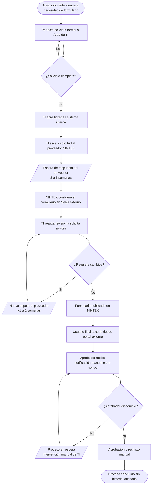
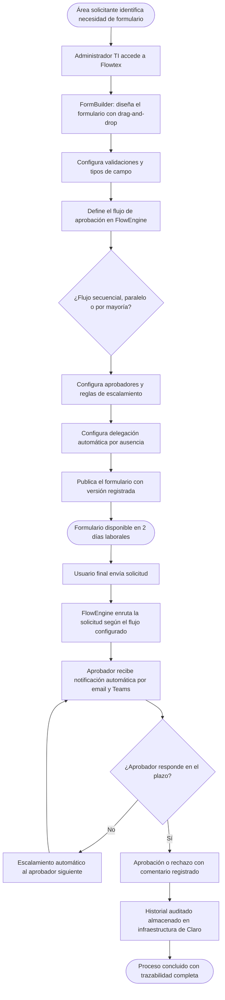

# Capítulo I: Introducción

## 1.1 Descripción del proyecto, rubro, entorno, usuarios y clientes

### 1.1.1 Empresa y contexto sectorial

Claro Perú es la subsidiaria peruana de América Móvil, uno de los grupos de telecomunicaciones más grandes de América Latina.
La empresa opera en el sector de telecomunicaciones con más de 15 millones de clientes en el Perú, ofreciendo servicios de telefonía móvil, banda ancha, televisión por cable y soluciones empresariales.
Hitss Perú actúa como el brazo tecnológico de América Móvil en la región, brindando servicios de desarrollo de software, consultoría tecnológica y mantenimiento de sistemas para las subsidiarias del grupo, entre ellas Claro Perú.

### 1.1.2 Descripción del producto

Flowtex es una plataforma web de desarrollo inhouse concebida para reemplazar la herramienta SaaS externa NINTEX, utilizada actualmente por el Área de Tecnología de Claro Perú para la gestión de formularios y flujos de aprobación.
El sistema es desarrollado por el equipo de Hitss Perú y se despliega sobre la infraestructura de nube corporativa de América Móvil.
Flowtex se organiza en tres módulos funcionales:

| Módulo | Descripción |
|---|---|
| **FormBuilder** | Editor visual drag-and-drop para la creación, configuración y publicación de formularios digitales. Permite gestionar tipos de campo, validaciones y versionamiento. |
| **FlowEngine** | Motor de flujos de aprobación que soporta rutas secuenciales, paralelas y por mayoría, con delegación automática, escalamiento configurable y notificaciones en tiempo real. |
| **MigraFlow** | Módulo de migración controlada que permite trasladar los formularios y flujos existentes en NINTEX hacia Flowtex de forma progresiva, con pruebas en paralelo para garantizar equivalencia funcional. |

### 1.1.3 Entorno tecnológico

El sistema se desarrolla con el siguiente stack tecnológico:

| Capa | Tecnología |
|---|---|
| Backend | Java 21, Spring Boot 3.3, Spring Data JPA |
| Base de datos | MySQL 8 |
| Frontend | React 18, TypeScript, Vite, Tailwind CSS 4, Zustand |
| Integración | Microsoft Teams (webhooks), correo corporativo SMTP |
| Arquitectura | Domain-Driven Design (DDD) + CQRS |

### 1.1.4 Usuarios del sistema

| Tipo de usuario | Descripción |
|---|---|
| Administradores TI de Claro | Personal del Área de Tecnología responsable de crear, configurar y publicar formularios y flujos de aprobación. Son los usuarios principales del módulo FormBuilder. |
| Solicitantes de todas las áreas | Colaboradores de cualquier área de Claro Perú que inician procesos mediante el envío de formularios. |
| Aprobadores designados | Colaboradores con rol de aprobación dentro de los flujos configurados. Interactúan con el módulo FlowEngine para revisar, aprobar, rechazar o delegar solicitudes. |
| Equipo Hitss | Desarrolladores y administradores responsables del mantenimiento, despliegue y soporte del sistema. Tienen acceso al módulo MigraFlow para gestionar la migración. |
| Auditores y Compliance | Personal que requiere acceso de solo lectura al historial de transacciones, versiones de formularios y trazabilidad de aprobaciones para cumplimiento regulatorio. |

### 1.1.5 Clientes del proyecto

| Cliente | Rol |
|---|---|
| Área de Tecnología de Claro Perú | Cliente directo. Define los requerimientos funcionales, valida los entregables y financia el desarrollo a través de Hitss Perú. |
| Áreas operativas de Claro Perú | Clientes internos. Son beneficiarios directos de la agilización de los procesos de formularios y aprobaciones. |
| Gerencia de TI de América Móvil | Cliente estratégico. Supervisa el cumplimiento de los estándares tecnológicos del grupo y el retorno de inversión de la solución. |

---

## 1.2 Perfiles de integrantes del equipo

### 1.2.1 Composición del equipo

El equipo de desarrollo de Flowtex está conformado por cinco integrantes de Hitss Perú con roles complementarios:

| Integrante | Rol en el proyecto | Responsabilidades principales | Habilidades técnicas |
|---|---|---|---|
| Lecca Choccare, Christopher Bryan | Product Owner / Backend Developer | Definición y priorización del backlog, desarrollo de APIs REST y lógica de negocio del sistema | Java, C#, JavaScript, Spring Boot, diseño de APIs |
| Sosa Colca, Angello Rodolfo | Frontend Developer / UX-UI | Diseño e implementación de la interfaz de usuario, experiencia de usuario y componentes visuales | React, Vue, TypeScript, Tailwind CSS, diseño de interfaces |
| Tongo Alejandro, Milagros Salet | Data Scientist | Modelos de análisis de datos, métricas de uso del sistema e inteligencia aplicada al monitoreo de flujos | Machine Learning, Python, análisis de datos |
| Ames Oviedo, Jose Mariano | Backend Developer | Desarrollo de servicios backend, integración de sistemas y diseño de prototipos de interfaz | Java, Spring Boot, Figma |
| Morales Montalvo, Omar Andrew | Scrum Master | Facilitación de ceremonias ágiles, gestión del tablero Kanban, remoción de impedimentos y seguimiento del avance del equipo | Scrum, Kanban, liderazgo ágil, gestión de equipos |

### 1.2.2 Lista de verificación de liderazgo ágil

El equipo evalúa el ejercicio del liderazgo ágil mediante la siguiente lista de verificación, aplicada de forma colectiva en las retrospectivas quincenales:

| Competencia de liderazgo ágil | Responsable principal | Evidencia en el proyecto |
|---|---|---|
| **Empatía con el usuario** | Product Owner (Christopher) | Sesiones semanales con administradores TI de Claro para validar funcionalidades antes de cerrar cada sprint |
| **Comunicación efectiva** | Scrum Master (Omar) | Daily standup de 15 minutos con agenda estructurada; acuerdos documentados en el repositorio del proyecto |
| **Facilitación de ceremonias** | Scrum Master (Omar) | Facilitación de sprint planning, revisión y retrospectiva; uso de tablero Kanban visible para todo el equipo |
| **Visión compartida del producto** | Product Owner (Christopher) | Backlog priorizado con criterios de aceptación claros para cada HU; socializado con todo el equipo al inicio de cada sprint |
| **Toma de decisiones colaborativa** | Todo el equipo | Las decisiones de arquitectura (DDD + CQRS, stack tecnológico) se adoptaron mediante consenso técnico del equipo completo |
| **Autonomía técnica del equipo** | Desarrolladores (Angello, Milagros, Jose) | Cada desarrollador propone soluciones de implementación dentro de la arquitectura acordada sin dependencia de aprobación jerárquica |
| **Retroalimentación continua** | Todo el equipo | Retrospectiva quincenal con análisis de lo que funcionó, lo que se debe mejorar y acciones concretas para el siguiente sprint |

---

## 1.3 Necesidad que cubre y problemática

### 1.3.1 Situación actual con NINTEX

El Área de Tecnología de Claro Perú utiliza NINTEX como herramienta SaaS para la gestión de formularios digitales y flujos de aprobación.
Esta dependencia genera una serie de restricciones operativas que impactan directamente la capacidad de respuesta del área ante las necesidades del negocio.

### 1.3.2 Problemas identificados

| Problema | Descripción | Impacto |
|---|---|---|
| **Tiempo de ciclo excesivo** | La creación de un formulario nuevo en NINTEX tarda entre 3 y 6 semanas, incluyendo las solicitudes al proveedor, configuración y aprobación. Las personalizaciones avanzadas pueden extenderse entre 4 y 8 semanas adicionales. | Incapacidad de responder a cambios regulatorios o del negocio en tiempo oportuno |
| **Costos de licenciamiento no controlados** | El modelo de precios de NINTEX es por consumo y usuario, con costos recurrentes que superan los S/. 400,000 anuales, sin visibilidad de optimización a corto plazo. | Sobrecosto anual con baja capacidad de negociación |
| **Ausencia de versionamiento** | NINTEX no provee control de versiones nativo para formularios. Los cambios sobrescriben la configuración anterior sin posibilidad de recuperación. | Deuda técnica, riesgo ante auditorías y pérdida de trazabilidad histórica |
| **Sin historial recuperable** | No existe un registro de cambios auditables que permita identificar quién modificó un formulario, cuándo y por qué razón. | Incumplimiento de requisitos de auditoría interna y riesgo regulatorio ante OSIPTEL |
| **Escalamiento manual de aprobaciones** | Cuando un aprobador no responde dentro del plazo establecido, el proceso se detiene o requiere intervención manual del área de TI. | Cuellos de botella operativos, demoras en procesos críticos |
| **Sin delegación automática** | No existe mecanismo para redirigir automáticamente las aprobaciones cuando un aprobador está ausente (vacaciones, licencia, baja). | Parálisis de flujos durante ausencias; dependencia de intervención manual |
| **Sin dashboards nativos** | NINTEX no ofrece dashboards de seguimiento de formularios ni métricas de tiempo de ciclo integrados con los procesos de Claro. | Imposibilidad de medir el rendimiento operativo y justificar mejoras |
| **Riesgo operativo ante caídas del proveedor** | Toda la operación de formularios y aprobaciones depende de la disponibilidad del servicio SaaS de NINTEX. Una caída del proveedor paraliza los procesos de todas las áreas. | Riesgo crítico de continuidad operativa |
| **Soberanía de datos comprometida** | Los datos de los formularios y los flujos de aprobación se alojan en servidores externos, fuera del control de Claro Perú. | Riesgo de incumplimiento con requisitos de soberanía de datos y regulaciones de OSIPTEL |

### 1.3.3 Impacto global de la problemática

La combinación de estos factores genera tres consecuencias organizacionales de primer nivel:

1. **Incapacidad de respuesta ágil:** el tiempo de 3 a 6 semanas para modificar un formulario hace imposible que el Área de Tecnología responda a cambios regulatorios, reorganizaciones o nuevos procesos del negocio en plazos razonables.
2. **Acumulación de deuda técnica y regulatoria:** la ausencia de versionamiento, trazabilidad e historial expone a Claro Perú a observaciones de auditoría interna y riesgos de incumplimiento ante los requisitos de OSIPTEL.
3. **Dependencia estructural de un proveedor externo:** la totalidad del proceso de formularios y aprobaciones queda sujeta a las decisiones comerciales, la disponibilidad del servicio y los cambios de precios de un proveedor que no pertenece al grupo América Móvil.

---

## 1.4 Flujograma básico del proceso

### 1.4.1 Proceso actual con NINTEX

### 1.4.2 Proceso con Flowtex

---

## 1.5 Productos o servicios

### 1.5.1 Hitss Perú como proveedor tecnológico

Hitss Perú es la unidad de servicios tecnológicos de América Móvil para la región, especializada en el desarrollo de software a medida, integración de sistemas, consultoría TI y mantenimiento de aplicaciones para las subsidiarias del grupo.
Su posicionamiento como empresa inhouse del grupo garantiza alineación con los estándares tecnológicos y de seguridad de América Móvil, acceso directo a la infraestructura cloud del grupo y eliminación de la dependencia de proveedores SaaS externos para funcionalidades críticas.

### 1.5.2 Flowtex como solución inhouse

Flowtex es el producto central desarrollado por Hitss Perú para Claro Perú.
No se trata de un producto comercializable externamente, sino de una solución estratégica inhouse diseñada específicamente para las necesidades operativas del Área de Tecnología de Claro.

| Módulo | Funcionalidad principal | Valor entregado |
|---|---|---|
| **FormBuilder** | Editor visual drag-and-drop con tipos de campo configurables, validaciones, versiones y publicación | Creación de formularios en 2 días laborales frente a 3–6 semanas con NINTEX |
| **FlowEngine** | Motor de flujos de aprobación con rutas secuenciales, paralelas, por mayoría, delegación automática y escalamiento | Automatización completa del ciclo de aprobación sin intervención manual |
| **MigraFlow** | Herramienta de migración controlada con pruebas en paralelo y comparación de resultados | Transición sin riesgo operativo desde NINTEX hacia Flowtex |

### 1.5.3 Beneficios cuantificables

| Beneficio | NINTEX (situación actual) | Flowtex (situación objetivo) |
|---|---|---|
| Tiempo de creación de formulario | 3–6 semanas | 2 días laborales |
| Tiempo de personalización avanzada | 4–8 semanas adicionales | Configuración en horas mediante interfaz visual |
| Versionamiento de formularios | No disponible | Versionamiento automático con historial completo |
| Trazabilidad de aprobaciones | No disponible | Registro completo auditado por transacción |
| Delegación automática | No disponible | Configuración por flujo, activación automática |
| Escalamiento de aprobaciones | Manual, requiere intervención TI | Automático según reglas de tiempo configuradas |
| Notificaciones | Correo básico sin integración corporativa | Email + Microsoft Teams con plantillas corporativas |
| Soberanía de datos | Datos en servidores del proveedor externo | Datos en infraestructura de América Móvil en Perú |
| Reducción de costo de licenciamiento | Referencia: 100% del gasto actual | Reducción estimada superior al 60% |
| Disponibilidad objetivo | Sujeta a SLA del proveedor externo | 99.5% mensual garantizado en infraestructura propia |

---

## 1.6 Requisitos y Historias de Usuario

### 1.6.1 Requisitos Funcionales

| ID | Requisito Funcional | Épica asociada | Justificación |
|---|---|---|---|
| RF01 | El sistema debe permitir crear formularios con al menos 10 tipos de campo configurables (texto, número, fecha, archivo, lista desplegable, casilla de verificación, radio, correo, teléfono, área de texto) | EP01: FormBuilder | Replica y amplía la capacidad de NINTEX para definir campos; es el núcleo del módulo FormBuilder |
| RF02 | El sistema debe proveer un editor drag-and-drop para la disposición visual de los campos del formulario | EP01: FormBuilder | Reduce la dependencia de configuración técnica avanzada; permite que administradores TI sin conocimientos de código construyan formularios |
| RF03 | El sistema debe validar los datos ingresados en los formularios según las reglas configuradas (obligatoriedad, formato, longitud, expresión regular) | EP01: FormBuilder | Garantiza la integridad de la información antes de iniciar el flujo de aprobación |
| RF04 | El sistema debe gestionar versiones de cada formulario, permitiendo consultar y restaurar versiones anteriores | EP01: FormBuilder | Cubre la ausencia crítica de versionamiento en NINTEX; requisito de trazabilidad para auditoría |
| RF05 | El sistema debe generar un ticket de seguimiento único por cada solicitud enviada a través de un formulario | EP01: FormBuilder | Permite al solicitante y al aprobador identificar y rastrear cada transacción de forma unívoca |
| RF06 | El sistema debe soportar flujos de aprobación secuenciales y paralelos configurables por formulario | EP02: FlowEngine | Habilita los dos patrones de aprobación más frecuentes en Claro Perú, actualmente gestionados de forma manual |
| RF07 | El sistema debe admitir aprobación por mayoría cuando se configura un quorum de aprobadores | EP02: FlowEngine | Permite patrones de votación en comités, no soportados de forma nativa por NINTEX en la configuración actual de Claro |
| RF08 | El sistema debe permitir la delegación automática de aprobaciones ante la ausencia de un aprobador | EP02: FlowEngine | Elimina la parálisis de flujos durante ausencias del personal aprobador |
| RF09 | El sistema debe enviar notificaciones automáticas por correo electrónico corporativo y por Microsoft Teams en cada evento del flujo (asignación, recordatorio, escalamiento, resolución) | EP02: FlowEngine | Integra Flowtex con los canales de comunicación ya adoptados corporativamente por Claro |
| RF10 | El sistema debe escalar automáticamente las solicitudes no atendidas según los tiempos de espera configurados por flujo | EP02: FlowEngine | Reemplaza la intervención manual del Área de TI para resolver cuellos de botella en aprobaciones |

### 1.6.2 Requisitos No Funcionales

| ID | Requisito No Funcional | Categoría | Criterio de medición |
|---|---|---|---|
| RNF01 | El sistema debe mantener una disponibilidad igual o superior al 99.5% mensual en el ambiente de producción | Disponibilidad | Medido mediante monitoreo continuo; máximo 3.6 horas de inactividad acumulada por mes |
| RNF02 | El tiempo de respuesta de las operaciones de consulta y envío de formularios no debe superar los 2 segundos en condiciones normales de carga | Rendimiento | Medido con pruebas de carga simulando el uso simultáneo de 200 usuarios concurrentes |
| RNF03 | El sistema debe cifrar en tránsito y en reposo toda la información sensible de formularios y flujos de aprobación, conforme a los estándares de seguridad de América Móvil | Seguridad | Verificado mediante auditoría de seguridad antes del despliegue en producción |
| RNF04 | La arquitectura del sistema debe soportar el escalamiento horizontal del backend sin modificaciones al código, ante el crecimiento del volumen de formularios y usuarios | Escalabilidad | Verificado mediante pruebas de estrés con carga incremental hasta 10 veces la carga base |
| RNF05 | El sistema debe registrar en un log de auditoría inmutable cada acción sobre formularios y flujos (creación, modificación, aprobación, rechazo, delegación, escalamiento), incluyendo usuario, fecha, hora y estado anterior y posterior | Trazabilidad / Cumplimiento | Verificado mediante revisión del log de auditoría en pruebas de aceptación con el equipo de Compliance de Claro |

### 1.6.3 Épicas del proyecto

| ID | Nombre | Descripción | HUs incluidas |
|---|---|---|---|
| EP01 | FormBuilder | Agrupa todas las funcionalidades de creación, configuración, validación, versionamiento y publicación de formularios digitales | HU01, HU02, HU03, HU04, HU05 |
| EP02 | FlowEngine | Agrupa las funcionalidades del motor de flujos de aprobación, incluyendo configuración de rutas, delegación, escalamiento, notificaciones, historial y seguimiento | HU06, HU07, HU08, HU09, HU10, HU11, HU12 |
| EP03 | MigraFlow | Agrupa las funcionalidades de migración controlada desde NINTEX hacia Flowtex, con soporte para pruebas en paralelo y validación de equivalencia funcional | HU13 |

### 1.6.4 Historias de Usuario

---

#### EP01: FormBuilder

---

**HU01: Tipos de campo configurables**

> Como administrador TI de Claro,
> quiero poder seleccionar y configurar distintos tipos de campo al construir un formulario (texto, número, fecha, archivo, lista desplegable, casilla de verificación, radio, correo, teléfono, área de texto),
> para que los formularios reflejen con exactitud los datos que cada área necesita recopilar.

**Criterios de aceptación:**

| Escenario | Dado | Cuando | Entonces |
|---|---|---|---|
| Escenario 1: Selección y configuración de un campo de tipo fecha | el administrador TI accede al FormBuilder y selecciona el tipo de campo "Fecha" desde el panel de componentes | lo arrastra al área de diseño del formulario y configura si el campo es obligatorio y si tiene rango de fechas válidas | el formulario guarda la configuración y, al previsualizar, el campo muestra un selector de calendario con las restricciones configuradas |
| Escenario 2: Campo obligatorio sin valor provoca error de validación | el usuario final accede al formulario publicado que tiene un campo de texto obligatorio | envía el formulario sin completar ese campo | el sistema muestra un mensaje de error en línea debajo del campo ("Este campo es obligatorio") y no permite el envío hasta que el campo sea completado |

---

**HU02: Editor drag-and-drop**

> Como administrador TI de Claro,
> quiero construir formularios arrastrando y soltando componentes en un área de diseño visual,
> para que la creación de formularios no requiera conocimientos de programación ni configuración técnica avanzada.

**Criterios de aceptación:**

| Escenario | Dado | Cuando | Entonces |
|---|---|---|---|
| Escenario 1: Reordenamiento de campos mediante arrastre | el administrador TI tiene un formulario con cinco campos ya configurados en el editor visual | arrastra el tercer campo hacia la primera posición del formulario | el formulario refleja el nuevo orden de forma inmediata en el área de diseño y ese orden se guarda al publicar |
| Escenario 2: Eliminación de un campo arrastrándolo fuera del área | el administrador TI tiene un campo de tipo texto en el formulario | lo arrastra hacia la zona de eliminación o hace clic en el ícono de eliminación del campo | el campo desaparece del área de diseño y el sistema solicita confirmación antes de eliminar si el campo ya tiene datos en formularios enviados previamente |

---

**HU03: Validaciones de campo**

> Como administrador TI de Claro,
> quiero configurar reglas de validación para cada campo del formulario (obligatoriedad, formato de correo, longitud mínima y máxima, expresión regular),
> para que los datos recibidos sean íntegros y reduzcan errores en el proceso de aprobación.

**Criterios de aceptación:**

| Escenario | Dado | Cuando | Entonces |
|---|---|---|---|
| Escenario 1: Validación de formato de correo electrónico | el administrador TI configura un campo de tipo "Correo" con la validación de formato activada | el usuario final ingresa una cadena de texto que no tiene el formato de correo válido (por ejemplo "usuarioclaro") y presiona enviar | el sistema muestra el mensaje "Ingrese una dirección de correo válida" debajo del campo y bloquea el envío del formulario |
| Escenario 2: Validación de longitud máxima en campo de texto | el administrador TI configura un campo de texto libre con longitud máxima de 200 caracteres | el usuario final escribe más de 200 caracteres en el campo | el sistema impide el ingreso adicional de caracteres una vez alcanzado el límite y muestra un contador de caracteres restantes en tiempo real |

---

**HU04: Versionamiento de formularios**

> Como administrador TI de Claro,
> quiero que cada cambio publicado en un formulario quede registrado como una nueva versión accesible,
> para que sea posible auditar el historial de modificaciones y restaurar versiones anteriores ante errores o cambios regulatorios.

**Criterios de aceptación:**

| Escenario | Dado | Cuando | Entonces |
|---|---|---|---|
| Escenario 1: Creación automática de nueva versión al publicar cambios | el administrador TI modifica el orden de los campos de un formulario ya publicado y en producción | guarda y publica los cambios | el sistema crea automáticamente la versión 2 del formulario, mantiene la versión 1 accesible en el historial con su fecha de publicación y el usuario que la publicó, y la versión 2 queda como la versión activa |
| Escenario 2: Restauración de una versión anterior | el administrador TI detecta un error en la versión actual de un formulario y accede al historial de versiones | selecciona la versión anterior y hace clic en "Restaurar" | el sistema crea una nueva versión con el contenido de la versión restaurada, registra en el historial que fue una restauración, y activa esta nueva versión sin eliminar el registro de la versión errónea |

---

**HU05: Generación de ticket de seguimiento**

> Como solicitante de cualquier área de Claro,
> quiero recibir un código de ticket único al enviar un formulario,
> para que pueda hacer seguimiento del estado de mi solicitud en cualquier momento sin depender de consultas manuales al Área de TI.

**Criterios de aceptación:**

| Escenario | Dado | Cuando | Entonces |
|---|---|---|---|
| Escenario 1: Generación del ticket al enviar el formulario | el usuario final completa todos los campos obligatorios de un formulario publicado | hace clic en "Enviar solicitud" | el sistema genera un código de ticket único con formato alfanumérico (por ejemplo FTX-2026-00123), lo muestra en pantalla al usuario, lo envía por correo corporativo al solicitante e inicia el flujo de aprobación configurado para ese formulario |
| Escenario 2: Consulta del estado del ticket | el solicitante posee el código de ticket FTX-2026-00123 y accede al portal de seguimiento | ingresa el código en el buscador de tickets | el sistema muestra el estado actual del ticket (pendiente, en revisión, aprobado, rechazado), el nombre del aprobador responsable en el paso actual, la fecha de la última acción y el historial de eventos del flujo |

---

#### EP02: FlowEngine

---

**HU06: Aprobación secuencial y paralela**

> Como administrador TI de Claro,
> quiero configurar flujos de aprobación que puedan ser secuenciales (un aprobador a la vez en orden) o paralelos (todos los aprobadores simultáneamente),
> para que cada formulario tenga el flujo que corresponde al proceso de negocio de cada área.

**Criterios de aceptación:**

| Escenario | Dado | Cuando | Entonces |
|---|---|---|---|
| Escenario 1: Flujo secuencial con tres aprobadores | el formulario tiene configurado un flujo secuencial con los aprobadores A, B y C en ese orden | el solicitante envía una solicitud | el sistema notifica al aprobador A; solo cuando A aprueba, notifica al B; solo cuando B aprueba, notifica al C; la aprobación de C cierra el flujo como aprobado |
| Escenario 2: Flujo paralelo con dos aprobadores simultáneos | el formulario tiene configurado un flujo paralelo con los aprobadores A y B | el solicitante envía una solicitud | el sistema notifica simultáneamente a A y B; cuando ambos aprueban, la solicitud queda aprobada; si cualquiera rechaza, la solicitud queda rechazada y se notifica al solicitante |

---

**HU07: Aprobación por mayoría**

> Como administrador TI de Claro,
> quiero configurar flujos donde la solicitud se aprueba si un porcentaje o número mínimo de aprobadores vota a favor,
> para que los procesos de comité no dependan de la unanimidad de todos los participantes.

**Criterios de aceptación:**

| Escenario | Dado | Cuando | Entonces |
|---|---|---|---|
| Escenario 1: Aprobación por mayoría simple con quorum del 51% | el flujo tiene 5 aprobadores configurados con regla de mayoría simple (mínimo 3 votos a favor) | 3 aprobadores votan a favor antes de que los otros 2 respondan | el sistema marca la solicitud como aprobada, notifica al solicitante con el resultado y registra los votos individuales en el historial |
| Escenario 2: Rechazo por mayoría antes de que todos respondan | el flujo tiene 5 aprobadores y se requieren mínimo 3 votos a favor; 3 aprobadores votan en contra | el tercer voto en contra se registra | el sistema marca la solicitud como rechazada de forma inmediata, notifica al solicitante e indica que la mayoría votó en contra, sin esperar a los 2 aprobadores restantes |

---

**HU08: Delegación automática de aprobaciones**

> Como aprobador designado,
> quiero poder configurar períodos de ausencia durante los cuales mis aprobaciones se delegan automáticamente a un suplente,
> para que los flujos de trabajo no se detengan durante mis vacaciones o licencias.

**Criterios de aceptación:**

| Escenario | Dado | Cuando | Entonces |
|---|---|---|---|
| Escenario 1: Delegación activa durante período de ausencia configurado | el aprobador A configuró delegación al aprobador B para el período del 1 al 15 de julio | el 5 de julio llega una solicitud asignada al aprobador A | el sistema redirige automáticamente la solicitud al aprobador B, notifica a B que actúa como delegado de A, y registra en el historial que la asignación fue por delegación con el período activo |
| Escenario 2: Retorno automático al aprobador original al término del período | el aprobador A tenía delegación activa hasta el 15 de julio; el 16 de julio llega una nueva solicitud | la solicitud llega después del fin del período de delegación | el sistema asigna la solicitud directamente al aprobador A sin intervención manual y no activa la delegación a B |

---

**HU09: Notificaciones automáticas por email y Teams**

> Como aprobador y como solicitante,
> quiero recibir notificaciones automáticas por correo electrónico corporativo y por Microsoft Teams en cada evento relevante del flujo (nueva solicitud asignada, recordatorio, escalamiento, resolución),
> para que pueda actuar oportunamente sin necesidad de revisar manualmente el sistema.

**Criterios de aceptación:**

| Escenario | Dado | Cuando | Entonces |
|---|---|---|---|
| Escenario 1: Notificación al aprobador al recibir nueva solicitud | el flujo de un formulario tiene al aprobador A configurado como primer nodo | el solicitante envía una solicitud y el flujo inicia | el aprobador A recibe en menos de 2 minutos una notificación en su correo corporativo y un mensaje en el canal de Microsoft Teams configurado, con el nombre del formulario, el solicitante, la fecha y un enlace directo a la solicitud |
| Escenario 2: Notificación al solicitante cuando su solicitud es aprobada | el flujo de la solicitud FTX-2026-00123 ha completado todos los pasos de aprobación | el último aprobador marca la solicitud como aprobada | el solicitante recibe en menos de 2 minutos una notificación por correo y por Teams indicando que su solicitud fue aprobada, con el número de ticket, la fecha de aprobación y el nombre del aprobador final |

---

**HU10: Escalamiento automático**

> Como administrador TI de Claro,
> quiero configurar tiempos de espera máximos por paso del flujo, de modo que las solicitudes no atendidas sean escaladas automáticamente al siguiente nivel,
> para que los cuellos de botella por inacción de un aprobador se resuelvan sin intervención manual del equipo de TI.

**Criterios de aceptación:**

| Escenario | Dado | Cuando | Entonces |
|---|---|---|---|
| Escenario 1: Escalamiento al aprobador de segundo nivel por vencimiento del plazo | el flujo tiene configurado un tiempo máximo de 48 horas para el aprobador de primer nivel; el aprobador no ha respondido en ese plazo | el sistema detecta el vencimiento del plazo | escala automáticamente la solicitud al aprobador de segundo nivel configurado, envía una notificación al nuevo aprobador, envía una notificación de alerta al solicitante indicando el escalamiento, y registra el evento en el historial del ticket |
| Escenario 2: Notificación de recordatorio antes del vencimiento | el plazo máximo es de 48 horas y quedan 24 horas para el vencimiento | el sistema ejecuta la verificación programada de tiempos | envía un recordatorio automático al aprobador indicando el plazo restante y el riesgo de escalamiento, sin escalar aún la solicitud |

---

**HU11: Historial de flujo auditado**

> Como auditor o personal de Compliance de Claro,
> quiero consultar el historial completo de cada solicitud (todos los eventos del flujo: asignaciones, aprobaciones, rechazos, delegaciones, escalamientos y comentarios),
> para que sea posible demostrar la trazabilidad del proceso ante auditorías internas o requerimientos regulatorios de OSIPTEL.

**Criterios de aceptación:**

| Escenario | Dado | Cuando | Entonces |
|---|---|---|---|
| Escenario 1: Consulta del historial completo de un ticket aprobado | el auditor accede al módulo de historial con el código de ticket FTX-2026-00123 | busca el ticket por su código | el sistema muestra una línea de tiempo cronológica con cada evento del flujo: fecha y hora, tipo de evento (asignación, aprobación, escalamiento, etc.), usuario que realizó la acción y comentarios adjuntados |
| Escenario 2: Exportación del historial en formato PDF para auditoría | el auditor necesita presentar el historial del ticket FTX-2026-00123 en un informe de auditoría | hace clic en "Exportar historial" y selecciona el formato PDF | el sistema genera un documento PDF con el historial completo, el nombre del formulario, los datos del solicitante, la secuencia de aprobaciones y la fecha de exportación, firmado con el nombre del auditor que realizó la consulta |

---

**HU12: Seguimiento de solicitudes**

> Como solicitante de cualquier área de Claro,
> quiero consultar en tiempo real el estado de mis solicitudes activas y el historial de mis solicitudes pasadas,
> para que pueda saber en qué etapa del flujo se encuentra mi solicitud sin necesidad de contactar al Área de TI.

**Criterios de aceptación:**

| Escenario | Dado | Cuando | Entonces |
|---|---|---|---|
| Escenario 1: Vista del estado actual de una solicitud activa | el solicitante tiene la solicitud FTX-2026-00123 en estado "En revisión por aprobador de segundo nivel" | accede al portal de seguimiento e ingresa su código de ticket | el sistema muestra el estado actual, el nombre y cargo del aprobador actual, la fecha en que llegó a ese aprobador y el tiempo transcurrido desde la asignación |
| Escenario 2: Consulta del historial de solicitudes pasadas | el solicitante desea revisar todas las solicitudes que envió en los últimos 6 meses | accede a la sección "Mis solicitudes" en el portal | el sistema muestra una lista paginada de todas las solicitudes con su código de ticket, nombre del formulario, fecha de envío, estado final y un enlace al detalle de cada una |

---

#### EP03: MigraFlow

---

**HU13: Pruebas en paralelo durante la migración**

> Como administrador TI de Claro,
> quiero ejecutar en paralelo el mismo formulario y flujo de aprobación en NINTEX y en Flowtex durante el período de migración,
> para que sea posible comparar los resultados y validar que Flowtex reproduce con exactitud el comportamiento de NINTEX antes de dar de baja la herramienta externa.

**Criterios de aceptación:**

| Escenario | Dado | Cuando | Entonces |
|---|---|---|---|
| Escenario 1: Ejecución simultánea de un formulario en ambos sistemas | el formulario "Solicitud de Acceso a Sistemas" ha sido migrado a Flowtex y el administrador activa el modo de prueba en paralelo para ese formulario | un solicitante envía el formulario en el portal de producción de NINTEX | MigraFlow replica automáticamente la misma solicitud en Flowtex, ejecuta el flujo configurado en Flowtex y registra los resultados de ambos sistemas (tiempos, aprobadores notificados, respuestas) para su comparación |
| Escenario 2: Detección de discrepancia entre los resultados de ambos sistemas | el módulo MigraFlow ejecuta la prueba en paralelo del formulario "Solicitud de Compra" y detecta que el flujo de Flowtex notificó a un aprobador distinto al que notificó NINTEX | se completa el ciclo de prueba paralela | el sistema genera una alerta en el panel de MigraFlow indicando la discrepancia, detalla el paso del flujo donde ocurrió la diferencia y sugiere al administrador revisar la configuración del flujo en Flowtex antes de continuar la migración |

---

## 1.7 Objetivos SMART del proyecto

Los siguientes objetivos se definen bajo el marco SMART (Específico, Medible, Alcanzable, Relevante y con Tiempo definido):

### Objetivo 1: Reducción del tiempo de creación de formularios

**Específico:** Reducir el tiempo promedio de creación y publicación de formularios desde el Área de Tecnología de Claro Perú de 21 días calendario (promedio actual con NINTEX) a 2 días laborales, para el 100% de las solicitudes de nuevos formularios.

**Medible:** El tiempo de creación se mide desde la apertura del proyecto en FormBuilder hasta la publicación del formulario en el ambiente de producción, registrado automáticamente por el sistema.

**Alcanzable:** La simplificación mediante drag-and-drop y la eliminación de la dependencia del proveedor externo hacen posible este objetivo con el stack tecnológico definido.

**Relevante:** Es el principal dolor operativo del cliente; reducirlo es el argumento central de reemplazo de NINTEX.

**Tiempo definido:** Verificado en producción antes del cierre del ciclo académico 2026-10 (diciembre 2026).

---

### Objetivo 2: Migración total de formularios y flujos activos desde NINTEX

**Específico:** Migrar el 100% de los formularios y flujos de aprobación activos en NINTEX a Flowtex sin interrupciones operativas ni pérdida de datos.

**Medible:** Porcentaje de formularios migrados y validados mediante pruebas en paralelo en MigraFlow, con cero incidentes de pérdida de datos documentados.

**Alcanzable:** El módulo MigraFlow está diseñado específicamente para este objetivo, con pruebas en paralelo que permiten validar equivalencia funcional antes de dar de baja cada formulario en NINTEX.

**Relevante:** La migración completa es condición necesaria para la discontinuación de NINTEX y la eliminación del costo de licenciamiento.

**Tiempo definido:** Migración completada en un plazo máximo de 6 meses contados desde el despliegue del MVP en producción.

---

### Objetivo 3: Usabilidad del FormBuilder para administradores TI sin capacitación previa

**Específico:** Lograr que el 80% de los administradores TI de Claro Perú sean capaces de crear un formulario básico funcional (mínimo 5 campos con validaciones) sin capacitación formal previa y en un tiempo inferior a 30 minutos.

**Medible:** Evaluado mediante pruebas de usabilidad supervisadas con protocolo de tareas definido, en las que se mide el tiempo de completitud de la tarea y el porcentaje de participantes que la completan con éxito.

**Alcanzable:** El diseño UX del FormBuilder prioriza la experiencia sin curva de aprendizaje técnico, con componentes autodescriptivos y retroalimentación visual inmediata.

**Relevante:** Si los administradores requieren capacitación extensa, el ahorro de tiempo frente a NINTEX se reduce significativamente.

**Tiempo definido:** Evaluado en el primer mes posterior al despliegue del MVP en el ambiente de producción de Claro.

---

### Objetivo 4: Reducción del costo anual de licenciamiento de herramientas de workflow

**Específico:** Reducir el presupuesto anual de licenciamiento y soporte de herramientas de workflow en al menos el 60% respecto al costo actual de NINTEX, como resultado del despliegue y adopción de Flowtex.

**Medible:** Comparación del gasto en licencias NINTEX del año anterior al despliegue versus el gasto en el primer año completo de operación de Flowtex (incluyendo costos de mantenimiento de Hitss).

**Alcanzable:** La eliminación del modelo de licencias por usuario de NINTEX, reemplazado por una solución inhouse con infraestructura ya disponible en América Móvil, hace posible esta reducción.

**Relevante:** El argumento económico es uno de los dos ejes estratégicos del proyecto (junto con la agilidad operativa).

**Tiempo definido:** Verificado al cierre del primer año fiscal completo de operación de Flowtex en producción.

---

### Objetivo 5: Disponibilidad del sistema en producción

**Específico:** Alcanzar y mantener una disponibilidad del sistema Flowtex igual o superior al 99.5% mensual durante los primeros 12 meses de operación en el ambiente de producción de Claro Perú.

**Medible:** Calculado como el porcentaje del tiempo mensual en que el sistema está operativo y accesible para los usuarios, medido mediante monitoreo continuo. El 99.5% mensual equivale a un máximo de 3.65 horas de inactividad acumulada por mes.

**Alcanzable:** La infraestructura cloud de América Móvil, con redundancia y balanceo de carga, soporta este nivel de disponibilidad para aplicaciones internas críticas.

**Relevante:** Flowtex reemplaza NINTEX como sistema crítico de operación; una disponibilidad inferior al objetivo haría más riesgosa la migración.

**Tiempo definido:** Evaluado mensualmente durante los primeros 12 meses contados desde el despliegue en producción.

---

## 1.8 Herramientas de priorización: MoSCoW aplicado a las Historias de Usuario

### 1.8.1 Tabla de priorización MoSCoW

| Categoría | HUs incluidas | Justificación |
|---|---|---|
| **Must Have** (imprescindible para el MVP) | HU01, HU02, HU04, HU05, HU06, HU09, HU11, HU12 | Son las funcionalidades que reproducen directamente el núcleo de NINTEX: creación de formularios, flujos básicos de aprobación, notificaciones, trazabilidad y seguimiento. Sin estas HUs, Flowtex no puede reemplazar a NINTEX en producción. |
| **Should Have** (importante, no bloqueante para el MVP) | HU03, HU07, HU10, HU13 | Mejoran significativamente la calidad y robustez del sistema, pero el MVP puede desplegarse sin ellas en una primera iteración. HU03 (validaciones avanzadas) y HU07 (mayoría) amplían los casos de uso; HU10 (escalamiento) y HU13 (migración paralela) reducen riesgos operativos pero no bloquean el uso básico. |
| **Could Have** (deseable si el tiempo lo permite) | HU08 | La delegación automática (HU08) es una funcionalidad de alto valor para el usuario, pero los administradores pueden gestionar la delegación manualmente en etapas iniciales. Se incluirá si el ritmo del equipo lo permite dentro del ciclo 2026-10. |
| **Won't Have** (fuera del alcance del MVP) | Reportería ejecutiva avanzada, dashboards de BI, integración con sistemas ERP legacy | Estas funcionalidades generan valor estratégico a largo plazo pero no son necesarias para reemplazar NINTEX en el MVP. Se registran en el backlog para ciclos futuros. |

> **Nota sobre los ocho Must Have de la visión y los del backlog operativo.**
> Los ocho Must Have de esta tabla (HU01, HU02, HU04, HU05, HU06, HU09, HU11, HU12) corresponden al nivel de la visión del producto descrita en este capítulo I: son las capacidades imprescindibles que definen qué debe hacer Flowtex para reemplazar funcionalmente a NINTEX.
> El backlog operativo del capítulo III (sección 3.0.3) descompone esa visión en aproximadamente dieciocho Historias de Usuario ejecutables, renombradas por bounded context (HU-IAM, HU-FB, HU-WF, HU-TR), que son las unidades reales de trabajo del tablero.
> Ambos conjuntos son válidos porque operan en niveles distintos: la visión enuncia el "qué" imprescindible del producto, mientras que el backlog operativo enuncia el "cómo" imprescindible de la construcción.
> No existe contradicción entre los ocho y los dieciocho: el segundo número es la granularidad ejecutable del primero.

### 1.8.2 Detalle por Historia de Usuario

| HU | Nombre | Prioridad MoSCoW | Justificación específica |
|---|---|---|---|
| HU01 | Tipos de campo configurables | Must Have | Sin tipos de campo, no es posible construir ningún formulario. Es el elemento base de la épica FormBuilder. |
| HU02 | Editor drag-and-drop | Must Have | Es el diferenciador central de la experiencia de usuario. Sin él, los administradores TI seguirían dependiendo de configuración técnica compleja, lo que no reduce el tiempo de creación. |
| HU03 | Validaciones de campo | Should Have | Las validaciones básicas (obligatoriedad) son críticas, pero las validaciones avanzadas (regex, longitud) pueden incorporarse en el segundo sprint sin bloquear el MVP. |
| HU04 | Versionamiento de formularios | Must Have | La ausencia de versionamiento es una de las críticas principales a NINTEX. Incluirlo en el MVP es requisito de auditoría. |
| HU05 | Ticket de seguimiento | Must Have | El ticket es el mecanismo central que permite a los solicitantes seguir sus procesos. Sin él, el sistema carece de trazabilidad básica para los usuarios. |
| HU06 | Aprobación secuencial y paralela | Must Have | Los dos patrones básicos de aprobación cubren el 90% de los casos de uso actuales de NINTEX en Claro. Son indispensables para el MVP. |
| HU07 | Aprobación por mayoría | Should Have | Cubre el 10% de casos restantes (comités). Importante pero no bloqueante para el primer despliegue. |
| HU08 | Delegación automática | Could Have | Alta utilidad para los usuarios, pero la delegación puede hacerse manualmente por el administrador TI en etapas iniciales sin impacto crítico en la operación. |
| HU09 | Notificaciones email y Teams | Must Have | Sin notificaciones automáticas, los aprobadores no sabrían que tienen solicitudes pendientes. Es funcionalidad crítica para que el FlowEngine tenga utilidad real. |
| HU10 | Escalamiento automático | Should Have | Reduce la intervención manual de TI, pero en el MVP el administrador puede monitorear y escalar manualmente los cuellos de botella. |
| HU11 | Historial auditado | Must Have | Es requisito de cumplimiento regulatorio (OSIPTEL). La trazabilidad completa debe estar presente desde el primer despliegue en producción. |
| HU12 | Seguimiento de solicitudes | Must Have | Permite la autonomía del solicitante y reduce las consultas al Área de TI. Es una funcionalidad básica que el cliente espera desde el inicio. |
| HU13 | Pruebas en paralelo (migración) | Should Have | Reduce significativamente el riesgo de la migración, pero el equipo puede iniciar la migración formulario por formulario con validación manual si la implementación de MigraFlow se retrasa. |

### 1.8.3 Justificación de la priorización

La lógica de priorización MoSCoW aplicada al backlog de Flowtex responde a un principio central:
**el MVP debe reemplazar funcionalmente a NINTEX en los procesos críticos del Área de Tecnología de Claro Perú, sin introducir riesgos operativos superiores a los que existen hoy.**

Esto implica que las funcionalidades Must Have son exactamente las que, si estuvieran ausentes, harían inviable la migración o generarían un impacto operativo inaceptable.
Las funcionalidades Should Have y Could Have mejoran la experiencia y la autonomía del sistema, pero su ausencia temporal no bloquea la operación básica.
Las funcionalidades Won't Have se excluyen del alcance del MVP para mantener el foco del equipo y respetar el cronograma del ciclo 2026-10.

### 1.8.4 MoSCoW frente a SAFe y WSJF: priorización cualitativa y cuantitativa

MoSCoW ordena el backlog en cuatro categorías cualitativas (Must, Should, Could, Won't) según el criterio experto del Product Owner y del equipo.
Es rápido de aplicar y comunica con claridad qué entra y qué no entra en el MVP, pero no produce un número que permita comparar dos historias que caen dentro de una misma categoría.
El marco SAFe (Scaled Agile Framework) propone para ese caso la métrica WSJF (Weighted Shortest Job First), que prioriza de forma cuantitativa.
WSJF se calcula dividiendo el costo del retraso (Cost of Delay, estimado a partir del valor de negocio, la criticidad temporal y la reducción de riesgo u oportunidad) entre el tamaño o duración del trabajo (Job Size).
Las historias con mayor WSJF se desarrollan primero, porque entregan más valor por unidad de esfuerzo.

Para Flowtex se adoptó MoSCoW como técnica principal por su simplicidad y por la claridad que aporta a la conversación con el cliente Claro, dado que el equipo es de cinco personas y el backlog es acotado.
WSJF se reserva como herramienta de desempate cuantitativo cuando dos historias de la misma categoría MoSCoW compiten por la capacidad de un mismo período: en ese caso, el cociente entre costo de retraso y tamaño ofrece un criterio objetivo para decidir cuál se ejecuta antes.
La combinación aprovecha la agilidad comunicativa de MoSCoW y el rigor numérico de WSJF sin renunciar a ninguno de los dos.

---

## 1.9 Generación de valor: Análisis PEST

El análisis PEST permite identificar los factores del entorno que impactan sobre la viabilidad y el valor estratégico de Flowtex, tanto desde perspectivas externas como internas a la organización.

### 1.9.1 Factor Político

| Elemento | Descripción | Impacto sobre Flowtex |
|---|---|---|
| Regulación OSIPTEL | El Organismo Supervisor de Inversión Privada en Telecomunicaciones exige a las empresas del sector mantener registros auditables de sus procesos internos | Flowtex, al almacenar el historial completo de flujos y aprobaciones en infraestructura propia de América Móvil, permite a Claro Perú demostrar cumplimiento regulatorio de forma directa, sin depender de logs externos del proveedor SaaS |
| Soberanía de datos | Las regulaciones peruanas y los estándares de América Móvil priorizan el almacenamiento de datos sensibles en infraestructura bajo control del grupo | La naturaleza inhouse de Flowtex elimina el riesgo de soberanía que representa NINTEX, cuyos datos residen en servidores fuera del control de Claro |
| Oportunidad | El cumplimiento regulatorio como diferenciador | El despliegue de Flowtex convierte el cumplimiento de OSIPTEL de un costo de gestión en una ventaja operativa demostrable ante auditorías |

### 1.9.2 Factor Económico

| Elemento | Descripción | Impacto sobre Flowtex |
|---|---|---|
| Costo de NINTEX | El gasto anual en licencias NINTEX más soporte externo supera los S/. 400,000 anuales, con modelo de precios por consumo y usuario sin techo claro | Flowtex elimina este gasto recurrente al reemplazar el SaaS externo por una solución inhouse mantenida por el equipo de Hitss |
| ROI positivo en el primer año | La inversión en desarrollo de Flowtex por parte de Hitss se amortiza con la reducción del costo de licenciamiento en el primer año de operación | El argumento financiero respalda la decisión de inversión ante la Gerencia de TI de América Móvil |
| Capacidad interna | Hitss Perú cuenta con el equipo técnico necesario para el desarrollo y mantenimiento de Flowtex, reduciendo el costo marginal de mejoras y nuevas funcionalidades | A diferencia de NINTEX, donde cualquier personalización implica un costo adicional al proveedor, las mejoras de Flowtex se ejecutan con recursos propios del grupo |
| Reducción del costo de personalización | En NINTEX, las personalizaciones avanzadas tienen un costo adicional por hora de consultoría del proveedor | En Flowtex, la personalización de formularios y flujos la realiza el propio administrador TI de Claro sin costo adicional |

### 1.9.3 Factor Social

| Elemento | Descripción | Impacto sobre Flowtex |
|---|---|---|
| Transformación digital post-COVID | La pandemia aceleró la adopción de herramientas de gestión digital en las empresas peruanas, generando mayor receptividad hacia plataformas digitales internas | El equipo de Claro Perú ya está familiarizado con flujos de trabajo digitales, lo que reduce la resistencia al cambio en la adopción de Flowtex |
| Adopción corporativa de Microsoft Teams | Los equipos de Claro Perú usan Microsoft Teams como canal de comunicación principal en su operación diaria | La integración de notificaciones de Flowtex con Teams aprovecha un canal ya adoptado, reduciendo la fricción de uso y aumentando la efectividad de las notificaciones |
| Autonomía operativa del Área de TI | La dependencia de NINTEX genera frustración en el equipo de TI de Claro, que no puede responder con agilidad a las necesidades del negocio | Flowtex devuelve el control al equipo de TI, mejorando su satisfacción operativa y su capacidad de respuesta |
| Cultura de mejora continua | El personal técnico de Claro y de Hitss tiene expectativas de herramientas modernas y capacidad de personalización | Flowtex, construido con un stack moderno (React 18, Java 21), se alinea con esas expectativas y facilita la apropiación del sistema |

### 1.9.4 Factor Tecnológico

| Elemento | Descripción | Impacto sobre Flowtex |
|---|---|---|
| Infraestructura cloud de América Móvil | El grupo cuenta con infraestructura cloud propia en la región, disponible para las subsidiarias | Flowtex se despliega sobre esta infraestructura sin inversión adicional en servidores, reduciendo el costo total de propiedad |
| Adopción corporativa de Microsoft Teams | La plataforma de colaboración del grupo ya está operativa y conectada al directorio corporativo | Permite implementar notificaciones de FlowEngine directamente en Teams mediante webhooks, sin integración de terceros adicional |
| Stack tecnológico maduro | Java 21 con Spring Boot 3.3 y React 18 con TypeScript son tecnologías con amplio soporte comunitario, documentación extensa y ecosistemas maduros | Reduce los riesgos técnicos del proyecto, facilita el onboarding de nuevos desarrolladores y garantiza soporte a largo plazo |
| Arquitectura DDD + CQRS | El diseño Domain-Driven Design con separación de comandos y consultas (CQRS) permite escalar el sistema horizontalmente y agregar nuevos módulos sin reescribir el core | Garantiza que Flowtex pueda crecer con las necesidades de Claro sin incurrir en deuda técnica estructural |
| Automatización de notificaciones | La integración con SMTP corporativo y la API de Microsoft Teams permite notificaciones en tiempo real sin infraestructura adicional | Reemplaza y supera la capacidad de notificación básica de NINTEX con notificaciones multicanal integradas |

### 1.9.5 Análisis FODA

Mientras el análisis PEST examina los factores del entorno, el análisis FODA cruza el diagnóstico interno del proyecto (Fortalezas y Debilidades) con el diagnóstico externo (Oportunidades y Amenazas) para situar su posición estratégica.
Las cuatro dimensiones se construyen a partir del contexto ya descrito en las secciones anteriores.

| Dimensión | Factores identificados en Flowtex |
|---|---|
| **Fortalezas** (internas, favorables) | Desarrollo inhouse por Hitss Perú, con acceso directo a la infraestructura cloud de América Móvil y alineación con sus estándares de seguridad. Equipo con roles complementarios y autonomía técnica plena sobre la arquitectura (DDD + CQRS). Soberanía de datos: la información reside en infraestructura propia del grupo y no en un proveedor externo. Stack tecnológico moderno y maduro (Java 21, Spring Boot 3.3, React 18) con amplio soporte. |
| **Debilidades** (internas, desfavorables) | Equipo reducido de cinco personas, lo que limita la capacidad de trabajo en paralelo. Concentración de conocimiento clave (por ejemplo, el modelo de datos en el Product Owner), mitigada con pair programming y ADRs. Producto nuevo sin historial de operación en producción frente a una herramienta consolidada como NINTEX. Necesidad de construir desde cero funcionalidades que NINTEX ya ofrece como servicio empaquetado. |
| **Oportunidades** (externas, favorables) | Costo de licenciamiento de NINTEX superior a S/. 400,000 anuales, que justifica económicamente el reemplazo. Adopción corporativa de Microsoft Teams, que facilita la integración de notificaciones. Transformación digital posterior a la pandemia, que reduce la resistencia al cambio dentro de Claro. Cumplimiento regulatorio de OSIPTEL como diferenciador demostrable ante auditorías. |
| **Amenazas** (externas, desfavorables) | Riesgo operativo en la migración de los formularios y flujos activos desde NINTEX. Cambios en la API de Microsoft Teams que afecten las notificaciones. Expectativa del cliente de equivalencia funcional con NINTEX desde el primer despliegue. Riesgo regulatorio si la trazabilidad no cumple los requisitos de OSIPTEL. |

Del cruce de estas dimensiones se desprende la estrategia del proyecto: apalancar las fortalezas internas (solución inhouse, soberanía de datos, autonomía técnica) sobre las oportunidades del entorno (ahorro de licencias, canales corporativos ya adoptados) para neutralizar las amenazas de la migración y del cumplimiento regulatorio, mientras se corrigen las debilidades mediante prácticas de transferencia de conocimiento y validación temprana con el cliente.

---

## 1.10 Adaptación de los valores y principios del Manifiesto Ágil a la organización

La siguiente tabla presenta la adaptación de los cuatro valores y los doce principios del Manifiesto Ágil al contexto específico del proyecto Flowtex, desarrollado por Hitss Perú para el Área de Tecnología de Claro Perú.

### 1.10.1 Los cuatro valores del Manifiesto Ágil

| Valor del Manifiesto Ágil | Adaptación a Flowtex / Claro Perú | Justificación de la adaptación |
|---|---|---|
| **Valor 1: Individuos e interacciones sobre procesos y herramientas** | El equipo de Hitss prioriza la comunicación directa con los administradores TI de Claro sobre la documentación formal de requerimientos en tickets o correos | La naturaleza dinámica del problema (reemplazar NINTEX con un sistema equivalente pero controlado) requiere retroalimentación directa del usuario para ajustar funcionalidades; los tickets formales introducirían la misma demora que se busca eliminar |
| **Valor 2: Software funcionando sobre documentación exhaustiva** | Cada sprint entrega funcionalidades verificables en un ambiente de QA accesible para el equipo de Claro Perú | La validación temprana de FormBuilder y FlowEngine con usuarios reales reduce el riesgo de rechazo en el despliegue final y permite corregir desviaciones funcionales antes de que sean costosas |
| **Valor 3: Colaboración con el cliente sobre negociación de contratos** | El Product Owner (Christopher) realiza sesiones semanales con el Área de Tecnología de Claro para ajustar el backlog según las necesidades reales del proceso de migración | La prioridad del cliente puede cambiar según el avance de la migración desde NINTEX; un contrato rígido no permitiría incorporar estos aprendizajes oportunamente |
| **Valor 4: Responder al cambio sobre seguir un plan** | El tablero Kanban se ajusta dinámicamente según la demanda de nuevos formularios o cambios en los flujos de NINTEX detectados durante las pruebas de MigraFlow | La migración puede revelar casos edge no previstos inicialmente; la capacidad de replanificar en cada sprint es crítica para el éxito de la transición |

### 1.10.2 Los doce principios del Manifiesto Ágil

| Principio del Manifiesto Ágil | Adaptación a Flowtex / Claro Perú | Justificación de la adaptación |
|---|---|---|
| **Principio 1: Satisfacer al cliente mediante entrega temprana y continua de software valioso** | Flowtex entrega valor de forma incremental: primero FormBuilder, luego FlowEngine, luego MigraFlow; el cliente recibe valor operativo real antes de completar la migración total | La secuencia de entrega permite que Claro comience a crear nuevos formularios en Flowtex desde el primer sprint completado, reduciendo la dependencia de NINTEX de forma progresiva |
| **Principio 2: Bienvenidos los requisitos cambiantes, incluso en etapas tardías del desarrollo** | Los requisitos de aprobación de Claro evolucionan con los procesos del negocio; FlowEngine permite configurar nuevos tipos de flujo sin modificación del código base | La arquitectura DDD + CQRS facilita agregar nuevos patrones de flujo (por ejemplo, aprobación por rol o por grupo dinámico) como extensiones sin reescribir el core del motor |
| **Principio 3: Entregar software funcionando frecuentemente, con preferencia por los períodos más cortos** | El equipo realiza entregas cada dos semanas de funcionalidades verificables en el ambiente de QA | El ciclo corto permite al equipo de Claro validar cada módulo antes de avanzar al siguiente, reduciendo la acumulación de desvíos funcionales |
| **Principio 4: Desarrolladores y responsables del negocio trabajan juntos cotidianamente** | Se realiza un daily standup de 15 minutos entre el equipo de Hitss y el representante del Área de Tecnología de Claro, con agenda estructurada y compromisos documentados | La distancia organizacional entre Hitss (proveedor) y las áreas operativas de Claro (usuario) requiere sincronización frecuente para evitar desviaciones en la interpretación de los requisitos |
| **Principio 5: Proyectos alrededor de individuos motivados; darles el entorno y el apoyo que necesitan** | El equipo de Hitss tiene autonomía técnica plena para elegir la arquitectura (DDD + CQRS) y las herramientas del stack tecnológico | La confianza en el equipo de Hitss es el principal factor que permite la velocidad de entrega; la microgestión técnica habría introducido fricciones innecesarias en las decisiones de diseño |
| **Principio 6: El método más eficiente de transmitir información es la conversación cara a cara** | Se realizan reuniones semanales de revisión en Microsoft Teams con pantalla compartida del ambiente de QA, donde el equipo de Claro interactúa directamente con las funcionalidades desarrolladas | La revisión visual e interactiva del software es más efectiva que los reportes escritos de avance; el equipo de Claro puede detectar desviaciones funcionales en tiempo real durante la sesión |
| **Principio 7: El software funcionando es la medida principal de progreso** | El avance del proyecto se mide en Historias de Usuario completadas y verificadas en QA, no en documentos entregados ni en horas trabajadas | El criterio de "hecho" (Definition of Done) incluye pruebas pasadas, deploy en QA y validación del representante de Claro; cualquier HU que no cumpla estos criterios no cuenta como progreso |
| **Principio 8: Los procesos ágiles promueven el desarrollo sostenible** | El límite de trabajo en progreso (WIP limit) del tablero Kanban evita la sobrecarga del equipo de cinco personas y mantiene un ritmo de entrega predecible | Un equipo de cinco personas con un WIP sin límite tiende a acumular trabajo incompleto; el WIP limit garantiza que el equipo termine las HUs comenzadas antes de iniciar nuevas |
| **Principio 9: La atención continua a la excelencia técnica y al buen diseño mejora la agilidad** | La arquitectura DDD + CQRS, el versionamiento automático de formularios y la obligatoriedad de tests unitarios e integración en el pipeline de CI/CD garantizan la calidad del código base | La calidad técnica sostenida reduce el costo de mantenimiento a largo plazo para Hitss y previene la acumulación de deuda técnica que haría costoso agregar nuevas funcionalidades en ciclos futuros |
| **Principio 10: La simplicidad (el arte de maximizar la cantidad de trabajo no realizado) es esencial** | MoSCoW prioriza únicamente las funcionalidades que replican y mejoran el núcleo de NINTEX en el MVP; las funcionalidades de valor secundario se posponen explícitamente | Construir funcionalidades no esenciales (dashboards de BI, integraciones ERP legacy) en el primer ciclo habría consumido capacidad del equipo sin incrementar el valor entregado al cliente en el plazo definido |
| **Principio 11: Las mejores arquitecturas, requisitos y diseños emergen de equipos autoorganizados** | Cada miembro del equipo de Hitss tiene autonomía para proponer soluciones técnicas dentro de la arquitectura acordada, sin dependencia de aprobación jerárquica en cada decisión de implementación | La autoorganización del equipo aceleró la decisión sobre el stack tecnológico (Java 21 + React 18) y la arquitectura (DDD + CQRS), evitando ciclos de aprobación burocrática que habrían retrasado el inicio del desarrollo |
| **Principio 12: El equipo reflexiona regularmente sobre cómo ser más efectivo y ajusta su comportamiento en consecuencia** | Se realiza una retrospectiva quincenal al cierre de cada sprint, con análisis estructurado de lo que funcionó, lo que debe mejorar y compromisos de ajuste concretos para el siguiente ciclo | El equipo adapta sus herramientas, sus procesos y su distribución de tareas al ritmo real del proyecto, en lugar de seguir una planificación rígida que no contemple los aprendizajes de cada sprint |

---

## 1.11 Selección del enfoque con Cynefin

El marco Cynefin, formulado por Dave Snowden a inicios de la década de 2000 durante su trabajo en IBM, es una herramienta de toma de decisiones que clasifica los problemas según la naturaleza de la relación entre causa y efecto.
Su utilidad para Flowtex es que permite justificar, antes de elegir una metodología, por qué un enfoque ágil resulta más adecuado que uno predictivo tradicional.
Cynefin distingue cinco dominios: cuatro dominios principales y un quinto dominio central de desorden, que aplica cuando todavía no se sabe en cuál de los otros cuatro se está.

### 1.11.1 Los cuatro dominios

| Dominio | Relación causa-efecto | Secuencia de actuación | Enfoque adecuado |
|---|---|---|---|
| **Claro (simple u obvio)** | Evidente y conocida por todos; existen buenas prácticas establecidas | Sentir, categorizar, responder | Procedimientos estándar y buenas prácticas |
| **Complicado** | Existe y es cognoscible, pero requiere análisis o expertise para descubrirla | Sentir, analizar, responder | Buenas prácticas de expertos |
| **Complejo** | Solo se comprende en retrospectiva; no es predecible de antemano | Experimentar, sentir, responder | Prácticas emergentes obtenidas mediante iteración |
| **Caótico** | No hay relación causa-efecto discernible; la situación es turbulenta | Actuar, sentir, responder | Acción inmediata para estabilizar |

En el dominio Claro la respuesta correcta es evidente y basta aplicar el procedimiento conocido.
En el dominio Complicado hay una respuesta correcta, pero está oculta y requiere el análisis de un experto para hallarla.
En el dominio Complejo no existe una respuesta correcta conocida de antemano: el sistema solo revela su comportamiento cuando se interviene, por lo que se avanza mediante experimentos que generan aprendizaje.
En el dominio Caótico no hay tiempo de analizar y lo primero es actuar para restablecer un mínimo de orden.

### 1.11.2 Flowtex se ubica en el dominio complejo

El problema que resuelve Flowtex pertenece al dominio complejo y no al complicado.
No basta con el análisis experto previo, porque no se conoce con certeza de antemano qué configuración exacta de formularios y flujos necesitará cada área de Claro, ni qué comportamientos de NINTEX habrá que replicar exactamente durante la migración.
Los requisitos de aprobación evolucionan con los procesos del negocio y la migración desde NINTEX revela casos no previstos que solo se entienden observando el uso real.
Por eso la relación entre lo que se construye y el valor percibido se comprende en retrospectiva, que es el rasgo característico del dominio complejo.
La secuencia propia de este dominio es "experimentar, sentir, responder": el equipo lanza un experimento acotado (un MVP o una Historia de Usuario verificable en QA), siente su efecto a través del feedback del cliente y de los KPIs, y responde ajustando el backlog en función de lo aprendido.

### 1.11.3 Justificación del enfoque ágil sobre el predictivo

Un enfoque predictivo tradicional (tipo cascada) supone que la relación causa-efecto es conocida al inicio, supuesto que solo se cumple en los dominios Claro y Complicado.
En el dominio complejo ese supuesto falla: fijar todo el alcance por adelantado produciría un plan rígido que la realidad de la migración desviaría de forma constante.
El enfoque ágil, en cambio, institucionaliza la secuencia "experimentar, sentir, responder" mediante iteraciones cortas, entregas frecuentes y retrospectivas periódicas.
Por esta razón Flowtex adopta un sistema de trabajo ágil basado en Kanban y en los valores y principios del Manifiesto Ágil (sección 1.10), coherente con la naturaleza compleja del problema diagnosticado con Cynefin.
