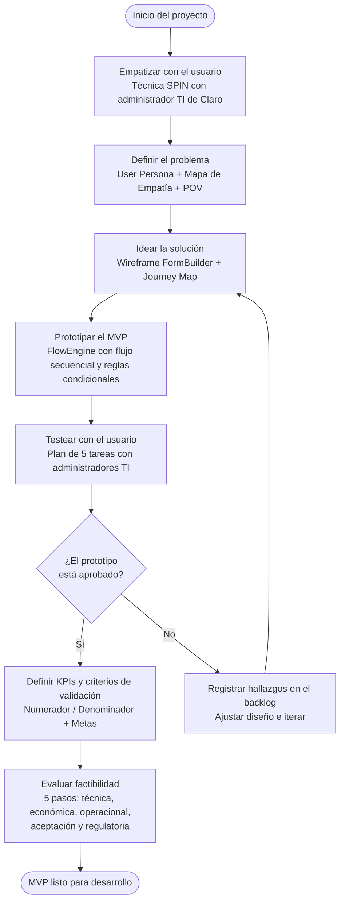

# Capítulo II: Inicio

## 2.1 Design Thinking

El equipo de Flowtex aplicó las cinco fases del Design Thinking para comprender el problema real de los administradores de TI de Claro Perú antes de proponer cualquier solución técnica.

### Fase 1: Empatizar

Se utilizó la técnica SPIN para entrevistar al Administrador de TI de Claro Perú, con el objetivo de diagnosticar el problema desde la perspectiva del usuario real.

| Tipo de pregunta SPIN | Pregunta realizada | Insight obtenido |
|---|---|---|
| S (Situación) | ¿Cuántas solicitudes de nuevos formularios o cambios recibe usted por semana? | Entre 2 y 3 solicitudes semanales de distintas áreas de la organización |
| P (Problema) | ¿Cuánto tiempo tarda actualmente en implementar un cambio en NINTEX? | Entre 3 y 6 semanas por cada modificación, incluyendo la gestión con el proveedor externo |
| I (Implicancia) | ¿Qué consecuencias genera esa demora en las áreas que solicitan los cambios? | Áreas como RRHH y Legal bloquean aprobaciones durante días, afectando procesos críticos de la empresa |
| N (Necesidad) | ¿Qué necesitaría para resolver este problema de forma sostenible? | Autonomía para crear o modificar formularios en días, sin depender de licencias ni tiempos de respuesta externos |

### Fase 2: Definir

A partir de las entrevistas se construyó el perfil del User Persona principal.

**User Persona: Ricardo Alvarado**
Ricardo Alvarado tiene 34 años y se desempeña como Coordinador de Plataformas TI en Claro Perú, Lima.
Sus objetivos son alcanzar autonomía operativa, garantizar trazabilidad completa de los procesos y eliminar la dependencia de proveedores externos.
Sus principales frustraciones son los tiempos de espera de 3 a 6 semanas con NINTEX, la ausencia de rollback en formularios, y el hecho de que los datos se alojan en infraestructura externa a Claro.

**Mapa de Empatía:** El mapa de empatía organiza la comprensión del usuario en seis cuadrantes, cada uno asociado a una pregunta: ¿Qué piensa y siente?, ¿Qué oye?, ¿Qué ve?, ¿Qué dice y hace?, ¿cuáles son sus esfuerzos o dolores? y ¿cuáles son sus resultados o beneficios esperados?
Aplicado a Ricardo, el mapa arroja los siguientes hallazgos.

| Cuadrante | Hallazgo sobre Ricardo |
|---|---|
| ¿Qué piensa y siente? | Cree que debería existir una solución más ágil dentro de la empresa y siente la presión de retrasos que no puede controlar. |
| ¿Qué oye? | Escucha de las áreas internas (RRHH, Legal) quejas por los tiempos de espera y comentarios sobre la lentitud del proceso actual. |
| ¿Qué ve? | Observa que cada solicitud depende del proveedor NINTEX y que no dispone de trazabilidad ni de rollback de formularios. |
| ¿Qué dice y hace? | Escala solicitudes manualmente y explica a las áreas que el retraso proviene de la dependencia externa. |
| Esfuerzos o dolores | Tiempos de espera de 3 a 6 semanas, ausencia de rollback y datos alojados fuera del control de Claro. |
| Resultados o beneficios | Autonomía para crear formularios en días, trazabilidad completa y eliminación de la dependencia de proveedores externos. |

**Point of View (POV):** Ricardo necesita autonomía para crear formularios y flujos de aprobación sin depender de NINTEX, porque cada semana de espera le cuesta credibilidad ante las áreas internas de la organización.

### Fase 3: Idear

El equipo generó ideas a partir del pain point central identificado en la Fase 2.

**Técnicas de ideación empleadas:** Para maximizar el número de ideas antes de converger, el equipo aplicó tres dinámicas en secuencia, seguidas de una votación para priorizar.
Cada técnica se corresponde con una fase del modelo de Tuckman según el grado de madurez del equipo.

| Técnica | En qué consiste | Fase de Tuckman asociada |
|---|---|---|
| Escribir en silencio (brainwriting) | Cada integrante escribe sus ideas de forma individual y en silencio, sin discutirlas todavía, para evitar el sesgo de quien habla primero y lograr que todos aporten por igual. | Forming: el equipo recién se conoce y la escritura individual reduce la inhibición inicial. |
| Round robin | Cada integrante expone sus ideas por turnos, una a la vez, rotando la palabra, de modo que la participación sea equitativa y ordenada. | Norming: el turno rotativo refuerza las normas de participación equitativa ya acordadas. |
| Free for all | Discusión abierta y espontánea donde las ideas se construyen unas sobre otras sin turnos rígidos, aprovechando la confianza establecida. | Performing: el equipo, ya cohesionado, produce ideas de forma fluida y colaborativa. |

Tras la generación, el equipo prioriza las ideas mediante dot voting (votación por puntos): cada integrante distribuye un número fijo de votos entre las ideas propuestas y las más votadas pasan al backlog.
El Scrum Master (Omar) recibe y consolida todas las ideas, elimina duplicados y traslada las priorizadas al tablero para su posterior refinamiento con el Product Owner.

**Wireframe de FormBuilder:** Se diseñó un panel drag-and-drop con tipos de campo básicos (texto, número, fecha, lista desplegable, checkbox) y una barra lateral de propiedades por campo.

**Journey Map del administrador TI:**

| Etapa | Acción del usuario | Pensamiento | Punto de dolor |
|---|---|---|---|
| 1: Detecta la necesidad | Recibe solicitud de nueva área vía correo | "Otra semana de espera si lo proceso por NINTEX" | Falta de canal directo de solicitudes |
| 2: Diseña el formulario | Arrastra campos al canvas de FormBuilder | "Esto es mucho más rápido que lo anterior" | Sin vista previa en tiempo real |
| 3: Configura el flujo | Define los niveles de aprobación en FlowEngine | "¿Puedo poner reglas condicionales?" | La interfaz de reglas no es intuitiva aún |
| 4: Publica y monitorea | Activa el formulario y comparte el enlace | "¿Cómo sé si alguien ya lo completó?" | Sin dashboard de seguimiento en el MVP inicial |

### Fase 4: Prototipar

Se construyó un prototipo funcional del FlowEngine con un flujo de tres pasos y reglas condicionales.

**Flujo base del prototipo:**
Inicio → Aprobación TI → Completado

**Reglas condicionales definidas:**

| Condición | Acción del flujo |
|---|---|
| Si Prioridad = Urgente | Escalar directamente al Gerente TI (saltar aprobación intermedia) |
| Si Monto < S/. 5,000 | Flujo de un solo nivel de aprobación |

### Fase 5: Testear

Se ejecutó un plan de pruebas con cinco tareas sobre el prototipo.

| Tarea | Resultado | Observación |
|---|---|---|
| Crear formulario con 4 campos básicos | Aprobado | El usuario completó la tarea sin asistencia |
| Configurar validaciones de campo obligatorio | Aprobado | La interfaz fue considerada intuitiva |
| Ejecutar flujo secuencial de 2 niveles | Aprobado | El flujo se ejecutó correctamente en el prototipo |
| Aplicar regla condicional por prioridad | Por revisar | El usuario no encontró la opción de reglas en el menú |
| Realizar rollback de versión anterior de formulario | Falla | La función no estaba disponible en el prototipo; se agrega al backlog como mejora prioritaria |

**Plan de mejora:** La regla condicional será rediseñada con un asistente guiado paso a paso.
El rollback de formularios se incorpora como HU de alta prioridad en el Sprint 2.

---

## 2.2 Sustentación del Valor de la Propuesta y su Priorización

La propuesta de valor de Flowtex se sustenta en la resolución directa de los problemas que el equipo identificó durante la fase de empatía con los administradores de TI de Claro Perú.

| Problema actual (NINTEX) | Valor que entrega Flowtex | Prioridad |
|---|---|---|
| Creación de formularios toma entre 3 y 6 semanas | Creación en 2 días laborales (reducción superior al 90%) | Alta |
| Costo de licencias recurrentes sin control presupuestario | Reducción del costo anual de herramientas workflow en más del 60% | Alta |
| Sin versionamiento ni rollback de formularios | Versionamiento automático con rollback instantáneo | Alta |
| Escalamiento manual de aprobaciones vencidas | Escalamiento automático por SLA configurado | Alta |
| Datos alojados en infraestructura externa al grupo América Móvil | Soberanía total de datos en infraestructura propia de Claro | Media |
| Sin dashboards de gestión de procesos | Dashboards de adopción y métricas de flujo para el área TI | Media |

**Criterio de priorización:** Los valores se ordenaron por impacto directo en las operaciones del Área de Tecnología de Claro.
Las tres primeras propuestas de valor (velocidad de creación, reducción de costo y versionamiento con rollback) conforman el núcleo del MVP porque abordan los problemas más críticos y frecuentes del proceso actual.
Las propuestas de prioridad media se incluyen en iteraciones posteriores al MVP, una vez que las funcionalidades base estén validadas en producción.

---

## 2.3 Formación de Equipos y Check List de Verificación de Liderazgo

### Modelo de Tuckman aplicado al equipo Flowtex

El equipo de Hitss Perú transitó por las cuatro fases del modelo de desarrollo de equipos de Tuckman desde la sesión de kick-off hasta la ejecución del primer sprint.

| Fase Tuckman | Descripción aplicada a Flowtex | Acción del líder |
|---|---|---|
| Forming (Formación) | El equipo de Hitss se reúne, define roles y establece el objetivo del proyecto (reemplazar NINTEX en Claro Perú) | Omar (Scrum Master) facilita la sesión de kick-off y presenta el contexto del cliente Claro al equipo completo |
| Storming (Conflicto) | Surgen discusiones sobre el stack tecnológico y la arquitectura: ¿DDD monolítico versus microservicios? ¿React versus Vue? | Omar media el debate; el equipo vota la decisión y la documenta como ADR (Architecture Decision Record) |
| Norming (Normalización) | Se acuerda la arquitectura DDD + CQRS para el backend y arquitectura hexagonal para el frontend; el tablero Kanban se establece como herramienta de trabajo compartida | Christopher como Product Owner prioriza el backlog; el equipo adopta las convenciones de código y nomenclatura de ramas |
| Performing (Rendimiento, estado objetivo) | Meta hacia la que evoluciona el equipo: ritmo fluido con code reviews diarios, pipeline CI/CD funcionando, entregas cada dos semanas y autoorganización plena | Omar facilita las retrospectivas bisemanales; a medida que el equipo se empodera, la intervención del líder se reduce al soporte y a la remoción de impedimentos |

**Denominación en español del modelo (mapeo del curso SI570):** El curso mapea las cuatro fases de Tuckman a un vocabulario de liderazgo en español que describe qué hace el líder en cada etapa.

| Fase Tuckman | Denominación del curso | Qué hace el líder |
|---|---|---|
| Forming | Comprender el contexto | Explica el contexto del cliente Claro, presenta el problema de NINTEX y ayuda al equipo a entender el propósito. Dirige. |
| Storming | Capacitar | Media los conflictos técnicos, forma al equipo en las convenciones y decisiones (ADRs) y aclara los desacuerdos. Enseña. |
| Norming | Liberar de mando y control | Delega las decisiones al equipo, retira la supervisión directa y deja que las normas acordadas gobiernen el trabajo. Delega. |
| Performing | Empoderar | El equipo se autoorganiza; el líder solo remueve impedimentos y sostiene el ritmo. Acompaña. |

**Fase actual del equipo Flowtex:** El equipo de Hitss se encuentra en la fase Norming, denominada "Liberar de mando y control".
Las convenciones de código, el tablero Kanban con WIP limits y las cadencias ya están internalizadas, y el Scrum Master ha retirado la supervisión directa para dejar que el equipo se gobierne por las normas acordadas.
La señal que confirmó la entrada a "Liberar de mando y control" fue la primera Historia de Usuario completada sin bloqueadores ni intervención directiva (HU01, tipos de campo del FormBuilder), que evidenció que el equipo puede operar bajo sus propias normas sin mando y control constante.
La fase Performing ("Empoderar"), de autoorganización plena, se plantea como estado objetivo aún en consolidación.

### Check List de Verificación de Liderazgo Ágil

El Scrum Master verifica el siguiente check list al inicio de cada sprint para asegurar las condiciones mínimas de trabajo colaborativo del equipo Flowtex.

- [ ] El equipo tiene un objetivo claro y compartido para el sprint en curso
- [ ] Los roles y responsabilidades de cada miembro están definidos y documentados
- [ ] Existe un canal de comunicación directa con el cliente (Área de Tecnología de Claro Perú)
- [ ] El tablero Kanban es visible y actualizado para todos los miembros del equipo
- [ ] Las retrospectivas se realizan cada dos semanas al cierre de cada sprint
- [ ] El límite de trabajo en progreso (WIP limit) se respeta en todas las columnas del tablero
- [ ] Los impedimentos identificados se resuelven en menos de 24 horas desde su registro

---

## 2.4 Técnicas para Lograr Trabajo Colaborativo

El equipo de Flowtex adoptó un conjunto de técnicas colaborativas orientadas a mantener la cadencia de entrega y reducir los cuellos de botella de comunicación entre los perfiles técnicos del equipo.

| Técnica | Descripción | Aplicación en Flowtex |
|---|---|---|
| Lean Coffee | Reunión sin agenda fija donde el equipo vota los temas a discutir por orden de prioridad | Se utiliza en el daily standup de 15 minutos cuando se presentan múltiples bloqueadores simultáneos |
| Pair Programming | Dos desarrolladores trabajan de forma simultánea sobre el mismo fragmento de código | Se aplica en los componentes críticos: el editor drag-and-drop de FormBuilder y el motor de reglas de FlowEngine |
| Code Review cruzado | Revisión del código por un miembro de distinta especialidad funcional | Angello (frontend) revisa los contratos de API del backend desarrollados por Christopher y Jose para validar la compatibilidad de los modelos de datos |
| Teams Canvas | Lienzo visual que define quiénes somos, qué hacemos y cómo trabajamos | Elaborado en la sesión de kick-off; establece las normas de trabajo y los acuerdos del equipo de Hitss para la duración del proyecto |
| Mob Review | Revisión grupal de las historias de usuario completadas antes de marcarlas como "Hecho" | Se aplica en la review semanal de los viernes (1 hora) con participación del representante del Área de Tecnología de Claro |

---

## 2.5 Lean Startup y Lean Inception Aplicados al Proyecto

El equipo articuló ambos enfoques en un orden deliberado.
Primero aplicó Lean Startup para construir y validar el primer MVP con la menor inversión posible, sometiendo a prueba la hipótesis central del proyecto (¿pueden los administradores TI crear formularios de forma autónoma?).
Una vez obtenido ese aprendizaje, aplicó Lean Inception para alinear al equipo y al cliente en torno a la visión del producto y planificar la siguiente iteración con mayor alcance.
De este modo, Lean Startup gobierna el descubrimiento del primer incremento y Lean Inception estructura la evolución posterior del producto.

### Lean Startup: Ciclo Build-Measure-Learn

El equipo aplicó el ciclo Lean Startup para estructurar el desarrollo del MVP y reducir el riesgo de construir funcionalidades que no generen valor real al usuario.
El ciclo Build-Measure-Learn (Construir-Medir-Aprender) fue formulado por Eric Ries en su obra "The Lean Startup", y propone validar las hipótesis de negocio con el menor esfuerzo posible antes de comprometer recursos en la construcción completa del producto.

| Fase | Aplicación en Flowtex |
|---|---|
| Build (Construir) | Se construye el MVP: FormBuilder con 5 tipos de campo básico más FlowEngine con flujo secuencial de hasta 2 niveles de aprobación |
| Measure (Medir) | Se miden tres KPIs principales: tiempo de creación de formulario, tasa de aprobación dentro del SLA, y NPS inicial de los administradores TI de Claro |
| Learn (Aprender) | Se valida la hipótesis central del proyecto: ¿los administradores de TI pueden crear formularios funcionales en menos de 2 días sin capacitación previa? |

### Lean Inception: Visión del Producto

Lean Inception es un taller colaborativo de cinco días formulado por Paulo Caroli, orientado a alinear a un equipo en torno a la construcción del MVP correcto.
El taller recorre de forma canónica cinco pasos que van de lo general a lo concreto:

1. **Visión del producto:** se declara para quién es el producto, qué es y qué lo diferencia, apoyándose en el Product Vision Board como lienzo de visión.
2. **Personas:** se identifican los usuarios del producto y sus necesidades principales.
3. **Journey (viaje del usuario):** se mapea el recorrido de cada persona a través del producto.
4. **Características (features):** se derivan las funcionalidades necesarias para sostener ese recorrido.
5. **Secuenciador y MVP Canvas:** se ordenan las características en incrementos y se sintetiza el alcance mínimo en el MVP Canvas.

El primer día del taller incluye la actividad "El producto ES / NO ES / HACE / NO HACE", que delimita el alcance acotando de forma explícita lo que el producto es y lo que no es, y lo que hace y lo que no hace.
El quinto día cierra con un Showcase, en el que el equipo presenta a los interesados los resultados obtenidos durante el taller.
Las secciones siguientes muestran cómo Flowtex recorrió estos pasos.

**Declaración de visión de Flowtex:**
Para administradores de TI de Claro que necesitan gestionar formularios y flujos sin depender de NINTEX,
Flowtex es una plataforma web inhouse
que permite crear formularios dinámicos, configurar flujos de aprobación y migrar desde NINTEX de forma controlada.
A diferencia de NINTEX, Flowtex es autónomo, más rápido, con trazabilidad completa y sin costo de licencia externo.

### Personas identificadas en Lean Inception

| Persona | Descripción | Necesidad principal |
|---|---|---|
| Ricardo Alvarado | Coordinador de Plataformas TI, 34 años, Lima | Crear y publicar formularios en días, no en semanas, sin depender de proveedores |
| Sofía Torres | Solicitante del área de RRHH, 28 años | Enviar solicitudes fácilmente y conocer en qué paso del flujo se encuentra su pedido |
| Ana Quispe | Gerente de Operaciones (aprobadora), 42 años | Recibir notificaciones puntuales y aprobar solicitudes directamente desde Microsoft Teams |

### Secuencia del MVP (Lean Inception)

| Secuencia | Funcionalidades | Descripción |
|---|---|---|
| 1: FormBuilder básico | HU01, HU02, HU04, HU05 | El administrador crea formularios; el solicitante los completa y el sistema genera un número de ticket |
| 2: FlowEngine básico | HU06, HU09, HU11, HU12 | Aprobación secuencial con notificaciones por correo y seguimiento por número de ticket |
| 3: Extensión del FlowEngine | HU03, HU07, HU10, HU08 | Validaciones avanzadas, aprobación por mayoría, escalamiento automático y delegación |
| 4: MigraFlow | HU13 | Migración paralela y controlada desde NINTEX hacia Flowtex |

---

## 2.6 MVP: Sustentación, Validación y Funcionalidades Fundamentales

### Funcionalidades incluidas en el MVP

**Módulo FormBuilder:**
El administrador puede crear formularios con 5 tipos de campo básico: texto libre, número, fecha, lista desplegable y checkbox.
La interfaz drag-and-drop permite reordenar campos sin escribir código.
El sistema genera automáticamente una nueva versión del formulario ante cada modificación publicada.
Al completar un formulario, el solicitante recibe un número de ticket único como referencia de seguimiento.

**Módulo FlowEngine:**
El administrador configura un flujo secuencial de hasta 2 niveles de aprobación para cada formulario.
El sistema envía notificaciones por correo electrónico a los aprobadores en menos de 1 minuto desde el envío de la solicitud.
Cada acción sobre una solicitud (envío, aprobación, rechazo, comentario) queda registrada de forma permanente en el historial.
El solicitante puede consultar el estado de su solicitud en cualquier momento mediante el número de ticket.

### Funcionalidades excluidas del MVP inicial

Las siguientes funcionalidades quedan fuera del MVP y serán desarrolladas en iteraciones posteriores:
delegación automática de aprobaciones, aprobación por mayoría configurable, escalamiento automático por vencimiento de SLA, pruebas paralelas de migración desde NINTEX, dashboards de reportería ejecutiva e integración con sistemas ERP legacy.

### Criterio de validación del MVP

El MVP se considera validado cuando el 80% de los administradores de TI de Claro Perú logran crear un formulario básico de 4 campos en menos de 30 minutos durante la primera sesión de prueba de usabilidad, sin haber recibido capacitación previa sobre la plataforma.

---

## 2.7 KPIs del Proyecto

Los indicadores clave de desempeño de Flowtex se definen con fórmulas explícitas de numerador y denominador para garantizar su medición objetiva desde el primer sprint de desarrollo.

| KPI | Fórmula (numerador / denominador) | Meta |
|---|---|---|
| Tasa de creación de formularios exitosa | Formularios publicados sin error / Total de solicitudes de nuevos formularios × 100 | ≥ 95% |
| Tiempo promedio de creación de formulario | Σ (Fecha de publicación − Fecha de solicitud) / Número de formularios creados | ≤ 2 días laborales |
| Tasa de aprobación dentro del SLA | Solicitudes aprobadas antes del vencimiento del SLA / Total de solicitudes enviadas × 100 | ≥ 90% |
| Tasa de migración exitosa desde NINTEX | Formularios migrados sin error / Total de formularios activos en NINTEX × 100 | 100% (con pruebas paralelas) |
| Reducción de costo de herramientas workflow | (Costo anual NINTEX − Costo anual Flowtex) / Costo anual NINTEX × 100 | ≥ 60% |
| Disponibilidad del sistema | Tiempo de operación efectiva / Tiempo total del período × 100 | ≥ 99.5% |

---

## 2.8 Pasos para Evaluar la Factibilidad del Método

El equipo definió cinco pasos mínimos para evaluar la factibilidad del proyecto antes de comprometer el desarrollo del MVP.

**Paso 1: Validación técnica**
Se verifica que el stack seleccionado (Java 21 + Spring Boot 3.3, React 18 + TypeScript, MySQL 8) puede soportar los requisitos no funcionales del sistema: 500 usuarios concurrentes, tiempo de respuesta inferior a 3 segundos para el 95% de las operaciones y disponibilidad igual o superior al 99.5%.
La validación se realiza mediante pruebas de carga con JMeter sobre el entorno de preproducción de Hitss.

**Paso 2: Validación económica**
Se compara el costo total de desarrollo y mantenimiento de Flowtex (equipo Hitss propio, sin licencias externas) con el costo anual de NINTEX más los servicios profesionales de personalización y soporte externo, proyectado a un horizonte de 3 años.
El resultado debe mostrar una reducción mínima del 60% para justificar la inversión inicial.

**Paso 3: Validación operacional**
Se confirma que el equipo de TI de Claro puede operar y mantener Flowtex de forma autónoma sin depender del equipo de Hitss para correcciones menores.
La validación se ejecuta mediante una sesión de capacitación de 4 horas seguida de una prueba de administración autónoma donde el equipo de Claro realiza tareas definidas de configuración y mantenimiento sin asistencia.

**Paso 4: Validación de aceptación de usuario**
Se ejecutan las pruebas de usabilidad del prototipo con al menos 3 administradores de TI de Claro (como se realizó en la Fase 5 del Design Thinking) y se mide el Net Promoter Score (NPS) inicial antes del inicio del desarrollo del MVP.
Un NPS igual o superior a 7 sobre 10 se considera una señal de aceptación suficiente para proceder.

**Paso 5: Validación regulatoria**
Se confirma con las áreas de Legal y Compliance de Claro Perú que la arquitectura de Flowtex cumple con los requisitos de soberanía de datos establecidos por OSIPTEL y las políticas internas de seguridad de América Móvil, incluyendo el tratamiento de datos sensibles capturados mediante formularios.
La validación concluye con la emisión de un documento de conformidad firmado por el área de Compliance antes del despliegue en producción.

---

## 2.9 Flujograma del Proceso de Inicio

El siguiente diagrama representa el proceso de inicio del proyecto Flowtex, desde la empatía con el usuario hasta la definición de los indicadores de seguimiento.

---

## 2.10 Tabla de Evaluación del Método

La siguiente tabla presenta cinco herramientas tomadas del sílabo del curso SI570, combinadas o reinterpretadas por el equipo de Flowtex para adaptarlas al contexto del proyecto, con su respaldo explícito en los valores y principios del Manifiesto Ágil.

| Herramienta/s tomadas del sílabo SI570 | Fusión / creación / combinación / interpretación | Respaldo en Valor o Principio del Manifiesto Ágil |
|---|---|---|
| Design Thinking (Empatizar) + SPIN | **EmpathySPIN**: técnica de empatía contextual que combina las cinco fases del Design Thinking con la estructura de preguntas SPIN para diagnosticar el problema real del usuario antes de proponer cualquier solución técnica | Principio 1: "Nuestra mayor prioridad es satisfacer al cliente mediante la entrega temprana y continua de software con valor", la empatía previa al diseño garantiza que el software construido resuelve el problema real y no una suposición del equipo |
| Lean Inception (Product Vision) + Business Model Canvas | **FlowVision**: lienzo de visión del producto que combina la declaración de visión de Lean Inception con los bloques del Business Model Canvas, orientado a proyectos de software interno de tipo B2B dentro de un corporativo | Valor 1: "Individuos e interacciones sobre procesos y herramientas", FlowVision prioriza entender al usuario y su contexto organizacional sobre documentar requerimientos formales en documentos extensos |
| MoSCoW + Impact Mapping | **ImpactPriority**: método de priorización que combina las categorías MoSCoW (Must, Should, Could, Won't) con el mapa de impacto para ordenar las historias de usuario según su contribución directa a los procesos críticos del negocio | Principio 10: "La simplicidad (el arte de maximizar el trabajo no hecho) es esencial", ImpactPriority elimina del backlog las funcionalidades que no contribuyen al valor central del producto en la iteración actual |
| Lean Startup (Build-Measure-Learn) + MVP | **LearnBuild**: ciclo iterativo donde el MVP se construye enfocado en las hipótesis de mayor riesgo del proyecto (¿puede el administrador crear formularios autónomamente?), se mide con KPIs con fórmulas explícitas y se aprende para ajustar la prioridad del backlog en el siguiente sprint | Principio 3: "Entregar software funcionando frecuentemente, en períodos de dos semanas a dos meses, con preferencia al período más corto", LearnBuild impone un ritmo de entrega medible y orientado al aprendizaje validado |
| Journey Map + KPI Formula (numerador / denominador) | **JourneyKPI**: métricas de validación derivadas directamente del journey del usuario, donde cada pain point identificado en el journey map se convierte en un KPI con fórmula medible de numerador y denominador, asegurando que las métricas reflejan la experiencia real del usuario y no indicadores técnicos desvinculados | Principio 7: "El software funcionando es la medida principal de progreso", los KPIs de JourneyKPI verifican que el software funciona para el usuario en su contexto real, no solo que compila y pasa las pruebas unitarias |
