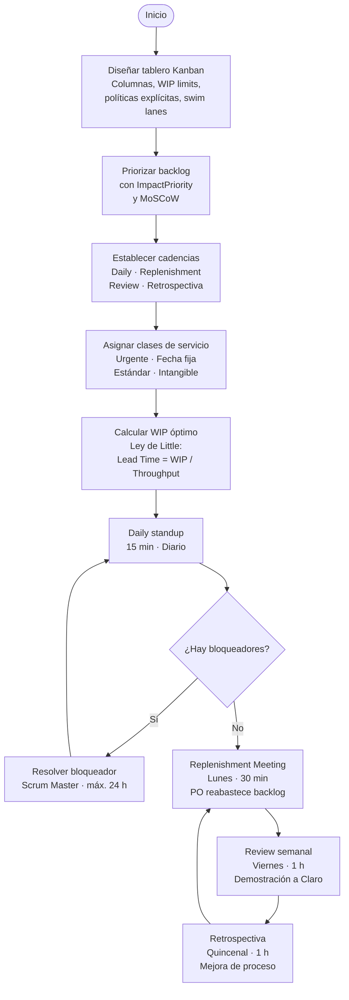

# Capítulo III: Planificación u organización

## 3.1 Consideraciones para la creación del tablero KANBAN

El tablero Kanban de Flowtex constituye el artefacto central del sistema de trabajo. Su diseño refleja la estructura de los tres módulos del producto (FormBuilder, FlowEngine y MigraFlow), cada uno representado por una swim lane independiente. Esta separación permite visualizar simultáneamente el estado de los tres flujos de valor sin mezclar tarjetas de naturaleza distinta.

El tablero se organiza en seis columnas que representan las etapas por las que transita cada historia de usuario (HU) desde su concepción hasta su entrega verificada. A continuación se describen el servicio o función de cada columna y los límites de trabajo en proceso (WIP limits) definidos:

| Columna | Servicio / función | WIP limit |
|---|---|---|
| Backlog | Repositorio de HUs priorizadas por MoSCoW; el PO reabastece en el Replenishment Meeting | Sin límite |
| Por Hacer | HUs seleccionadas para el período actual; listas para iniciar desarrollo | 5 |
| En Desarrollo | HU en construcción; una HU por desarrollador | 3 (por swim lane) |
| En Revisión | Code review obligatorio; el revisor dispone de máximo 4 horas | 2 |
| Testing | Pruebas de integración y criterios de aceptación; QA o el mismo desarrollador que no escribió el código | 2 |
| Hecho | HU verificada, desplegada en QA y validada por el PO | Sin límite |

### Políticas explícitas

El sistema de trabajo se sostiene sobre políticas explícitas que el equipo acepta y respeta:

- Una HU no puede pasar a "En Desarrollo" sin tener criterios de aceptación completos y verificables.
- Una HU no puede pasar a "Hecho" sin haber sido desplegada en el ambiente de QA y validada por el PO (Christopher).
- Si el WIP limit de "En Revisión" está lleno, el desarrollador que termina una HU debe realizar una revisión de código pendiente antes de iniciar una nueva HU.
- Los bloqueadores se marcan con una tarjeta de color rojo en el tablero; el Scrum Master (Omar) dispone de un máximo de 24 horas para resolverlos o escalarlos.

### Cadencias del equipo

| Cadencia | Día y frecuencia | Duración | Propósito |
|---|---|---|---|
| Daily standup | Todos los días | 15 minutos | Sincronización del equipo; asincrónico en Microsoft Teams cuando el trabajo es remoto |
| Replenishment Meeting | Lunes de cada semana | 30 minutos | El PO reabastece el backlog según el feedback del cliente Claro |
| Review semanal | Viernes de cada semana | 1 hora | Demostración de lo completado al representante del Área de Tecnología de Claro |
| Retrospectiva | Cada dos semanas | 1 hora | Reflexión sobre proceso, personas y producto; herramientas rotativas (4Ls, Roses/Thorns/Buds) |

---

## 3.2 Consideraciones para la tarjeta de trabajo (work item card) del tablero KANBAN

Cada tarjeta del tablero Kanban de Flowtex representa una unidad de trabajo (historia de usuario, bug, chore o spike) y contiene los campos necesarios para que cualquier integrante del equipo pueda comprender el trabajo sin necesidad de solicitar aclaraciones verbales. Los campos definidos son los siguientes:

| Campo | Descripción y formato |
|---|---|
| **ID** | Identificador único: HU01, HU02, ... / BUG-01, CHORE-01 |
| **Título** | Nombre corto y descriptivo de la historia o tarea |
| **Épica** | Referencia a la épica padre: EP01 (FormBuilder), EP02 (FlowEngine), EP03 (MigraFlow) |
| **Tipo** | Feature / Bug / Chore / Spike |
| **Clase de servicio** | Urgente / Fecha fija / Estándar / Intangible |
| **Responsable** | Nombre del integrante asignado |
| **Fecha de inicio** | Fecha en que la tarjeta ingresa a "En Desarrollo" |
| **Fecha comprometida** | Fecha máxima de entrega acordada con el PO |
| **Descripción** | "Como [rol], quiero [funcionalidad] para [beneficio]" |
| **Criterios de aceptación** | Lista de verificación en formato Given-When-Then |
| **Estimación** | Puntos de historia: S = 1 / M = 3 / L = 5 / XL = 8 |
| **Bloqueado por** | ID de la dependencia o del bloqueador activo |
| **Comentarios** | Notas del code review, observaciones de testing o decisiones técnicas |

La clase de servicio es un campo crítico porque determina la prioridad dinámica de la tarjeta dentro del flujo. Una HU clasificada como "Urgente" puede adelantar a tarjetas "Estándar" que llevan más tiempo en el backlog, sin necesidad de replanificar todo el tablero. Esta política es coherente con el principio de gestión de políticas explícitas del método Kanban.

---

## 3.3 KPIs que serán gestionados

Los indicadores clave de rendimiento (KPIs) del tablero Kanban de Flowtex permiten al equipo y al cliente Claro evaluar objetivamente el desempeño del flujo de entrega. Cada KPI tiene una fórmula de cálculo, una frecuencia de medición y una meta cuantificada que orienta las decisiones de mejora.

| KPI | Fórmula | Frecuencia de medición | Meta |
|---|---|---|---|
| Lead Time | Fecha de Done − Fecha de inicio en Backlog | Por HU completada | ≤ 5 días (Feature estándar) |
| Cycle Time | Fecha de Done − Fecha de entrada a "En Desarrollo" | Por HU completada | ≤ 3 días |
| Throughput semanal | HUs completadas (en Hecho) / semana | Semanal | ≥ 3 HUs/semana |
| WIP actual | Σ tarjetas en En Desarrollo + En Revisión + Testing | Diario | ≤ 7 (suma de columnas) |
| Tasa de re-trabajo | HUs devueltas de Testing / Total HUs completadas × 100 | Semanal | ≤ 10% |
| Tasa de bloqueo | Tarjetas bloqueadas > 24h / Total tarjetas activas × 100 | Diario | ≤ 5% |

**Justificación de los KPIs seleccionados:**

- **Lead Time y Cycle Time**: son las métricas fundamentales del método Kanban. El Lead Time refleja la experiencia del cliente Claro (cuánto tiempo desde que solicita una funcionalidad hasta que la recibe), mientras que el Cycle Time refleja la eficiencia interna del equipo de Hitss.
- **Throughput semanal**: permite predecir cuándo se completará el backlog total (13 HUs + emergentes) usando la Ley de Little. Con un throughput de 3 HUs/semana, el backlog base se completa en aproximadamente 5 semanas.
- **WIP actual**: monitoreo diario del trabajo en proceso para detectar acumulaciones antes de que se conviertan en cuellos de botella.
- **Tasa de re-trabajo**: indica la calidad del proceso de desarrollo y la claridad de los criterios de aceptación. Una tasa superior al 10% sugiere problemas en la definición de HUs o en los criterios de aceptación.
- **Tasa de bloqueo**: mide la capacidad del equipo para resolver impedimentos. Una tasa superior al 5% indica que los bloqueadores sistemáticos requieren una acción estructural, no solo resolución individual.

---

## 3.4 Tabla resumen de pasos para la evaluación del método en planificación

La evaluación del método FlowAgile durante la fase de planificación se realiza a través de reuniones regulares de seguimiento, cada una con un propósito específico, participantes definidos y criterios de evaluación claros.

| Paso | Reunión / Actividad | Frecuencia | Duración | Participantes | Qué se evalúa |
|---|---|---|---|---|---|
| 1 | Daily standup | Diaria | 15 min | Todo el equipo Hitss | Avance individual, bloqueadores activos, WIP actual por swim lane |
| 2 | Replenishment Meeting | Lunes semanal | 30 min | PO + equipo | Prioridad del backlog, clases de servicio, capacidad disponible de la semana |
| 3 | Review semanal | Viernes semanal | 1 hora | Equipo + representante Claro | HUs completadas y demostradas, feedback del cliente, ajuste de requisitos |
| 4 | Retrospectiva | Quincenal | 1 hora | Todo el equipo Hitss | Proceso, personas y producto; acciones de mejora concretas y medibles |
| 5 | Replenishment estratégico | Mensual | 2 horas | PO + Scrum Master + Claro | Ajuste de prioridades por épica según avance de la migración de NINTEX |

Cada reunión genera al menos un artefacto: el Daily actualiza el tablero Kanban; el Replenishment Meeting actualiza el orden del backlog; la Review produce un registro de feedback del cliente; la Retrospectiva genera un plan de acción con responsable y fecha; el Replenishment estratégico actualiza la hoja de ruta de las tres épicas.

---

## 3.5 Pasos principales para una planificación ágil según la solución propuesta

La planificación ágil en Flowtex sigue una secuencia de cinco pasos que van desde el diseño del sistema de trabajo hasta la calibración continua del flujo. Estos pasos no son lineales: el paso 5 retroalimenta permanentemente al paso 1.

1. **Diseñar el sistema de trabajo**: definir las columnas del tablero Kanban, los WIP limits por columna y swim lane, las políticas explícitas de transición y los criterios de la Definition of Done. El tablero se diseña colectivamente en la sesión de kick-off con la participación de todo el equipo de Hitss.

2. **Construir y priorizar el backlog**: aplicar MoSCoW e ImpactPriority (herramienta propia del método FlowAgile) para ordenar las historias de usuario por valor de negocio e impacto en la operación del cliente Claro. El resultado es un backlog con prioridades explícitas y visibles para todo el equipo.

3. **Establecer cadencias**: fijar el calendario permanente de Daily standup, Replenishment Meeting, Review semanal y Retrospectiva antes de iniciar el primer ciclo de desarrollo. Las cadencias no se negocian semana a semana; son compromisos del equipo.

4. **Asignar clases de servicio**: clasificar cada HU del backlog como Urgente, Fecha fija, Estándar o Intangible, de modo que el equipo pueda gestionar cambios de prioridad sin necesidad de replanificar completamente el tablero.

5. **Establecer el WIP óptimo**: calcular el número máximo de tarjetas activas por columna según la capacidad real del equipo (5 personas), utilizando la Ley de Little como referencia:

   > **Lead Time = WIP / Throughput**

   Con un throughput objetivo de 3 HUs/semana y un Lead Time aceptable de 5 días hábiles (1 semana), el WIP óptimo del sistema completo es de 3 tarjetas activas en el flujo central (En Desarrollo + En Revisión + Testing), lo que justifica los WIP limits definidos en el tablero.

---

## 3.6 Flujograma de planificación

El siguiente diagrama representa el flujo de planificación de Flowtex, mostrando el ciclo continuo de cadencias y la gestión de bloqueadores.

---

## 3.7 Tabla de pasos del método — fase de planificación

La siguiente tabla describe los dos componentes del método FlowAgile desarrollados durante la fase de planificación, su origen en las herramientas del sílabo del curso SI570 y el respaldo en los valores y principios del Manifiesto Ágil.

| Herramienta/s del sílabo SI570 | Fusión / creación / combinación | Respaldo en Valor o Principio del Manifiesto Ágil |
|---|---|---|
| STATIK (System Thinking Approach to Introducing Kanban) + Kanban | **FlowPlan**: diseño del sistema de trabajo comenzando desde el contexto externo (demanda del cliente Claro, tres módulos diferenciados) hacia la capacidad interna (cinco personas, WIP limits), con swim lanes que representan los tres servicios de Flowtex (FormBuilder, FlowEngine, MigraFlow). FlowPlan garantiza que el tablero no es una plantilla genérica, sino un sistema diseñado para la demanda real del proyecto. | Valor 3: "Colaboración con el cliente sobre negociación contractual". FlowPlan incorpora las necesidades del Área de Tecnología de Claro directamente en el diseño del tablero, haciendo visible la demanda del cliente desde el primer día del proyecto. |
| MoSCoW + Kanban Classes of Service (clases de servicio) | **PriorityFlow**: priorización dinámica del backlog que combina la categorización MoSCoW (Must/Should/Could/Won't) con las clases de servicio de Kanban (Urgente / Fecha fija / Estándar / Intangible) para gestionar cambios de prioridad sin necesidad de replanificar completamente el tablero. PriorityFlow permite al PO Christopher responder a solicitudes urgentes del cliente Claro sin desestabilizar el flujo en curso. | Principio 1: "Nuestra mayor prioridad es satisfacer al cliente mediante la entrega temprana y continua de software con valor". PriorityFlow garantiza que las historias de usuario de mayor impacto para la operación de Claro siempre se encuentran en el tope del flujo, maximizando el valor entregado en cada ciclo. |
