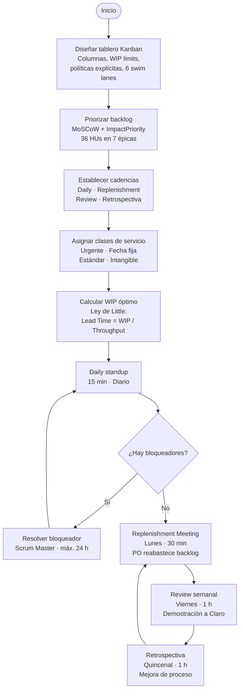

# Capítulo III: Planificación u organización

> **Nota de alcance.** Este capítulo opera el backlog corregido del MVP académico, decidido en planning del 2026-05-09 a partir de los repos `flowtex-web-app` y `flowtex-web-service`. El backlog original del cap. I, sección 1.6 se conserva como visión histórica del producto; el backlog operativo de los sprints es el de la sección 3.0 de este capítulo. Las decisiones de alcance que motivaron la corrección están documentadas en `docs/adr/0007-descope-migraflow-mvp.md`, `0008-sin-acceso-tenant-nintex.md`, `0009-notificaciones-email-only-mvp.md` y `0010-escalamiento-y-delegacion-sobre-iam.md`.

---

## 3.0 Backlog corregido del MVP

### 3.0.1 Bounded contexts del producto

El backend está organizado en cuatro bounded contexts implementados (`IAM`, `FormBuilder`, `Workflow`, `Tracking`) y dos bounded contexts nuevos en construcción que se apalancan sobre los datos ya existentes (`Notifications`, `Reporting`). El frontend espeja los cuatro implementados en módulos paralelos. Cada épica del backlog corresponde a un bounded context.

| Épica | Bounded context | Propósito | Trazabilidad principal |
|---|---|---|---|
| EP01 | IAM | Identidad, autenticación, autorización, jerarquía Claro (área, cargo, código de empleado) | `flowtex-web-service/.../IAM/`, `flowtex-web-app/src/iam/` |
| EP02 | FormBuilder | Diseño visual de formularios, tipos de campo, validaciones, versiones, vinculación con flujos | `flowtex-web-service/.../FormBuilder/`, `flowtex-web-app/src/form-builder/` |
| EP03 | Workflow | Diseño visual de flujos de aprobación: pasos, aprobadores, transiciones, condiciones | `flowtex-web-service/.../Workflow/`, `flowtex-web-app/src/workflow/` |
| EP04 | Tracking | Ejecución de solicitudes: ticket, decisión, devolución, cancelación, timeline auditado | `flowtex-web-service/.../Tracking/`, `flowtex-web-app/src/tracking/` |
| EP05 | Notifications | Envío de notificaciones por email a aprobadores y solicitantes (sin Teams, ver ADR-0009) | a construir en `flowtex-web-service/.../Notifications/` |
| EP06 | Reporting | Reportes de auditoría y KPIs sobre la base de submissions y eventos | a construir en `flowtex-web-service/.../Reporting/` |
| EP07 | Operación (transversal) | Delegación temporal y escalamiento por jerarquía IAM (ver ADR-0010) | extiende `Tracking/.../WorkflowEngine.resolveApprover` |

El módulo MigraFlow del cap. I queda fuera del alcance del MVP académico (ver ADR-0007 + ADR-0008).

### 3.0.2 Historias de Usuario

#### EP01: IAM (Identidad y acceso)

---

##### HU-IAM-01: Registro con código de empleado Claro

> **Como** colaborador de Claro Perú,
> **quiero** registrarme en FLOWTEX usando mi código de empleado, mi cargo y mi área,
> **para** que el sistema me reconozca con la jerarquía con la que opero en el resto de la empresa.

**Trazabilidad:** `flowtex-web-app/src/iam/interfaces/pages/SignUp.page.tsx`, `flowtex-web-service/.../IAM/Interfaces/REST/Controllers/AuthenticationController.java`, `IAM/Domain/Model/ValueObjects/Area.java`, `Position.java`.

**Criterios de aceptación:**

- **Escenario 1: Registro exitoso con código C##### válido**
  - **Dado** que un colaborador accede a `/sign-up` y completa nombre completo, correo, código de empleado `C12345`, cargo "Analista" y área "Tecnología"
  - **Cuando** envía el formulario de registro
  - **Entonces** el sistema crea el usuario con rol `ROLE_USER` por defecto, lo redirige a `/dashboard` autenticado y emite un JWT que incluye su área y cargo

- **Escenario 2: Rechazo de código de empleado mal formado**
  - **Dado** que el colaborador ingresa un código que no respeta el patrón `C\d{5}` (por ejemplo `12345` o `CC123`)
  - **Cuando** intenta enviar el formulario
  - **Entonces** el sistema muestra el error "Código inválido: formato esperado C##### (cinco dígitos)" y bloquea el envío hasta que el campo se corrija

---

##### HU-IAM-02: Inicio de sesión con JWT

> **Como** colaborador registrado,
> **quiero** autenticarme con mi usuario y contraseña,
> **para** acceder a las funciones protegidas del sistema según mis roles.

**Trazabilidad:** `flowtex-web-app/src/iam/interfaces/pages/SignIn.page.tsx`, `iam/interfaces/stores/auth.store.ts`, `flowtex-web-service/.../IAM/Interfaces/REST/Controllers/AuthenticationController.java`.

**Criterios de aceptación:**

- **Escenario 1: Login exitoso almacena el token y enruta al dashboard**
  - **Dado** que un usuario existe en la base con credenciales `c.lecca / Hitss2026!`
  - **Cuando** ingresa esas credenciales en `/sign-in` y envía
  - **Entonces** el frontend almacena el JWT en `localStorage`, hidrata el `auth.store` con los datos del usuario (nombre, área, cargo, roles) y navega a `/dashboard`

- **Escenario 2: Credenciales inválidas devuelven 401**
  - **Dado** que el usuario ingresa una contraseña incorrecta
  - **Cuando** envía el formulario
  - **Entonces** el frontend muestra "Usuario o contraseña incorrectos" sin filtrar cuál de los dos está mal y permanece en `/sign-in`

---

##### HU-IAM-03: Perfil con cargo, área y código

> **Como** usuario autenticado,
> **quiero** que mi perfil exhiba mi nombre, cargo, especialidad, área y código de empleado,
> **para** que cualquier solicitud que envíe quede ligada a esa identidad sin que tenga que ingresarla manualmente.

**Trazabilidad:** `flowtex-web-app/src/iam/domain/models/User.ts` (`formattedPosition()`), `flowtex-web-app/src/shared/ui/components/AppShell.tsx`.

**Criterios de aceptación:**

- **Escenario 1: AppShell muestra los datos de perfil completos**
  - **Dado** un usuario con cargo "Analista", especialidad "de Sistemas" y área "Tecnología"
  - **Cuando** abre cualquier página autenticada
  - **Entonces** el header del shell muestra "Analista de Sistemas · Tecnología" y las iniciales de su nombre completo en el avatar

- **Escenario 2: Auto-fill de campos de formulario desde el perfil**
  - **Dado** un formulario con campos `AUTO_USER_NAME`, `AUTO_EMPLOYEE_CODE`, `AUTO_POSITION`, `AUTO_AREA`
  - **Cuando** el usuario abre la vista de llenado
  - **Entonces** los cuatro campos vienen pre-rellenados con los datos de su perfil y son de sólo lectura

---

##### HU-IAM-04: Asignación de roles por administrador

> **Como** administrador,
> **quiero** asignar los roles `ROLE_ADMIN`, `ROLE_DESIGNER`, `ROLE_APPROVER` o `ROLE_USER` a otros colaboradores,
> **para** que la responsabilidad de diseñar formularios, aprobar solicitudes y administrar el sistema quede delegada según el cargo real.

**Trazabilidad:** `flowtex-web-app/src/iam/interfaces/pages/UsersList.page.tsx`, `flowtex-web-service/.../IAM/Interfaces/REST/Controllers/UsersController.java` (`PUT /api/v1/users/{id}/roles`), `IAM/Domain/Model/Commands/UpdateUserRolesCommand.java`.

**Criterios de aceptación:**

- **Escenario 1: Administrador agrega rol APPROVER a un analista**
  - **Dado** un usuario con rol `ROLE_USER` y un administrador autenticado en `/users`
  - **Cuando** el administrador edita la fila del usuario, marca el checkbox `ROLE_APPROVER` y guarda
  - **Entonces** el backend devuelve 200 con la lista actualizada de roles, la fila se re-renderiza con el nuevo rol y el usuario afectado, en su próximo login, puede ver la bandeja "asignadas a mí"

- **Escenario 2: No-admin no puede modificar roles**
  - **Dado** un usuario con rol `ROLE_DESIGNER` autenticado
  - **Cuando** intenta navegar a `/users`
  - **Entonces** la `AuthGuard` lo redirige a `/dashboard` y la API devuelve 403 si fuerza la llamada

---

##### HU-IAM-05: Bandeja de usuarios filtrable

> **Como** administrador,
> **quiero** ver el listado de todos los usuarios con filtros por área y cargo,
> **para** identificar rápidamente quién puede ser aprobador en un nuevo flujo o quién requiere ajuste de roles.

**Trazabilidad:** `flowtex-web-app/src/iam/interfaces/pages/UsersList.page.tsx`, `iam/interfaces/stores/users.store.ts`, `flowtex-web-service/.../IAM/Interfaces/REST/Controllers/UsersController.java` (`GET /api/v1/users`).

**Criterios de aceptación:**

- **Escenario 1: Filtro por área "Tecnología" reduce la lista**
  - **Dado** una base con 25 usuarios distribuidos en 11 áreas
  - **Cuando** el administrador selecciona el filtro de área "Tecnología"
  - **Entonces** la tabla muestra sólo los usuarios cuyo área es `TECNOLOGIA`, con sus cargos formateados y sus roles actuales

- **Escenario 2: Filtro combinado área + cargo**
  - **Dado** los filtros de área "Tecnología" y cargo "Jefe"
  - **Cuando** ambos están activos simultáneamente
  - **Entonces** la tabla muestra sólo los usuarios cuyo área es `TECNOLOGIA` Y cuyo cargo es `JEFE`, indicando además si tienen rol `ROLE_APPROVER` para que el admin sepa si están listos para aparecer en flujos

---

#### EP02: FormBuilder (Diseño de formularios)

---

##### HU-FB-01: Tipos de campo configurables

> **Como** diseñador de formularios,
> **quiero** elegir entre 24 tipos de campo (texto, número, fecha, archivo, firma, lista, radio, casilla, sección, encabezado, auto-fill, etc.),
> **para** capturar exactamente los datos que cada proceso del cliente requiere.

**Trazabilidad:** `flowtex-web-app/src/form-builder/interfaces/components/FieldPalette.tsx`, `FieldRender.tsx`, `flowtex-web-service/.../FormBuilder/Domain/Model/ValueObjects/FieldType.java` (24 valores).

**Criterios de aceptación:**

- **Escenario 1: Arrastrar campo "Fecha" lo agrega al canvas**
  - **Dado** el diseñador en `/forms/new` con la paleta de campos a la izquierda
  - **Cuando** arrastra el ítem "Fecha" al canvas central
  - **Entonces** el canvas muestra un nuevo campo de tipo `DATE` con label por defecto "Fecha", el inspector de la derecha muestra sus propiedades (obligatorio, rango mín/máx) y el campo aparece en la previsualización con un selector de calendario

- **Escenario 2: Campo de tipo "Firma" se renderiza como canvas de dibujo**
  - **Dado** un formulario con un campo `SIGNATURE` agregado
  - **Cuando** el usuario final abre la vista de llenado
  - **Entonces** el campo se renderiza como un área de firma manuscrita con botón "Limpiar" y el valor capturado se persiste como dataURL en el JSON de la submission

---

##### HU-FB-02: Editor drag-and-drop con grid

> **Como** diseñador de formularios,
> **quiero** posicionar los campos en un canvas con grid (X/Y),
> **para** componer formularios visualmente sin escribir código ni configurar layouts manualmente.

**Trazabilidad:** `flowtex-web-app/src/form-builder/interfaces/pages/FormBuilder.page.tsx`, `flowtex-web-service/.../FormBuilder/Domain/Model/Entities/FormField.java` (campos `gridX`, `gridY`, migración V9).

**Criterios de aceptación:**

- **Escenario 1: Reordenar campos por arrastre persiste el orden al publicar**
  - **Dado** un formulario en edición con cinco campos posicionados verticalmente
  - **Cuando** el diseñador arrastra el tercer campo a la primera fila del grid y guarda
  - **Entonces** el backend persiste los nuevos `gridX/gridY` y el formulario, al re-abrirse, muestra los campos en el nuevo orden

- **Escenario 2: Eliminar un campo desde el inspector**
  - **Dado** un campo seleccionado en el canvas
  - **Cuando** el diseñador hace clic en "Eliminar campo" en el inspector
  - **Entonces** el campo desaparece del canvas, los campos siguientes se recompactan y la previsualización se re-renderiza sin el campo eliminado

---

##### HU-FB-03: Validaciones por campo

> **Como** diseñador de formularios,
> **quiero** declarar reglas de validación por campo (obligatoriedad, longitud mínima/máxima, expresión regular, formato de correo),
> **para** que las solicitudes lleguen con datos íntegros al flujo de aprobación.

**Trazabilidad:** `flowtex-web-app/src/form-builder/interfaces/components/Inspector.tsx`, `tracking/interfaces/components/FormFiller.tsx` (validación al envío).

**Criterios de aceptación:**

- **Escenario 1: Campo obligatorio bloquea el envío**
  - **Dado** un formulario con un campo de texto marcado como obligatorio
  - **Cuando** el usuario final intenta enviar la solicitud sin completarlo
  - **Entonces** el sistema muestra el mensaje "Este campo es obligatorio" debajo del campo, el cursor se posiciona en él y la submission no se envía al backend

- **Escenario 2: Validación de formato de correo electrónico**
  - **Dado** un campo de tipo `EMAIL` configurado con validación de formato
  - **Cuando** el usuario ingresa `usuario@dominio` (sin TLD)
  - **Entonces** se muestra "Ingrese una dirección de correo válida" y el botón Enviar permanece deshabilitado mientras el valor no respete el patrón `[^@\s]+@[^@\s]+\.[^@\s]+`

---

##### HU-FB-04: Auto-fill desde perfil del solicitante

> **Como** diseñador de formularios,
> **quiero** colocar campos que se auto-rellenen con datos del usuario logueado (nombre, código de empleado, cargo, área),
> **para** que los procesos de aprobación tengan al solicitante identificado sin pedirle que retipee información que el sistema ya conoce.

**Trazabilidad:** `flowtex-web-service/.../FormBuilder/Domain/Model/ValueObjects/FieldType.java` (`AUTO_USER_NAME`, `AUTO_EMPLOYEE_CODE`, `AUTO_POSITION`, `AUTO_AREA`), `flowtex-web-app/src/form-builder/interfaces/components/FieldRender.tsx`.

**Criterios de aceptación:**

- **Escenario 1: Auto-fill se completa al abrir la vista de llenado**
  - **Dado** un formulario que incluye los cuatro tipos auto y un usuario logueado con cargo "Jefe", área "Finanzas", nombre "María Pérez", código `C20034`
  - **Cuando** el usuario abre `/forms/{id}/fill`
  - **Entonces** los campos auto se renderizan ya completos con esos cuatro valores y son de sólo lectura

- **Escenario 2: Auto-fill se persiste con la submission incluso si el perfil cambia**
  - **Dado** una submission enviada el día 1 con cargo "Analista"
  - **Cuando** el día 5 el usuario cambia de cargo a "Jefe" y se consulta la submission histórica
  - **Entonces** la submission muestra el snapshot con cargo "Analista" (el que tenía al envío), no el cargo actual

---

##### HU-FB-05: Sugerencias de campos por IA

> **Como** diseñador de formularios,
> **quiero** describir el propósito del formulario en lenguaje natural y recibir sugerencias de campos relevantes,
> **para** acelerar el diseño inicial cuando construyo un formulario nuevo desde cero.

**Trazabilidad:** `flowtex-web-app/src/form-builder/interfaces/components/AiSuggestionPanel.tsx`, `flowtex-web-service/.../FormBuilder/Interfaces/REST/Controllers/FieldSuggestionsController.java` (`POST /api/v1/forms/suggestions/fields`).

**Criterios de aceptación:**

- **Escenario 1: Sugerencias relevantes para "Solicitud de viaje al interior"**
  - **Dado** el panel de sugerencias abierto y un formulario nuevo titulado "Solicitud de viaje al interior"
  - **Cuando** el diseñador ingresa el contexto "Para colaboradores de Claro que necesitan viajar a regiones por motivos laborales" y solicita sugerencias
  - **Entonces** el panel muestra al menos 5 sugerencias coherentes (Destino, Fecha de salida, Fecha de retorno, Motivo, Centro de costos), cada una con tipo recomendado (`SELECT`, `DATE`, `DATE`, `TEXTAREA`, `TEXT`) y una justificación corta

- **Escenario 2: Aceptar una sugerencia la agrega al canvas**
  - **Dado** una sugerencia de campo "Fecha de salida" tipo `DATE` en el panel
  - **Cuando** el diseñador hace clic en "Agregar"
  - **Entonces** el campo aparece al final del formulario en el canvas, con el label sugerido y el tipo correcto, y el inspector lo muestra disponible para edición fina

---

##### HU-FB-06: Versionamiento automático al publicar

> **Como** diseñador de formularios,
> **quiero** que cada publicación cree una versión nueva inmutable,
> **para** que las solicitudes en curso no se rompan cuando el formulario se modifica y los auditores puedan reconstruir qué versión vio cada solicitante.

**Trazabilidad:** `flowtex-web-service/.../FormBuilder/Domain/Model/Aggregates/Form.java`, `flowtex-web-service/.../Tracking/Domain/Model/Aggregates/Submission.java` (campos `formVersion`, `formSnapshot`).

**Criterios de aceptación:**

- **Escenario 1: Publicar incrementa el número de versión**
  - **Dado** un formulario en versión 1 publicado y con submissions activas
  - **Cuando** el diseñador modifica un campo y publica los cambios
  - **Entonces** el sistema crea la versión 2, las submissions previas conservan `formVersion=1` y `formSnapshot` con la estructura vieja, y los nuevos llenados ven la versión 2

- **Escenario 2: Una submission abierta sigue mostrando su versión original tras cambios al formulario**
  - **Dado** una submission `IN_PROGRESS` enviada en la versión 1 del formulario
  - **Cuando** el diseñador publica una versión 2 que elimina dos campos y agrega tres
  - **Entonces** el aprobador, al abrir la submission, ve los campos tal como existían en la versión 1 (los datos no se pierden ni se inventan campos vacíos)

---

##### HU-FB-07: Vincular formulario con un workflow

> **Como** diseñador de formularios,
> **quiero** ligar un formulario a un workflow específico,
> **para** que cada envío inicie automáticamente el flujo de aprobación que corresponde al proceso.

**Trazabilidad:** `flowtex-web-service/.../FormBuilder/Interfaces/REST/Controllers/FormsController.java` (`PUT /api/v1/forms/{id}/workflow`), `flowtex-web-app/src/form-builder/interfaces/pages/FormBuilder.page.tsx`.

**Criterios de aceptación:**

- **Escenario 1: Vincular workflow publicado**
  - **Dado** un formulario en borrador y un workflow publicado "Aprobación de viajes"
  - **Cuando** el diseñador abre el panel de vinculación y selecciona ese workflow
  - **Entonces** el formulario queda vinculado, al envío de una submission el `WorkflowEngine` arranca el flujo y la submission queda `IN_PROGRESS`

- **Escenario 2: Formulario sin workflow se aprueba al envío**
  - **Dado** un formulario publicado pero sin workflow vinculado
  - **Cuando** un solicitante lo envía
  - **Entonces** la submission queda en estado `APPROVED` inmediatamente, con un evento de auditoría `WORKFLOW_COMPLETED` que indica "sin flujo de aprobación: completada al envío"

---

#### EP03: Workflow (Diseño de flujos)

---

##### HU-WF-01: Editor visual de canvas

> **Como** diseñador de flujos,
> **quiero** componer un workflow arrastrando pasos en un canvas y conectándolos visualmente,
> **para** modelar procesos de aprobación sin escribir reglas en archivos de configuración.

**Trazabilidad:** `flowtex-web-app/src/workflow/interfaces/components/WorkflowCanvas.tsx`, `nodes/`, `flowtex-web-service/.../Workflow/Domain/Model/Entities/WorkflowStep.java` (campos `canvasX`, `canvasY`).

**Criterios de aceptación:**

- **Escenario 1: Crear un paso, posicionarlo y conectarlo a otro**
  - **Dado** el editor de workflow vacío
  - **Cuando** el diseñador agrega dos pasos "Revisión de Jefatura" y "Aprobación de Gerencia", los posiciona en el canvas y conecta el primero al segundo
  - **Entonces** el backend persiste los dos `WorkflowStep` con sus posiciones X/Y y una `WorkflowStepTransition` del primero al segundo

- **Escenario 2: Mover un paso actualiza sus coordenadas**
  - **Dado** un paso ya posicionado en (200, 150)
  - **Cuando** el diseñador lo arrastra a (450, 300) y guarda
  - **Entonces** el siguiente render del workflow muestra el paso en la nueva posición y la base lo refleja

---

##### HU-WF-02: Aprobadores por usuario, área+cargo o rol

> **Como** diseñador de flujos,
> **quiero** declarar el aprobador de un paso de tres formas distintas (un usuario nominal, una combinación de área y cargo, o un rol del sistema),
> **para** modelar tanto procesos donde el aprobador es siempre la misma persona como procesos donde la jerarquía de Claro decide quién aprueba.

**Trazabilidad:** `flowtex-web-app/src/workflow/interfaces/components/StepInspector.tsx`, `flowtex-web-service/.../Workflow/Domain/Model/Entities/WorkflowStepApprover.java`, `Workflow/Domain/Model/ValueObjects/ApproverKind.java` (`USER`, `AREA_POSITION`, `ROLE`).

**Criterios de aceptación:**

- **Escenario 1: Aprobador AREA_POSITION resuelve al usuario en momento de envío**
  - **Dado** un paso configurado como `AREA_POSITION` "Jefe de Tecnología"
  - **Cuando** un solicitante envía una submission que llega a ese paso
  - **Entonces** el `WorkflowEngine` busca al usuario activo con cargo "Jefe" y área "Tecnología" y le asigna el paso, dejando rastro en `SubmissionStepExecution.userId` y `assignmentKind=AREA_POSITION`

- **Escenario 2: Cambiar el usuario asignado a USER específico no afecta submissions en curso**
  - **Dado** una submission en curso asignada a un paso con aprobador `USER` Pedro
  - **Cuando** el diseñador edita el workflow y cambia el aprobador a María
  - **Entonces** la submission en curso sigue asignada a Pedro (porque trabaja sobre el snapshot del workflow al envío); las nuevas submissions van a María

---

##### HU-WF-03: Modo de paso secuencial / paralelo / mayoría

> **Como** diseñador de flujos,
> **quiero** elegir el modo de un paso entre secuencial (un aprobador a la vez), paralelo (todos a la vez) o mayoría (quorum),
> **para** modelar comités y validaciones simultáneas además de las cadenas tradicionales.

**Trazabilidad:** `flowtex-web-service/.../Workflow/Domain/Model/ValueObjects/StepMode.java` (`SEQUENTIAL`, `PARALLEL`, `MAJORITY`), `flowtex-web-app/src/workflow/interfaces/components/StepInspector.tsx`.

**Criterios de aceptación:**

- **Escenario 1: Paso secuencial con tres aprobadores**
  - **Dado** un paso `SEQUENTIAL` con aprobadores A, B y C
  - **Cuando** el solicitante envía y A aprueba
  - **Entonces** el sistema notifica al B; sólo cuando B aprueba notifica a C; la aprobación de C cierra el paso

- **Escenario 2: Paso por mayoría con quorum 3 de 5**
  - **Dado** un paso `MAJORITY` con cinco aprobadores y quorum 3
  - **Cuando** tres aprobadores votan a favor antes de que los otros dos respondan
  - **Entonces** el paso se cierra como aprobado y el flujo avanza, sin esperar a los dos restantes

---

##### HU-WF-04: Transiciones por decisión (aprobar/rechazar/devolver)

> **Como** diseñador de flujos,
> **quiero** que cada paso tenga transiciones distintas según la decisión del aprobador (aprobar, rechazar, devolver),
> **para** modelar caminos del tipo "si rechaza, va al paso de revisión final; si devuelve, vuelve al solicitante".

**Trazabilidad:** `flowtex-web-service/.../Workflow/Domain/Model/ValueObjects/TransitionCondition.java` (`ALWAYS`, `ON_APPROVE`, `ON_REJECT`, `ON_RETURN`, `CUSTOM`), `Workflow/Domain/Model/Entities/WorkflowStepTransition.java`, `Tracking/.../WorkflowEngine.pickTransition`.

**Criterios de aceptación:**

- **Escenario 1: Decisión REJECT toma la transición ON_REJECT**
  - **Dado** un paso con dos transiciones salientes: `ON_APPROVE → "Aprobación final"` y `ON_REJECT → "Revisión obligatoria"`
  - **Cuando** el aprobador rechaza el paso
  - **Entonces** el `WorkflowEngine` elige la transición `ON_REJECT`, asigna el siguiente paso "Revisión obligatoria" y registra evento `STEP_ASSIGNED` en el audit

- **Escenario 2: Sin transición que matchee, el flujo cierra con el resultado del paso**
  - **Dado** un paso final con sólo una transición `ON_APPROVE` y el aprobador rechaza
  - **Cuando** ninguna transición matchea
  - **Entonces** la submission cierra como `REJECTED` con evento `WORKFLOW_COMPLETED` "Solicitud rechazada, fin del flujo"

---

##### HU-WF-05: Constructor de condiciones personalizadas

> **Como** diseñador de flujos,
> **quiero** declarar transiciones que dependan del valor de un campo del formulario (campo + operador + valor),
> **para** modelar bifurcaciones del tipo "si el monto solicitado supera S/. 5000, requiere aprobación de Gerencia; si no, va directo a cierre".

**Trazabilidad:** `flowtex-web-app/src/workflow/interfaces/components/CustomConditionBuilder.tsx`, `flowtex-web-service/.../Tracking/.../WorkflowEngine.evaluateCustom` (operadores `EQUALS`, `NOT_EQUALS`, `CONTAINS`, `GT`, `LT`, `GTE`, `LTE`).

**Criterios de aceptación:**

- **Escenario 1: Condición `monto > 5000` enruta a paso de Gerencia**
  - **Dado** un paso con dos transiciones: `CUSTOM {field: "monto", operator: "GT", value: 5000} → "Gerencia"` y `ALWAYS → "Cierre"`
  - **Cuando** un solicitante envía una submission con `monto = 7800`
  - **Entonces** el `WorkflowEngine` evalúa la primera transición, matchea, y enruta al paso "Gerencia"

- **Escenario 2: Operador CONTAINS sobre un campo de texto**
  - **Dado** una transición `CUSTOM {field: "tipo_solicitud", operator: "CONTAINS", value: "urgente"}`
  - **Cuando** el solicitante envía con `tipo_solicitud = "Compra urgente de equipo"`
  - **Entonces** la transición matchea y el siguiente paso se asigna

---

##### HU-WF-06: Snapshot inmutable del workflow al envío

> **Como** diseñador de flujos,
> **quiero** que cada submission registre una copia del workflow en el momento del envío,
> **para** que cualquier edición posterior del workflow no afecte solicitudes ya en curso.

**Trazabilidad:** `flowtex-web-service/.../Tracking/Domain/Model/Aggregates/Submission.java` (`workflowSnapshot LONGTEXT`), `Tracking/.../WorkflowEngine.parseWorkflow`.

**Criterios de aceptación:**

- **Escenario 1: Edición posterior del workflow no cambia la submission abierta**
  - **Dado** una submission `IN_PROGRESS` enviada cuando el workflow tenía 3 pasos
  - **Cuando** el diseñador agrega un cuarto paso al workflow
  - **Entonces** la submission abierta sigue ejecutándose contra los 3 pasos originales (lee `workflowSnapshot`, no la tabla de pasos vigente)

- **Escenario 2: Aprobador específico borrado del sistema no rompe la submission**
  - **Dado** una submission asignada a un paso con aprobador `USER` Pedro y Pedro es desactivado del sistema
  - **Cuando** alguien abre la submission
  - **Entonces** el paso sigue mostrando "Asignado a Pedro" según el snapshot, y la HU-OP-03 (reasignación manual por admin) se vuelve la salida

---

#### EP04: Tracking (Ejecución y trazabilidad)

---

##### HU-TR-01: Envío de solicitud con ticket único

> **Como** colaborador de cualquier área,
> **quiero** llenar un formulario publicado y enviarlo como solicitud,
> **para** iniciar el proceso de aprobación correspondiente y recibir un código de ticket que pueda referenciar.

**Trazabilidad:** `flowtex-web-app/src/tracking/interfaces/pages/FillForm.page.tsx`, `tracking/interfaces/components/FormFiller.tsx`, `flowtex-web-service/.../Tracking/Interfaces/REST/Controllers/SubmissionsController.java` (`POST /api/v1/submissions`), `Tracking/Domain/Repositories/TicketSequenceRepository.java`.

**Criterios de aceptación:**

- **Escenario 1: Envío genera ticket FTX-AAAA-NNNNN**
  - **Dado** un formulario "Solicitud de viaje" publicado y vinculado a un workflow
  - **Cuando** el solicitante completa los campos obligatorios y envía
  - **Entonces** el backend persiste la submission, devuelve un ticket con formato `FTX-2026-00123` (año + secuencia anual de 5 dígitos), arranca el flujo y la submission queda en estado `IN_PROGRESS`

- **Escenario 2: Buscar por ticket recupera la submission**
  - **Dado** una submission con ticket `FTX-2026-00123`
  - **Cuando** un usuario consulta `/submissions?ticket=FTX-2026-00123` (o el endpoint `GET /api/v1/submissions/by-ticket/FTX-2026-00123`)
  - **Entonces** el sistema responde con el detalle completo: estado, paso actual, datos del formulario, timeline

---

##### HU-TR-02: Decisión sobre paso (aprobar/rechazar/devolver)

> **Como** aprobador asignado a un paso,
> **quiero** decidir aprobar, rechazar o devolver la solicitud con un comentario,
> **para** que el flujo avance, se cierre o regrese al solicitante para corrección.

**Trazabilidad:** `flowtex-web-app/src/tracking/interfaces/pages/SubmissionDetail.page.tsx`, `flowtex-web-service/.../Tracking/Interfaces/REST/Controllers/SubmissionsController.java` (`POST /{id}/steps/{execId}/decide`), `Tracking/Domain/Model/ValueObjects/Decision.java` (`APPROVE`, `REJECT`, `RETURN`).

**Criterios de aceptación:**

- **Escenario 1: Aprobar avanza al siguiente paso**
  - **Dado** una submission asignada al aprobador en el paso "Revisión Jefatura" con un siguiente paso "Aprobación Gerencia"
  - **Cuando** el aprobador escribe el comentario "Conforme con el monto" y elige Aprobar
  - **Entonces** el paso queda con `status=APPROVED`, el `WorkflowEngine` encola "Aprobación Gerencia" y registra dos eventos (`STEP_APPROVED`, `STEP_ASSIGNED`)

- **Escenario 2: Rechazar cierra la submission**
  - **Dado** una submission en el último paso del flujo
  - **Cuando** el aprobador rechaza con comentario "No se justifica el gasto"
  - **Entonces** la submission cierra como `REJECTED`, el solicitante puede ver el comentario en el detalle, y no se permiten más decisiones sobre la submission

---

##### HU-TR-03: Reenvío del solicitante tras devolución

> **Como** solicitante,
> **quiero** corregir mi solicitud cuando un aprobador la devuelve y reenviarla al flujo,
> **para** atender la observación sin abrir un ticket nuevo.

**Trazabilidad:** `flowtex-web-app/src/tracking/interfaces/pages/SubmissionDetail.page.tsx`, `flowtex-web-service/.../Tracking/Interfaces/REST/Controllers/SubmissionsController.java` (`PUT /{id}/data`, `POST /{id}/resubmit`).

**Criterios de aceptación:**

- **Escenario 1: Devolución habilita la edición de datos para el solicitante**
  - **Dado** una submission en estado `RETURNED` con el comentario "Falta el centro de costos"
  - **Cuando** el solicitante abre el detalle
  - **Entonces** los campos del formulario son editables (igual que en el llenado original) y aparece un botón "Reenviar"

- **Escenario 2: Reenvío reinicia el flujo desde el paso devuelto**
  - **Dado** el solicitante completa el centro de costos y envía
  - **Cuando** ejecuta "Reenviar"
  - **Entonces** la submission vuelve a estado `IN_PROGRESS`, el `WorkflowEngine` reasigna el paso al mismo aprobador que devolvió, registra evento `RESUBMITTED` y los datos quedan actualizados

---

##### HU-TR-04: Cancelación de solicitud por solicitante

> **Como** solicitante,
> **quiero** cancelar mi solicitud mientras el flujo no haya cerrado,
> **para** retirar peticiones que ya no apliquen sin esperar a que un aprobador las rechace.

**Trazabilidad:** `flowtex-web-service/.../Tracking/Interfaces/REST/Controllers/SubmissionsController.java` (`POST /{id}/cancel`), `Tracking/Domain/Model/ValueObjects/SubmissionStatus.java` (`CANCELED`).

**Criterios de aceptación:**

- **Escenario 1: Cancelar una submission abierta**
  - **Dado** una submission `IN_PROGRESS` del solicitante
  - **Cuando** abre el detalle y elige Cancelar
  - **Entonces** la submission pasa a `CANCELED`, registra evento `CANCELED`, y los aprobadores asignados ven el paso cerrado sin posibilidad de decidir

- **Escenario 2: No se puede cancelar una submission ya cerrada**
  - **Dado** una submission en `APPROVED` o `REJECTED`
  - **Cuando** el solicitante intenta cancelar
  - **Entonces** la API responde 409 con mensaje "La submission ya cerró", y el botón Cancelar no aparece en la UI

---

##### HU-TR-05: Bandeja "mis solicitudes"

> **Como** solicitante,
> **quiero** ver mis solicitudes activas e históricas con filtros por estado,
> **para** consultar el estado de mis peticiones sin tener que pedirle al área de TI que me lo informe.

**Trazabilidad:** `flowtex-web-app/src/tracking/interfaces/pages/SubmissionsList.page.tsx`, `flowtex-web-service/.../Tracking/Interfaces/REST/Controllers/SubmissionsController.java` (`GET /api/v1/submissions?scope=mine`).

**Criterios de aceptación:**

- **Escenario 1: Lista paginada con estado de cada solicitud**
  - **Dado** un solicitante con 12 solicitudes históricas
  - **Cuando** abre `/submissions?scope=mine`
  - **Entonces** el sistema muestra una tabla con ticket, formulario, fecha de envío, estado actual y enlace al detalle, ordenada por fecha descendente

- **Escenario 2: Filtro por estado IN_PROGRESS**
  - **Dado** la bandeja con solicitudes en varios estados
  - **Cuando** el solicitante activa el filtro "En curso"
  - **Entonces** sólo aparecen las solicitudes con estado `IN_PROGRESS` o `RETURNED`

---

##### HU-TR-06: Bandeja "asignadas a mí" para aprobadores

> **Como** aprobador,
> **quiero** ver todas las solicitudes pendientes de mi decisión en una bandeja única,
> **para** procesar mis pendientes sin tener que rastrear notificaciones por correo.

**Trazabilidad:** `flowtex-web-app/src/tracking/interfaces/pages/SubmissionsList.page.tsx` (modo `assigned`), `flowtex-web-service/.../Tracking/Interfaces/REST/Controllers/SubmissionsController.java` (`GET /api/v1/submissions?scope=assigned`).

**Criterios de aceptación:**

- **Escenario 1: Sólo aparecen submissions con paso activo asignado al usuario**
  - **Dado** un aprobador con tres submissions asignadas y una submission ya decidida
  - **Cuando** abre la bandeja "asignadas"
  - **Entonces** la lista muestra exactamente las tres pendientes, con ticket, formulario, solicitante, paso actual y antigüedad

- **Escenario 2: Una submission decidida desaparece de la bandeja**
  - **Dado** una de las tres pendientes recién aprobada por el usuario
  - **Cuando** el aprobador refresca la bandeja
  - **Entonces** la submission decidida ya no aparece, queda en historial pero no en pendientes

---

##### HU-TR-07: Timeline cronológico de eventos

> **Como** auditor o solicitante o aprobador,
> **quiero** ver una línea de tiempo cronológica de todos los eventos de una submission,
> **para** reconstruir qué pasó en cada paso, quién decidió, cuándo y con qué comentario.

**Trazabilidad:** `flowtex-web-app/src/tracking/interfaces/components/Timeline.tsx`, `flowtex-web-service/.../Tracking/Domain/Model/Entities/SubmissionAuditEvent.java`, `Tracking/Domain/Model/ValueObjects/AuditEventType.java`.

**Criterios de aceptación:**

- **Escenario 1: Timeline muestra eventos en orden cronológico**
  - **Dado** una submission con cinco eventos (`SUBMITTED`, `STEP_ASSIGNED`, `STEP_APPROVED`, `STEP_ASSIGNED`, `WORKFLOW_COMPLETED`)
  - **Cuando** alguien abre el detalle
  - **Entonces** el componente Timeline lista los cinco con timestamp, actor, tipo de evento, paso afectado y comentario, ordenados ascendentemente

- **Escenario 2: Eventos del audit son inmutables**
  - **Dado** un evento `STEP_APPROVED` con timestamp y actor registrados
  - **Cuando** un usuario edita la submission posteriormente
  - **Entonces** el evento original permanece inalterado y se agrega un evento nuevo (`DATA_UPDATED` por ejemplo) sin sobrescribir el histórico

---

#### EP05: Notifications (Notificaciones por email)

---

##### HU-NT-01: Email al aprobador en asignación

> **Como** aprobador,
> **quiero** recibir un correo cuando una submission me sea asignada,
> **para** enterarme oportunamente sin tener que revisar manualmente la bandeja.

**Trazabilidad:** `Notifications/` (a construir), gatillo en `Tracking/.../WorkflowEngine.enqueueStep`. Ver ADR-0009.

**Criterios de aceptación:**

- **Escenario 1: Correo llega en menos de 2 minutos tras asignación**
  - **Dado** un workflow que asigna el paso al aprobador `pedro@hitss.com`
  - **Cuando** una submission llega a ese paso
  - **Entonces** Pedro recibe en menos de 2 minutos un correo con asunto `FLOWTEX · Solicitud FTX-2026-00123 · Te toca decidir`, cuerpo con el formulario, el solicitante, el comentario previo (si lo hay) y enlace directo al detalle

- **Escenario 2: Sin canal Teams, no hay envío Teams**
  - **Dado** la configuración del MVP (ADR-0009)
  - **Cuando** el `WorkflowEngine` invoca al puerto `INotificationChannel`
  - **Entonces** sólo el adaptador `EmailNotificationChannel` está activo y no hay intentos de enviar a Teams

---

##### HU-NT-02: Email al solicitante en cierre

> **Como** solicitante,
> **quiero** recibir un correo cuando mi solicitud se aprueba o se rechaza,
> **para** enterarme del resultado sin tener que entrar al sistema a revisar.

**Trazabilidad:** `Notifications/` (a construir), gatillo en `WorkflowEngine.finalizeBy`. Ver ADR-0009.

**Criterios de aceptación:**

- **Escenario 1: Correo de aprobación incluye ticket y comentario final**
  - **Dado** una submission `FTX-2026-00123` que cierra como `APPROVED`
  - **Cuando** el `WorkflowEngine` registra `WORKFLOW_COMPLETED`
  - **Entonces** el solicitante recibe un correo con asunto `FLOWTEX · FTX-2026-00123 aprobada`, cuerpo con el nombre del aprobador final y el comentario adjunto

- **Escenario 2: Correo de rechazo distingue del de aprobación**
  - **Dado** una submission rechazada con comentario "no se justifica"
  - **Cuando** cierra como `REJECTED`
  - **Entonces** el correo trae asunto `FLOWTEX · FTX-2026-00123 rechazada` y cuerpo con el motivo del rechazo

---

##### HU-NT-03: Email al solicitante en devolución

> **Como** solicitante,
> **quiero** recibir un correo cuando un aprobador me devuelva la solicitud,
> **para** corregirla rápido sin tener que descubrir el cambio de estado por mi cuenta.

**Trazabilidad:** `Notifications/` (a construir), gatillo en `WorkflowEngine.advanceAfter` cuando `decision = RETURN`. Ver ADR-0009.

**Criterios de aceptación:**

- **Escenario 1: Correo de devolución muestra el comentario del aprobador**
  - **Dado** una submission devuelta con comentario "Falta el centro de costos"
  - **Cuando** el aprobador confirma la devolución
  - **Entonces** el solicitante recibe un correo con asunto `FLOWTEX · FTX-2026-00123 requiere ajustes` y cuerpo con el comentario íntegro y un enlace para editar y reenviar

- **Escenario 2: Falla SMTP no bloquea el flujo**
  - **Dado** el servidor SMTP temporalmente no disponible
  - **Cuando** el `WorkflowEngine` intenta notificar
  - **Entonces** la decisión de devolución se persiste igual, el evento de auditoría queda registrado, y la falla del envío se loguea para reintento manual (no se cae el endpoint de decisión)

---

#### EP06: Reporting (Reportes y auditoría)

---

##### HU-RP-01: Reporte de solicitudes por estado y rango de fechas

> **Como** auditor o administrador,
> **quiero** consultar las solicitudes filtradas por estado, rango de fechas y formulario,
> **para** producir reportes ad hoc sin acceder directamente a la base de datos.

**Trazabilidad:** `Reporting/` (a construir, endpoint `GET /api/v1/reports/submissions`), apoya el dashboard de KPIs y la bandeja "todas" de auditoría.

**Criterios de aceptación:**

- **Escenario 1: Reporte de aprobadas en abril 2026**
  - **Dado** la base con 80 submissions de varios estados en el período
  - **Cuando** el auditor consulta `?status=APPROVED&from=2026-04-01&to=2026-04-30`
  - **Entonces** el endpoint responde con el conjunto filtrado paginado, cada item trae ticket, formulario, solicitante, fecha de envío, fecha de cierre y duración total

- **Escenario 2: Filtro por formulario y rango parcial**
  - **Dado** dos formularios "Solicitud de viaje" y "Compra menor"
  - **Cuando** el auditor consulta `?formId=12&from=2026-04-15`
  - **Entonces** el reporte trae sólo submissions del formulario 12 enviadas a partir del 15 de abril, sin tope superior

---

##### HU-RP-02: KPI tiempo promedio de ciclo por formulario

> **Como** product owner,
> **quiero** ver el tiempo promedio de ciclo (envío → cierre) de cada formulario,
> **para** identificar qué procesos están demorando más y priorizar mejoras al diseño del flujo.

**Trazabilidad:** `Reporting/` (a construir, endpoint `GET /api/v1/reports/cycle-time`).

**Criterios de aceptación:**

- **Escenario 1: KPI de ciclo medio de "Solicitud de viaje"**
  - **Dado** 30 submissions cerradas del formulario 12 con tiempos entre 1.5 y 6 días
  - **Cuando** el PO consulta el KPI
  - **Entonces** el endpoint devuelve el promedio (por ejemplo 3.2 días), la mediana, el p95, el conteo total y el conteo por estado final

- **Escenario 2: Formulario sin submissions cerradas devuelve N/A**
  - **Dado** un formulario nuevo sin submissions cerradas todavía
  - **Cuando** se consulta su KPI
  - **Entonces** el endpoint devuelve un objeto con `count=0` y los promedios en `null`, sin error

---

##### HU-RP-03: KPI aprobación / rechazo por área

> **Como** product owner,
> **quiero** ver la tasa de aprobación y rechazo de solicitudes agrupadas por área del solicitante,
> **para** detectar áreas con tasas anormales que requieran ajuste de proceso o capacitación.

**Trazabilidad:** `Reporting/` (a construir, endpoint `GET /api/v1/reports/approval-rate?groupBy=area`).

**Criterios de aceptación:**

- **Escenario 1: Tasa por las 11 áreas Claro**
  - **Dado** la base con submissions cerradas distribuidas en las 11 áreas
  - **Cuando** el PO consulta el KPI agrupado por área
  - **Entonces** el endpoint devuelve un array con 11 entradas (una por área), cada una con conteo de aprobadas, rechazadas, devueltas, canceladas y la tasa porcentual de cada estado

- **Escenario 2: Filtrar por rango de fechas**
  - **Dado** el mismo dataset y un rango `from=2026-01-01&to=2026-04-30`
  - **Cuando** el PO consulta con el filtro
  - **Entonces** los conteos sólo incluyen submissions cerradas en ese rango

---

##### HU-RP-04: Exportación CSV de bandeja

> **Como** auditor,
> **quiero** descargar una bandeja de submissions filtrada como archivo CSV,
> **para** procesar la información en planillas externas y entregar evidencias a auditorías.

**Trazabilidad:** `Reporting/` (a construir, endpoint `GET /api/v1/reports/submissions.csv` con los mismos filtros que HU-RP-01).

**Criterios de aceptación:**

- **Escenario 1: Descarga CSV con encabezados y todos los filtros aplicados**
  - **Dado** una bandeja filtrada por estado `APPROVED` y rango de fechas
  - **Cuando** el auditor pulsa "Exportar CSV"
  - **Entonces** el navegador descarga un archivo `flowtex-submissions-2026-05-09.csv` con encabezados (ticket, formulario, solicitante, área, fecha_envio, fecha_cierre, estado, ultimo_aprobador, comentario_final), una fila por submission, codificado en UTF-8 con BOM para que Excel lo lea bien

- **Escenario 2: CSV vacío con encabezados si el filtro no devuelve resultados**
  - **Dado** un filtro sin matches
  - **Cuando** el auditor exporta
  - **Entonces** el archivo descargado contiene sólo la fila de encabezados, no se devuelve un 404

---

##### HU-RP-05: Reporte detallado por formulario

> **Como** product owner,
> **quiero** abrir un reporte por formulario que muestre versiones publicadas, conteo total de submissions, distribución por estado y tiempo medio de ciclo,
> **para** entender el ciclo de vida completo de cada formulario en una sola vista.

**Trazabilidad:** `Reporting/` (a construir, endpoint `GET /api/v1/reports/forms/{id}`).

**Criterios de aceptación:**

- **Escenario 1: Reporte de "Solicitud de viaje" con dos versiones**
  - **Dado** el formulario 12 con versión 1 (40 submissions) y versión 2 (15 submissions)
  - **Cuando** el PO abre el reporte
  - **Entonces** la respuesta trae ambas versiones con su fecha de publicación, conteo de submissions por versión, tasa de aprobación, mediana de ciclo y top 3 motivos de rechazo (extraídos del campo comentario)

- **Escenario 2: Versión sin submissions reporta sólo metadatos**
  - **Dado** una versión recién publicada sin submissions todavía
  - **Cuando** se consulta el reporte
  - **Entonces** la versión aparece con su fecha y `count=0`, sin distorsionar los promedios de las versiones anteriores

---

#### EP07: Operación (Delegación, escalamiento, reasignación)

---

##### HU-OP-01: Delegación temporal a suplente

> **Como** aprobador,
> **quiero** declarar un suplente y un rango de fechas en mi perfil,
> **para** que durante mi ausencia las solicitudes que me lleguen sean asignadas automáticamente a esa persona.

**Trazabilidad:** Configuración en perfil de `IAM/`, lectura en `Tracking/.../WorkflowEngine.resolveApprover` (extensión por ADR-0010), evento `DELEGATED` en `SubmissionAuditEvent`.

**Criterios de aceptación:**

- **Escenario 1: Solicitud durante el rango de delegación**
  - **Dado** Pedro declaró suplente a María del 2026-06-01 al 2026-06-15 y hoy es 2026-06-05
  - **Cuando** una submission alcanza un paso asignado a Pedro
  - **Entonces** el `WorkflowEngine` asigna el paso a María, registra evento `DELEGATED` con motivo "Pedro está en delegación hasta 2026-06-15", y María lo ve en su bandeja

- **Escenario 2: Solicitud después del rango**
  - **Dado** la misma delegación pero hoy es 2026-06-20
  - **Cuando** una submission alcanza el paso de Pedro
  - **Entonces** el paso se asigna a Pedro normalmente y no se registra evento `DELEGATED`

---

##### HU-OP-02: Escalamiento por jerarquía IAM

> **Como** product owner,
> **quiero** que cuando un paso busque un aprobador por área+cargo y no exista nadie en esa combinación, el sistema escale por la jerarquía Claro hasta encontrar un usuario activo,
> **para** que las solicitudes no queden bloqueadas por cargos vacantes en la organización.

**Trazabilidad:** `Tracking/.../WorkflowEngine.resolveApprover` (extensión por ADR-0010), eventos `ESCALATED` en `SubmissionAuditEvent`.

**Criterios de aceptación:**

- **Escenario 1: No hay JEFE de Tecnología, escala a GERENTE**
  - **Dado** un paso con aprobador `AREA_POSITION JEFE TECNOLOGIA` y la base sin usuarios activos en esa combinación
  - **Cuando** una submission llega a ese paso
  - **Entonces** el resolver sube la jerarquía y busca `GERENTE TECNOLOGIA`; si encuentra un usuario activo, le asigna el paso y registra evento `ESCALATED` con detalle de la cadena recorrida

- **Escenario 2: Cadena vacía cae en ROLE_ADMIN**
  - **Dado** ningún usuario activo en ningún cargo de "Tecnología"
  - **Cuando** una submission requiere `AREA_POSITION JEFE TECNOLOGIA`
  - **Entonces** el resolver agota la cadena hasta DIRECTOR sin éxito y asigna el paso al usuario con `ROLE_ADMIN`, registrando evento `ESCALATED` con motivo "cadena de área vacía"

---

##### HU-OP-03: Reasignación manual por administrador

> **Como** administrador,
> **quiero** reasignar el paso activo de una submission a otro aprobador desde el detalle,
> **para** desbloquear procesos donde el aprobador asignado existe pero está inactivo de hecho (vacaciones no declaradas, baja inminente, etc.).

**Trazabilidad:** `flowtex-web-app/src/tracking/interfaces/pages/SubmissionDetail.page.tsx` (acción admin), `flowtex-web-service/.../Tracking/.../SubmissionsController.java` (endpoint a construir `POST /{id}/steps/{execId}/reassign`).

**Criterios de aceptación:**

- **Escenario 1: Admin reasigna paso bloqueado**
  - **Dado** una submission cuyo paso lleva 5 días sin decisión y el admin ya verificó que el aprobador está fuera sin haber declarado delegación
  - **Cuando** el admin abre el detalle, elige "Reasignar paso" y selecciona otro aprobador
  - **Entonces** el paso queda asignado al nuevo aprobador, se registra evento `REASSIGNED` con el motivo opcional ingresado por el admin, y el aprobador anterior pierde el paso de su bandeja

- **Escenario 2: Sólo un usuario con ROLE_ADMIN puede reasignar**
  - **Dado** un usuario sin rol admin
  - **Cuando** intenta llamar al endpoint de reasignación
  - **Entonces** la API responde 403 y la UI no expone el botón

---

### 3.0.3 Priorización MoSCoW recalibrada

| Categoría | Historias | Justificación |
|---|---|---|
| **Must Have** | HU-IAM-01..05 · HU-FB-01, 02, 03, 04, 06, 07 · HU-WF-01, 02, 03, 04, 06 · HU-TR-01, 02, 05, 06, 07 | Es el flujo end-to-end mínimo para que un colaborador de Claro pueda diseñar un formulario, vincularlo a un flujo, recibir solicitudes y decidirlas con trazabilidad. Sin estas no hay producto demostrable. |
| **Should Have** | HU-FB-05 (sugerencias IA) · HU-WF-05 (condiciones custom) · HU-TR-03, 04 (devolución, cancelación) · HU-NT-01, 02, 03 (email) · HU-RP-01, 02, 04 (reportes base) | Mejoran la calidad del flujo y entregan KPIs verificables, pero el MVP puede demostrarse sin ellas en una primera iteración. |
| **Could Have** | HU-RP-03 (KPI por área) · HU-RP-05 (reporte por formulario) · HU-OP-01, 02, 03 (delegación, escalamiento, reasignación) | Son robustez del producto. Aportan mucho valor pero el MVP cubre la operación básica sin ellas. |
| **Won't Have del MVP** | Notificaciones Microsoft Teams (ADR-0009) · Escalamiento programado por SLA (ADR-0010) · Exportación PDF · Migración paralela contra NINTEX (ADR-0007 + ADR-0008) · Dashboards BI ejecutivos · Integración con sistemas ERP legacy | Quedan registradas como visión a futuro, fuera del alcance verificable del ciclo académico. |

> **Nota sobre los Must Have del capítulo I y los de este backlog.**
> Los ocho Must Have de la sección 1.8.1 corresponden al nivel de la visión del producto (capítulo I): enuncian las capacidades imprescindibles que definen qué debe hacer Flowtex para reemplazar a NINTEX.
> La tabla anterior descompone esa visión en el backlog operativo del MVP: aproximadamente dieciocho Historias de Usuario Must Have renombradas por bounded context (HU-IAM, HU-FB, HU-WF, HU-TR), que son las unidades ejecutables del tablero.
> Ambos conjuntos son válidos porque operan en niveles distintos: el capítulo I fija el "qué" imprescindible del producto y este capítulo fija el "cómo" imprescindible de la construcción.
> No existe contradicción entre los ocho y los dieciocho: el segundo número es la granularidad ejecutable del primero.

---

## 3.1 Tablero Kanban: swim lanes y WIP

El tablero Kanban se reorganiza alrededor de los seis bounded contexts del MVP corregido (sección 3.0.1). Cada bounded context es una swim lane, lo que permite visualizar simultáneamente el estado de los seis flujos de valor sin mezclar tarjetas.

| Swim lane | Bounded context | Foco | WIP limit |
|---|---|---|---|
| IAM | `IAM` | Identidad, autenticación, jerarquía Claro | 2 |
| FormBuilder | `FormBuilder` | Diseño de formularios y campos | 2 |
| Workflow | `Workflow` | Diseño de flujos de aprobación | 2 |
| Tracking | `Tracking` | Ejecución de solicitudes y auditoría | 2 |
| Notifications | `Notifications` | Email al aprobador y al solicitante | 1 |
| Reporting | `Reporting` | KPIs y reportes de auditoría | 1 |

El WIP limit por swim lane se reduce de 3 a 2 (FormBuilder, Workflow, Tracking, IAM) y a 1 (Notifications, Reporting) porque hay más swim lanes operando en paralelo y el equipo es de cinco personas.

Las columnas del tablero se mantienen como antes:

| Columna | Servicio / función | WIP limit |
|---|---|---|
| Backlog | Repositorio de HUs priorizadas por MoSCoW; el PO reabastece en el Replenishment Meeting | Sin límite |
| Por Hacer | HUs seleccionadas para el período actual; listas para iniciar desarrollo | 5 |
| En Desarrollo | HU en construcción | Por swim lane (ver tabla) |
| En Revisión | Code review obligatorio; el revisor dispone de máximo 4 horas | 2 |
| Testing | Pruebas de integración y criterios de aceptación; QA o el desarrollador que no escribió el código | 2 |
| Hecho | HU verificada, desplegada en QA y validada por el PO | Sin límite |

### Políticas explícitas

- Una HU no puede pasar a "En Desarrollo" sin tener criterios de aceptación gherkin completos y verificables.
- Una HU no puede pasar a "Hecho" sin haber sido desplegada en el ambiente de QA y validada por el PO.
- Si el WIP limit de "En Revisión" está lleno, el desarrollador que termina una HU debe realizar una revisión de código pendiente antes de iniciar una nueva HU.
- Los bloqueadores se marcan con una tarjeta roja; el Scrum Master dispone de un máximo de 24 horas para resolverlos o escalarlos.
- Las HUs marcadas Won't Have del MVP no entran al backlog operativo. Si alguien las propone, se devuelven con cita al ADR correspondiente (0007, 0008, 0009 o 0010).

### Cadencias del equipo

| Cadencia | Día y frecuencia | Duración | Propósito |
|---|---|---|---|
| Daily standup | Todos los días | 15 minutos | Sincronización del equipo; asincrónico en Microsoft Teams cuando el trabajo es remoto |
| Replenishment Meeting | Lunes de cada semana | 30 minutos | El PO reabastece el backlog según el feedback del cliente Claro |
| Review semanal | Viernes de cada semana | 1 hora | Demostración de lo completado al representante del Área de Tecnología de Claro |
| Retrospectiva | Cada dos semanas | 1 hora | Reflexión sobre proceso, personas y producto; herramientas rotativas (4Ls, Roses/Thorns/Buds) |

---

## 3.2 Consideraciones para la tarjeta de trabajo (work item card) del tablero KANBAN

Cada tarjeta del tablero Kanban representa una unidad de trabajo (historia de usuario, bug, chore o spike) y contiene los campos necesarios para que cualquier integrante del equipo pueda comprender el trabajo sin necesidad de aclaraciones verbales:

| Campo | Descripción y formato |
|---|---|
| **ID** | Identificador único: `HU-IAM-01`, `HU-FB-03`, `HU-WF-05`, `HU-TR-02`, `HU-NT-01`, `HU-RP-04`, `HU-OP-02`. Para no-historias: `BUG-NN`, `CHORE-NN`, `SPIKE-NN` |
| **Título** | Nombre corto y descriptivo de la historia o tarea |
| **Épica** | Referencia a la épica padre: EP01 (IAM), EP02 (FormBuilder), EP03 (Workflow), EP04 (Tracking), EP05 (Notifications), EP06 (Reporting), EP07 (Operación) |
| **Tipo** | Feature / Bug / Chore / Spike |
| **Clase de servicio** | Urgente / Fecha fija / Estándar / Intangible |
| **Responsable** | Nombre del integrante asignado |
| **Fecha de inicio** | Fecha en que la tarjeta ingresa a "En Desarrollo" |
| **Fecha comprometida** | Fecha máxima de entrega acordada con el PO |
| **Descripción** | "Como [rol], quiero [funcionalidad] para [beneficio]" |
| **Criterios de aceptación** | Lista gherkin con al menos dos escenarios Given-When-Then |
| **Trazabilidad** | Archivos del repo (frontend o backend) que se tocan o que verifican la HU |
| **Estimación** | Puntos de historia: S = 1 / M = 3 / L = 5 / XL = 8 |
| **Bloqueado por** | ID de la dependencia o del bloqueador activo |
| **Comentarios** | Notas del code review, observaciones de testing o decisiones técnicas |

La clase de servicio determina la prioridad dinámica de la tarjeta dentro del flujo. Una HU "Urgente" puede adelantar a tarjetas "Estándar" sin replanificar todo el tablero, coherente con la política de gestión explícita del método Kanban.

---

## 3.3 KPIs que serán gestionados

| KPI | Fórmula | Frecuencia | Meta |
|---|---|---|---|
| Lead Time | Fecha de Done − Fecha de inicio en Backlog | Por HU completada | ≤ 5 días (Feature estándar) |
| Cycle Time | Fecha de Done − Fecha de entrada a "En Desarrollo" | Por HU completada | ≤ 3 días |
| Throughput semanal | HUs completadas / semana | Semanal | ≥ 3 HUs/semana |
| WIP actual | Σ tarjetas en En Desarrollo + En Revisión + Testing | Diario | ≤ 8 (suma de columnas, ajustado a 6 swim lanes) |
| Tasa de re-trabajo | HUs devueltas de Testing / Total HUs completadas × 100 | Semanal | ≤ 10% |
| Tasa de bloqueo | Tarjetas bloqueadas > 24h / Total tarjetas activas × 100 | Diario | ≤ 5% |

**Justificación:**

- **Lead Time y Cycle Time** son las métricas fundamentales de Kanban. Lead Time refleja la experiencia del cliente Claro; Cycle Time, la eficiencia interna.
- **Throughput semanal**: con un objetivo de 3 HUs/semana y un backlog corregido de 36 HUs, el ritmo del MVP completo es de aproximadamente 12 semanas si todo entra como Must Have, o ~6 semanas para los 18 Must Have.
- **WIP actual** se sube de 7 a 8 por la separación en seis swim lanes (más capacidad paralela disponible) sin aumentar el WIP por persona.
- **Tasa de re-trabajo** > 10% indica problemas en la definición de HUs o en los criterios gherkin.
- **Tasa de bloqueo** > 5% indica bloqueadores sistémicos que requieren acción estructural, no resolución individual.

---

## 3.4 Tabla resumen de pasos para la evaluación del método en planificación

| Paso | Reunión / Actividad | Frecuencia | Duración | Participantes | Qué se evalúa |
|---|---|---|---|---|---|
| 1 | Daily standup | Diaria | 15 min | Todo el equipo Hitss | Avance individual, bloqueadores activos, WIP actual por swim lane |
| 2 | Replenishment Meeting | Lunes semanal | 30 min | PO + equipo | Prioridad del backlog, clases de servicio, capacidad disponible de la semana |
| 3 | Review semanal | Viernes semanal | 1 hora | Equipo + representante Claro | HUs completadas y demostradas, feedback del cliente, ajuste de requisitos |
| 4 | Retrospectiva | Quincenal | 1 hora | Todo el equipo Hitss | Proceso, personas y producto; acciones de mejora concretas y medibles |
| 5 | Replenishment estratégico | Mensual | 2 horas | PO + Scrum Master + Claro | Ajuste de prioridades por épica según avance del MVP |

Cada reunión genera al menos un artefacto: el Daily actualiza el tablero; el Replenishment actualiza el orden del backlog; la Review produce un registro de feedback del cliente; la Retrospectiva genera un plan de acción con responsable y fecha; el Replenishment estratégico actualiza la hoja de ruta de las seis épicas.

---

## 3.5 Pasos principales para una planificación ágil según la solución propuesta

La planificación ágil en FLOWTEX sigue una secuencia de cinco pasos que retroalimentan permanentemente al primero:

1. **Diseñar el sistema de trabajo**: definir las columnas del tablero Kanban, los WIP limits por columna y swim lane, las políticas explícitas de transición y los criterios de la Definition of Done. El tablero se diseña colectivamente en la sesión de kick-off.
2. **Construir y priorizar el backlog**: aplicar MoSCoW e ImpactPriority para ordenar las HUs por valor de negocio e impacto en la operación del cliente Claro. Resultado: backlog con prioridades visibles para todo el equipo (sección 3.0.3).
3. **Establecer cadencias**: fijar el calendario permanente de Daily, Replenishment, Review y Retrospectiva antes de iniciar el primer ciclo. Las cadencias son compromisos del equipo, no se negocian semana a semana.
4. **Asignar clases de servicio**: clasificar cada HU como Urgente, Fecha fija, Estándar o Intangible para gestionar cambios de prioridad sin replanificar completamente.
5. **Establecer el WIP óptimo** usando la Ley de Little:

   > **Lead Time = WIP / Throughput**

   Con throughput objetivo de 3 HUs/semana y Lead Time aceptable de 5 días hábiles, el WIP óptimo del flujo central (En Desarrollo + En Revisión + Testing) es 3 tarjetas activas, distribuidas según la swim lane (sección 3.1).

---

## 3.6 Flujograma de planificación

---

## 3.7 Tabla de pasos del método: fase de planificación

| Herramienta/s del sílabo SI570 | Fusión / creación / combinación | Respaldo en Valor o Principio del Manifiesto Ágil |
|---|---|---|
| STATIK (System Thinking Approach to Introducing Kanban) + Kanban | **FlowPlan**: diseño del sistema de trabajo desde el contexto externo (demanda del cliente Claro, seis bounded contexts) hacia la capacidad interna (cinco personas, WIP limits), con swim lanes que representan los seis BCs del MVP corregido. FlowPlan garantiza que el tablero no es una plantilla genérica sino un sistema diseñado para la demanda real. | Valor 3: "Colaboración con el cliente sobre negociación contractual". Las necesidades del Área de Tecnología de Claro entran directamente en el diseño del tablero, haciendo visible la demanda desde el primer día. |
| MoSCoW + Kanban Classes of Service | **PriorityFlow**: priorización dinámica del backlog que combina MoSCoW (Must/Should/Could/Won't) con clases de servicio Kanban (Urgente / Fecha fija / Estándar / Intangible) para gestionar cambios de prioridad sin replanificar completamente. PriorityFlow permite al PO responder a solicitudes urgentes sin desestabilizar el flujo en curso. | Principio 1: "Nuestra mayor prioridad es satisfacer al cliente mediante la entrega temprana y continua de software con valor". PriorityFlow garantiza que las HUs de mayor impacto siempre están en el tope del flujo, maximizando el valor entregado en cada ciclo. |
