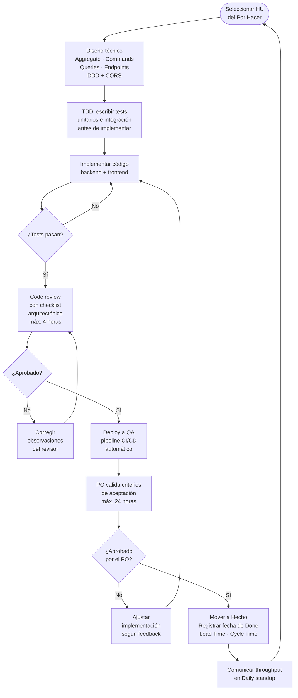

# Capítulo IV: Ejecución o desarrollo

## 4.1 Las cuatro fases de TUCKMAN para el equipo que desarrolla el método

El modelo de desarrollo de equipos propuesto por Bruce Tuckman describe cuatro fases secuenciales por las que atraviesa todo equipo antes de alcanzar un rendimiento sostenido: Forming, Storming, Norming y Performing. A continuación se describe cómo cada fase se manifiesta en el equipo de Hitss Perú durante el desarrollo de Flowtex, y las intervenciones específicas del Scrum Master (Omar) en cada etapa.

| Fase | Descripción en el contexto de Flowtex | Acciones del líder (Omar, Scrum Master) |
|---|---|---|
| **Forming** (Formación) | El equipo de Hitss se reúne por primera vez para analizar el problema de NINTEX. Se definen los roles: PO (Christopher), Frontend (Angello), Data Science (Milagros), Backend (Jose), Scrum Master (Omar). El equipo revisa el backlog inicial de 13 HUs y comprende la magnitud del reemplazo funcional requerido por Claro. | Omar facilita la sesión de kick-off; Christopher presenta el contexto de Claro y el objetivo de reemplazar NINTEX. Se acuerda el uso del tablero Kanban como herramienta principal del sistema de trabajo. Se establecen las reglas de convivencia del equipo. |
| **Storming** (Conflicto) | Surgen desacuerdos sobre la arquitectura del backend (¿DDD monolítico vs. microservicios?) y el framework del frontend (¿React vs. Vue?). Christopher y Jose tienen perspectivas distintas sobre el modelo de datos de FormBuilder, lo que genera tensión en las primeras sesiones de diseño técnico. | Omar media el debate; el equipo aplica la técnica de votación ponderada y documenta la decisión como ADR-0003 (DDD + CQRS) y ADR-0002 (arquitectura hexagonal). Se acuerda que las decisiones técnicas de impacto requieren consenso del equipo y deben quedar registradas en los ADRs del repositorio. |
| **Norming** (Normalización) | El equipo adopta las convenciones de código (Conventional Commits, naming DDD), el tablero Kanban con WIP limits, y el calendario de cadencias. Las revisiones de código se vuelven colaborativas en lugar de correctivas. El equipo desarrolla una comprensión compartida del dominio de negocio de Flowtex. | Omar introduce la herramienta de check list de Definition of Done; Christopher consolida el backlog ordenado por MoSCoW. El equipo completa su primera HU (HU01: tipos de campo del FormBuilder) sin bloqueadores, lo que refuerza la confianza colectiva en el proceso. |
| **Performing** (Rendimiento) | El equipo trabaja con ritmo predecible: throughput de 3 HUs/semana, code reviews completados en menos de 4 horas, CI/CD funcionando con despliegue automático al ambiente QA. La tasa de re-trabajo se mantiene por debajo del 5%. El equipo detecta y resuelve sus propios cuellos de botella sin intervención externa. | Omar facilita las retrospectivas quincenales; el equipo propone y ejecuta mejoras de proceso autónomamente (por ejemplo: reducir el WIP de 4 a 3 después de detectar un cuello de botella en la columna Testing). La intervención del Scrum Master es de soporte, no directiva. |

La progresión a través de las cuatro fases de Tuckman no es automática ni garantizada. Las intervenciones deliberadas del Scrum Master en Forming y Storming son condición necesaria para que el equipo alcance la fase Performing dentro del horizonte temporal del proyecto.

---

## 4.2 STATIK Kanban como enfoque de ejecución

Para la ejecución del proyecto Flowtex se adopta el enfoque **STATIK Kanban** (System Thinking Approach to Introducing Kanban), en lugar de un Kanban genérico o un Scrumban. La justificación de esta elección se fundamenta en las características específicas del proyecto:

Flowtex tiene tres servicios diferenciados (FormBuilder, FlowEngine y MigraFlow) con patrones de demanda y capacidad de entrega distintos:

- **FormBuilder**: demanda alta y predecible; cinco HUs de funcionalidades definidas con criterios de aceptación claros.
- **FlowEngine**: demanda media con complejidad variable; siete HUs que incluyen reglas condicionales y lógica de orquestación de procesos.
- **MigraFlow**: demanda baja pero de alta criticidad; una HU de migración con riesgo operativo alto para la operación de Claro.

El enfoque STATIK permite diseñar el sistema comenzando desde la demanda externa del cliente (Área de Tecnología de Claro) hacia la capacidad interna del equipo de Hitss, en lugar de imponer un proceso genérico sobre el equipo. Esta orientación desde afuera hacia adentro es la diferencia fundamental respecto a Scrumban, que parte de la estructura interna del equipo.

### Las 7 preguntas del STATIK aplicadas a Flowtex

| Pregunta | Respuesta en el contexto de Flowtex |
|---|---|
| 1. ¿Por qué usamos Kanban? | Para visualizar y gestionar el flujo de desarrollo de los tres módulos con transparencia hacia el cliente Claro y el equipo de Hitss. |
| 2. ¿Cuáles son las fuentes de insatisfacción? | Tiempos de entrega largos en FlowEngine por complejidad variable; defectos en MigraFlow por alto riesgo de la migración de NINTEX. |
| 3. ¿Cuáles son las demandas? | HUs de FormBuilder (5), FlowEngine (7) y MigraFlow (1), más bugs y chores emergentes durante el desarrollo. |
| 4. ¿Cuáles son las capacidades? | Cinco desarrolladores con roles diferenciados; throughput objetivo de 3 HUs/semana. |
| 5. ¿Cuáles son los tipos de trabajo? | Features, Bugs, Chores, Spikes. |
| 6. ¿Cuáles son las clases de servicio? | Urgente, Fecha fija, Estándar, Intangible. |
| 7. ¿Cuál es el diseño del sistema Kanban? | Tablero con 6 columnas, 3 swim lanes (una por módulo), WIP limits definidos por capacidad del equipo y flujo esperado. |

---

## 4.3 Nivel 4 de madurez KANBAN considerando los riesgos

El nivel 4 de madurez Kanban implica la gestión cuantitativa del flujo y la predicción probabilística del sistema. En este nivel, el equipo no solo mide el flujo, sino que utiliza esas métricas para anticipar riesgos de incumplimiento antes de que se materialicen. La siguiente tabla describe las prácticas del nivel 4 y su aplicación específica en Flowtex:

| Práctica nivel 4 | Aplicación en Flowtex | Riesgo que mitiga |
|---|---|---|
| Simulación Monte Carlo | Se utiliza para estimar la fecha probable de completación de cada épica, dado el throughput histórico del equipo Hitss. La simulación se corre con los datos de las primeras tres semanas de desarrollo para proyectar la fecha de entrega de FlowEngine y MigraFlow. | Riesgo: comprometer fechas de entrega con el cliente Claro sin base estadística, lo que generaría pérdida de confianza. |
| Control de variabilidad | Se monitorea el coeficiente de variación del cycle time por tipo de tarea (Feature, Bug, Chore). Si el CV supera el 50%, se investiga la causa raíz antes de la siguiente retrospectiva. | Riesgo: bugs en FlowEngine que alargan el cycle time inesperadamente, afectando la predictibilidad del tablero. |
| Gestión de dependencias | Las dependencias entre módulos (FlowEngine depende de FormBuilder completado) se mapean explícitamente en el tablero mediante etiquetas de dependencia entre tarjetas. | Riesgo: bloquear el desarrollo de FlowEngine por una HU incompleta de FormBuilder sin que el equipo lo detecte a tiempo. |
| Métricas de flujo | Cumulative Flow Diagram (CFD), Lead Time Distribution, Throughput Run Chart; revisados en la Review semanal con el representante de Claro. | Riesgo: no detectar cuellos de botella acumulados hasta que afectan la entrega de una épica completa. |

El nivel 4 de madurez Kanban no es un estado que se alcanza desde el inicio del proyecto. El equipo de Flowtex parte del nivel 2 (Kanban básico con WIP limits y políticas explícitas) y evoluciona hacia el nivel 4 a medida que acumula datos de throughput y cycle time suficientes para hacer proyecciones estadísticas confiables.

---

## 4.4 Medidas para gestión de calidad, gestión de cambios y gestión de riesgos durante el desarrollo del tablero KANBAN

### Gestión de calidad

La calidad en Flowtex no es una actividad separada del desarrollo; está integrada en el ciclo de vida de cada historia de usuario mediante la Definition of Done y las herramientas de análisis estático.

**Definition of Done (DoD) — Flowtex:**

- Build del backend pasa sin errores (`mvn clean package`).
- Build del frontend pasa sin errores (`npm run build`).
- Typecheck del frontend pasa sin errores (`tsc --noEmit`).
- Lint pasa sin warnings críticos en backend y frontend.
- Tests relevantes escritos y pasando con cobertura ≥ 80% (reportado por JaCoCo en backend; Vitest en frontend).
- Deploy exitoso en el ambiente QA de Hitss (Docker Compose).
- Validación del PO (Christopher) con evidencia de los criterios de aceptación cumplidos.

**Code review obligatorio:** toda HU requiere revisión de al menos un integrante del equipo diferente al autor antes de pasar a la columna Testing.

**SonarQube:** análisis estático de código integrado en cada pull request mediante el pipeline CI. El Quality Gate es bloqueante: si la cobertura de tests es inferior al 80% o existen code smells de severidad crítica, el merge no está permitido hasta que se corrija el problema.

### Gestión de cambios

- Todo cambio de requisito se documenta como una nueva HU o como modificación formal de una HU existente. No se aceptan cambios informales de alcance (verbal o por chat sin registro en el tablero).
- El PO (Christopher) evalúa el impacto de cada cambio en el WIP actual, el Lead Time proyectado y el throughput de la semana antes de aceptarlo oficialmente.
- Los cambios que afecten contratos de API entre el backend y el frontend requieren aprobación explícita de Christopher (PO) y Angello (Frontend), y se documentan como una actualización del contrato OpenAPI del repositorio.

### Gestión de riesgos

| Riesgo | Probabilidad | Impacto | Mitigación |
|---|---|---|---|
| Errores en la migración de formularios desde NINTEX | Alta | Alta | Ejecutar pruebas paralelas (HU13: prueba de migración en paralelo) antes del apagado definitivo de NINTEX en el ambiente de producción de Claro. |
| Indisponibilidad del ambiente de QA de Hitss | Media | Media | Ambiente de QA replicado localmente mediante Docker Compose; cualquier integrante puede levantarlo con un único comando. |
| Cambios en la API de Microsoft Teams (notificaciones de flujo) | Baja | Alta | Capa de abstracción implementada en el adapter de notificaciones (arquitectura hexagonal); fallback a notificaciones por correo electrónico en caso de fallo del adapter de Teams. |
| Rotación de un integrante del equipo | Baja | Alta | Documentación de decisiones arquitectónicas en ADRs versionados en el repositorio; práctica de pair programming para transferencia de conocimiento en HUs de alta complejidad. |

---

## 4.5 Pasos básicos para desarrollar el método en la solución propuesta

El ciclo de desarrollo de Flowtex sigue cinco pasos que integran las prácticas de DDD, TDD, code review y entrega continua con el tablero Kanban como artefacto de coordinación.

1. **Diseño técnico por HU**: antes de escribir código, el desarrollador define el aggregate responsable, los commands, las queries y los endpoints REST según DDD + CQRS. Para el frontend, se define el port (interfaz del dominio) y el use case correspondiente. Este paso tiene una duración máxima de 2 horas; si supera ese tiempo, el equipo declara la HU como Spike y la planifica como tarea de investigación separada.

2. **Desarrollo guiado por tests (TDD)**: el desarrollador escribe primero los tests unitarios del aggregate y del use case, y luego implementa la lógica de negocio hasta que los tests pasen. Los tests de integración del endpoint se escriben junto con el controlador. Esta secuencia garantiza que cada HU cuenta con cobertura de tests desde el inicio y no como actividad posterior.

3. **Code review con checklist arquitectónico**: el revisor verifica que:
   - No existen referencias cruzadas entre bounded contexts (FormBuilder, FlowEngine, MigraFlow).
   - Los aggregates no exponen setters públicos (inmutabilidad del estado).
   - Los commands devuelven acuses de recibo, no entidades completas.
   - Los adapters del frontend implementan correctamente los ports declarados en el dominio de aplicación.
   El revisor dispone de un máximo de 4 horas. Si en ese tiempo no puede completar la revisión, lo comunica en el daily del día siguiente.

4. **Deploy a QA y validación del PO**: tras el merge a la rama principal, el pipeline CI/CD despliega automáticamente la nueva versión al ambiente QA de Hitss. El desarrollador envía el enlace del ambiente QA al PO (Christopher) junto con la evidencia de los criterios de aceptación (capturas de pantalla o video). El PO tiene un plazo de 24 horas para validar o devolver la HU con observaciones.

5. **Actualización del tablero y comunicación**: una vez que el PO valida la HU, el desarrollador mueve la tarjeta a "Hecho", registra la fecha de Done en la tarjeta (dato necesario para calcular el Lead Time y el Cycle Time), y comunica al equipo el throughput acumulado de la semana en el daily standup. Si la semana termina con un throughput inferior a 3 HUs, se identifica la causa en la retrospectiva siguiente.

---

## 4.6 Flujograma de la ejecución

El siguiente diagrama representa el ciclo de desarrollo de una historia de usuario en Flowtex, desde su selección en el tablero hasta su marcación como "Hecho".

---

## 4.7 Tabla de pasos del método — fase de ejecución

La siguiente tabla describe los cinco componentes del método FlowAgile desarrollados durante la fase de ejecución, su origen en las herramientas del sílabo del curso SI570 y el respaldo en los valores y principios del Manifiesto Ágil.

| Herramienta/s del sílabo SI570 | Fusión / creación / combinación | Respaldo en Valor o Principio del Manifiesto Ágil |
|---|---|---|
| STATIK Kanban | **FlowSTATIK**: diseño del sistema de trabajo partiendo desde las 7 preguntas del STATIK aplicadas a los tres módulos de Flowtex (FormBuilder, FlowEngine, MigraFlow), incorporando la demanda real del cliente Claro en el diseño del tablero. FlowSTATIK reemplaza la imposición de procesos genéricos por un sistema diseñado para la demanda y capacidad específicas del proyecto. | Principio 2: "Bienvenidos los requisitos cambiantes, incluso en etapas avanzadas del desarrollo. Los procesos ágiles aprovechan el cambio para proporcionar ventaja competitiva al cliente". FlowSTATIK hace que el sistema de trabajo sea lo suficientemente flexible para absorber cambios de demanda sin requerir rediseños estructurales del tablero. |
| Tuckman (4 fases de desarrollo de equipos) | **TeamFlow**: aplicación deliberada de las cuatro fases de Tuckman con intervenciones específicas del Scrum Master en cada etapa, utilizando las herramientas del curso (ADRs para resolver conflictos en Storming, WIP limits para normalizar el ritmo en Norming) como mecanismos de transición entre fases. TeamFlow hace explícita la evolución del equipo como variable de gestión del proyecto. | Valor 1: "Individuos e interacciones sobre procesos y herramientas". TeamFlow prioriza la cohesión y el desarrollo del equipo como condición necesaria para el rendimiento técnico, reconociendo que ningún proceso compensa un equipo en fase Storming sin intervención de liderazgo. |
| Kanban madurez nivel 4 (cuantitativo) | **FlowRisk**: gestión cuantitativa de riesgos del proyecto usando métricas de flujo (Throughput Run Chart, Lead Time Distribution, Simulación Monte Carlo) para predecir probabilísticamente las fechas de entrega de cada épica y detectar riesgos de incumplimiento antes de que se materialicen. FlowRisk convierte los datos del tablero en información accionable para el PO y el cliente Claro. | Principio 8: "Los procesos ágiles promueven el desarrollo sostenible. El promotor, los desarrolladores y los usuarios deben ser capaces de mantener un ritmo constante de forma indefinida". FlowRisk asegura que el ritmo del equipo es medido, predecible y ajustable, evitando picos de esfuerzo insostenibles al final de cada épica. |
| DDD + CQRS + Kanban (ciclo de desarrollo) | **ArchFlow**: ciclo de desarrollo donde cada HU sigue el camino Diseño DDD → TDD → Code Review arquitectónico → Deploy QA → Validación PO, garantizando que la arquitectura del sistema se mantiene consistente a lo largo de todo el desarrollo. ArchFlow convierte las decisiones arquitectónicas (bounded contexts, aggregates, ports) en parte del flujo de trabajo ordinario, no en actividades de arquitectura separadas. | Principio 9: "La atención continua a la excelencia técnica y al buen diseño mejora la agilidad". ArchFlow hace de la calidad arquitectónica un criterio de aceptación implícito de cada HU, no una deuda técnica que se acumula y se paga al final del proyecto. |
| CI/CD + DevOps (pipeline automático) | **DeployFlow**: integración del pipeline de entrega continua (CI en cada pull request, CD automático a QA en cada merge a la rama principal) con el tablero Kanban, de modo que el estado del despliegue es información visible para todo el equipo y para el representante de Claro en la Review semanal. DeployFlow elimina el "funciona en mi máquina" como fuente de incertidumbre en la validación del PO. | Principio 3: "Entregar software funcionando frecuentemente, en períodos de dos semanas a dos meses, con preferencia al período de tiempo más corto". DeployFlow garantiza que cada HU validada por el PO representa software funcionando desplegado en un ambiente real, no una demostración local. |
