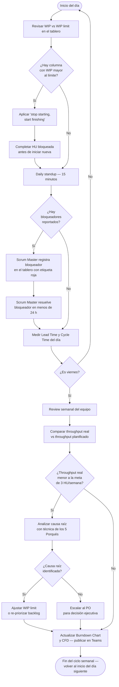

# Capítulo V: Control

## 5.1 Tiempo de ciclo por servicio del tablero

El tiempo de ciclo de cada servicio representa el SLA comprometido con el cliente Claro para la entrega de cada unidad de trabajo.
El tablero Kanban de Flowtex organiza el trabajo en tres swim lanes, cada una con su propio SLA de tiempo de ciclo.

| Servicio (swim lane Kanban) | Solicitud de tiempo (SLA comprometido) |
|---|---|
| FormBuilder | 5 días hábiles por Historia de Usuario (Feature estándar) |
| FlowEngine | 7 días hábiles por Historia de Usuario (Feature complejo con reglas condicionales) |
| MigraFlow | 10 días hábiles por lote de 10 formularios migrados desde NINTEX |

Estos valores constituyen el umbral de control: cuando el Lead Time medido supera el SLA comprometido, el equipo activa el protocolo de respuesta definido en la sección 5.4.

## 5.2 Fórmula Lead Time = WIP / Throughput: Tres situaciones críticas

La Ley de Little establece que el Lead Time de un sistema es igual al Trabajo en Curso (WIP) dividido entre el Throughput (rendimiento), expresado como: **Lead Time = WIP / Throughput**.
Esta fórmula permite proyectar el tiempo de entrega esperado a partir de dos variables medibles en el tablero Kanban en tiempo real.
A continuación se presentan tres situaciones críticas identificadas durante la ejecución del proyecto Flowtex.

| Servicio | Tiempo de ciclo (SLA) | WIP (variable) | Rendimiento / Throughput | Situación durante la ejecución | Tu respuesta |
|---|---|---|---|---|---|
| FormBuilder | 5 días hábiles por HU | 6 HUs activas simultáneamente (3 en desarrollo + 2 en revisión + 1 en testing) | 3 HUs completadas / semana → 0.6 HU/día | **Lead Time = 6 / (3/5) = 10 días**, supera el SLA de 5 días. Las HUs se acumulan en "En Revisión" porque hay más trabajo entrando que saliendo. **Desperdicio Lean: Espera (Waiting)**, los desarrolladores esperan que su código sea revisado antes de iniciar la siguiente HU. Throughput necesario = 6 / 5 = 1.2 HU/día; el equipo produce solo 0.6 HU/día → cuello de botella. | Reducir el WIP limit de "En Desarrollo" de 3 a 2 por swim lane; aplicar la regla "stop starting, start finishing", antes de iniciar una nueva HU, se debe completar la revisión de la HU anterior. |
| FlowEngine | 7 días hábiles por HU | 8 HUs activas (4 en desarrollo + 2 en revisión + 2 en testing) | 2 HUs completadas / semana → 0.4 HU/día | **Lead Time = 8 / (2/5) = 20 días**, supera el SLA de 7 días por 13 días. Ninguna HU de FlowEngine llega a "Hecho" en la semana, lo que preocupa al cliente Claro. **Desperdicio Lean: Inventario**, hay acumulación de trabajo en curso sin valor entregado. WIP óptimo = Throughput × Lead Time = 0.4 × 7 = 2.8 ≈ 3 HUs activas máximo. | Reducir WIP a 3 HUs activas en FlowEngine; priorizar HU06 (aprobación secuencial) y HU09 (notificaciones) como Must Have del MVP; posponer HU07 y HU08 para el siguiente período. |
| MigraFlow | 10 días hábiles por lote de 10 formularios | 3 lotes en migración simultánea (lotes A, B y C) | 0.5 lotes completados / semana → 0.1 lotes/día | **Lead Time = 3 / (0.5/5) = 30 días**, supera el SLA de 10 días en 20 días. Los errores en la migración se detectan en QA y obligan a volver a migrar el lote completo. **Desperdicio Lean: Defectos (Defects)**, el retrabajo consume el 60% del tiempo del equipo asignado a MigraFlow. Throughput necesario = 3 / 10 = 0.3 lotes/día; el equipo produce 0.1 lotes/día → déficit de capacidad. | Reducir WIP a 1 lote activo; establecer criterios de aceptación claros para la migración (HU13: pruebas paralelas); capacitar al equipo en los patrones de datos de NINTEX antes de migrar el siguiente lote. |

## 5.3 Sustentación del cálculo relacionado con la situación problemática y solución concreta

### Situación 1: FormBuilder, cuello de botella en revisión

El cuello de botella en FormBuilder se produjo porque el equipo inició nuevas HUs antes de completar las revisiones pendientes.
La regla "stop starting, start finishing" del Kanban Essential (Lean Kanban University, 2016) establece que completar el trabajo en curso es más valioso que iniciar trabajo nuevo.
El cálculo confirma la gravedad de la situación: con un WIP de 6 y un throughput de 0.6 HU/día, el Lead Time proyectado es de 10 días, el doble del SLA comprometido.
Al reducir el WIP de 6 a 3 HUs activas, el Lead Time disminuye proporcionalmente de 10 a 5 días, cumpliendo exactamente el SLA sin necesidad de aumentar la capacidad del equipo.
La solución no requiere recursos adicionales; requiere disciplina de flujo: ningún miembro del equipo inicia una nueva HU si hay una HU en estado "En Revisión" esperando atención.

### Situación 2: FlowEngine, acumulación de inventario sin valor entregado

La acumulación de HUs en FlowEngine evidencia que el equipo subestimó la complejidad de las reglas condicionales propias de este servicio.
Anderson (2010) señala que el sistema Kanban hace visible el trabajo invisible y permite ajustar la capacidad antes de que el retraso llegue al cliente.
El cálculo demuestra que el WIP óptimo para el SLA de 7 días, dado el throughput real de 0.4 HU/día, es de 2.8 ≈ 3 HUs activas como máximo.
Al operar con 8 HUs activas (más del doble del límite óptimo), el equipo garantiza que ninguna HU se completará dentro del SLA.
Al priorizar únicamente las HUs del MVP (HU06 y HU09) y reducir el WIP a 3, el throughput efectivo sube de 2 a 3 HUs/semana porque el equipo concentra su atención en menos tareas simultáneas.
La priorización con MoSCoW permite posponer HU07 y HU08 sin afectar el valor entregado en el período actual.

### Situación 3: MigraFlow, defectos como el desperdicio más costoso

Los defectos en MigraFlow son el desperdicio más costoso porque generan retrabajo que no aporta valor al cliente y consume el 60% de la capacidad del equipo.
Davis (2015) argumenta que las métricas de flujo como el Lead Time Distribution permiten detectar outliers (lotes que tardan el doble del promedio) antes de que se conviertan en crisis.
El cálculo revela que el throughput real de 0.1 lotes/día es tres veces menor que el throughput necesario (0.3 lotes/día), lo que indica un déficit estructural de calidad, no solo de velocidad.
La solución no es acelerar la migración, sino detener la acumulación: al migrar de a 1 lote, el equipo puede verificar cada lote completamente antes de avanzar al siguiente.
Establecer criterios de aceptación claros (HU13: pruebas paralelas) y capacitar al equipo en los patrones de datos de NINTEX son precondiciones necesarias para que el throughput mejore de forma sostenible.
Este enfoque sigue el principio de calidad integrada (Built-In Quality) del Lean Software Development: la calidad no se verifica al final, se construye en cada paso del proceso.

## 5.4 Pasos básicos para controlar el método

El equipo de Flowtex ejecuta los siguientes cuatro pasos de control de manera sistemática durante cada jornada y cada semana de trabajo.

**Paso 1: Medir Lead Time y Cycle Time diariamente.**
El equipo registra la fecha de inicio y la fecha de "Hecho" de cada HU en el tablero al momento en que ocurren los cambios de estado.
Al cierre de cada día, el responsable de métricas calcula el Lead Time acumulado por servicio y actualiza el CFD (Diagrama de Flujo Acumulado).
Si el Lead Time de cualquier servicio supera el SLA en más del 20%, se activa el protocolo de respuesta descrito en el Paso 4.

**Paso 2: Comparar el throughput real con el planificado.**
En la Review semanal del viernes, el equipo contrasta las HUs completadas durante la semana con el objetivo de throughput establecido (≥ 3 HUs/semana para el proyecto en conjunto).
Si hay déficit, el equipo identifica la causa en el tablero antes de cerrar la sesión, utilizando la técnica de los 5 Porqués para distinguir causas raíz de síntomas.
El resultado de esta comparación alimenta el Burndown Chart y el Throughput Run Chart, que se publican en el canal de Teams del equipo.

**Paso 3: Identificar y resolver bloqueadores.**
En el Daily standup de 15 minutos, cada miembro del equipo reporta si su tarjeta tiene un bloqueador que le impide avanzar.
El Scrum Master registra el bloqueador en el tablero con una etiqueta de color rojo y asume la responsabilidad de resolverlo en un máximo de 24 horas.
Los bloqueadores no resueltos en 24 horas se escalan al PO (Christopher) para decisión ejecutiva.
Cada bloqueador se clasifica según el tipo de desperdicio Lean que representa, lo que permite identificar patrones recurrentes en las Retrospectivas.

**Paso 4: Revisar WIP vs WIP limit al inicio de cada Daily.**
Al inicio de cada Daily standup, el equipo verifica visualmente en el tablero si alguna columna supera el WIP limit establecido para esa columna.
Si hay acumulación en una columna (WIP > límite), el equipo aplica la regla "stop starting, start finishing" antes de iniciar cualquier HU nueva.
El WIP limit de cada columna se define en el Replenishment Meeting del lunes y puede ajustarse si los datos de la semana anterior demuestran que el límite no es apropiado.
Esta revisión diaria convierte el WIP limit de una regla estática en un instrumento de control dinámico que responde a la realidad del flujo.

## 5.5 Radiadores importantes para el proceso

Los radiadores de información son mecanismos de comunicación pasiva que transmiten el estado del proyecto a cualquier observador sin necesidad de solicitar un reporte.
El equipo de Flowtex utiliza cinco radiadores complementarios, cada uno diseñado para hacer visible un aspecto diferente del flujo de trabajo.

### Radiador 1: Gráfico de quemado (Burndown Chart)

El Burndown Chart muestra el avance de cada épica (EP01: FormBuilder, EP02: FlowEngine, EP03: MigraFlow) semana a semana a lo largo del proyecto.
El eje Y representa el número de HUs pendientes de completar; el eje X representa las semanas del proyecto.
La línea ideal de quemado (trayectoria perfecta) se traza desde el número total de HUs de la épica hasta cero al final del período planificado.
La línea real de quemado se actualiza cada viernes con las HUs completadas en la semana y se publica en el canal de Teams del equipo.
Cuando la línea real queda por encima de la línea ideal, el equipo está atrasado respecto al plan; cuando queda por debajo, está adelantado.
Este radiador permite detectar si el ritmo de entrega actual es insuficiente para completar la épica en el tiempo comprometido con Claro.

### Radiador 2: Tablero Kanban con WIP limits y swim lanes

El tablero Kanban es el radiador más importante del proyecto porque muestra el estado real de cada HU en tiempo real.
El tablero cuenta con 3 swim lanes (FormBuilder, FlowEngine, MigraFlow) y 6 columnas (Backlog, En Desarrollo, En Revisión, En Testing, Listo para Deploy, Hecho).
Cada columna tiene un WIP limit visible que limita el número máximo de tarjetas que pueden estar activas simultáneamente en esa columna.
Las tarjetas bloqueadas se marcan con una etiqueta roja; las tarjetas con riesgo de superar el SLA se marcan con una etiqueta naranja.
El tablero es accesible para todo el equipo de Hitss y para el representante del Área de Tecnología de Claro durante las Reviews.
La visibilidad del tablero elimina la necesidad de reuniones de estado: cualquier interesado puede conocer el estado del proyecto con solo mirar el tablero.

### Radiador 3: Tablero de curva S

La curva S muestra el porcentaje acumulado de HUs completadas respecto al porcentaje planificado para cada semana del proyecto.
El eje Y representa el porcentaje de avance acumulado (de 0% a 100%); el eje X representa las semanas del proyecto.
La curva S característica tiene forma de "S" porque el avance es lento al inicio (el equipo está configurando el ambiente y aprendiendo los procesos), acelera en la fase central (el equipo está en plena productividad) y desacelera al final (las HUs más complejas y los defectos residuales).
Cuando la curva real queda por debajo de la curva planificada, el proyecto está retrasado; cuando la supera, está adelantado.
Este radiador se presenta en la Review mensual al cliente Claro como evidencia del avance del proyecto respecto al plan contractual.

### Radiador 4: Diagrama de Flujo Acumulado (CFD: Cumulative Flow Diagram)

El CFD muestra cómo las HUs fluyen por las columnas del tablero a lo largo del tiempo, representando en un solo gráfico el WIP, el Lead Time y el Throughput simultáneamente.
El eje Y representa el número acumulado de HUs; el eje X representa el tiempo (días hábiles del proyecto).
Cada columna del tablero genera una banda de color en el CFD; la distancia vertical entre dos bandas en un punto del tiempo representa el WIP de ese par de columnas.
Una banda que se expande horizontalmente indica acumulación (cuello de botella): por ejemplo, si la banda de "En Revisión" se ensancha, hay más HUs entrando a revisión que saliendo.
La distancia horizontal entre la línea de entrada a una columna y la línea de salida representa el Lead Time promedio de esa columna.
El CFD se revisa en cada Retrospectiva como insumo para identificar los cuellos de botella del período y definir las acciones de mejora del siguiente período.

### Radiador 5: Gráfico de Throughput Run Chart

El Throughput Run Chart muestra el número de HUs completadas por semana a lo largo del proyecto, representado como una serie de tiempo.
El eje Y representa el número de HUs completadas; el eje X representa las semanas del proyecto.
Una línea de media móvil de 3 semanas suaviza las variaciones puntuales y revela la tendencia real de la velocidad del equipo.
Los percentiles P50 y P85 del throughput histórico se calculan a partir del Run Chart y se usan para proyectar fechas de completación de cada épica con un nivel de confianza estadístico.
Una proyección basada en el P85 garantiza que el 85% de las semanas históricas tuvieron un throughput igual o superior al proyectado, lo que permite comprometer fechas realistas con el cliente.
Este radiador se utiliza en el Replenishment Meeting del lunes para decidir cuántas HUs se pueden comprometer en el período siguiente.

## 5.6 Motivo e importancia del control

El control en FlowAgile cumple dos funciones estratégicas: detectar desviaciones antes de que se conviertan en retrasos críticos, y generar el aprendizaje necesario para mejorar el proceso en cada retrospectiva.
Sin control, el equipo opera de manera reactiva (respondiendo a crisis cuando ya son visibles) en lugar de operar de manera proactiva, ajustando el flujo antes de que el impacto llegue al cliente.

El control genera valor porque permite al equipo de Hitss comprometerse con fechas de entrega realistas ante el Área de Tecnología de Claro, basadas en el throughput real del equipo y no en estimaciones optimistas desconectadas de la capacidad real.
Un equipo que controla su flujo puede decirle al cliente cuándo estará lista cada funcionalidad con una base estadística; un equipo que no controla su flujo solo puede hacer promesas.

### Justificación con autores Q1

Anderson, D. (2010), en *Kanban: Successful Evolutionary Change for Your Technology Business*, establece que el control del flujo de trabajo a través de métricas como el Lead Time y el Throughput permite identificar cuellos de botella sistémicos y redistribuir la capacidad del equipo de manera eficiente, incrementando el throughput sin aumentar el estrés del equipo ni los costos del proyecto.
Anderson argumenta que el control no es una actividad adicional sobre el proceso: es el proceso mismo, porque el flujo de trabajo solo mejora cuando el equipo puede ver su comportamiento y actuar sobre él con datos objetivos.

Davis, C. W. H. (2015), en *Agile Metrics in Action*, sostiene que las métricas de flujo son la forma más honesta de medir el rendimiento de un equipo ágil, porque reflejan el trabajo real completado, no el trabajo estimado.
Davis señala que la trampa de los reportes basados en porcentajes de avance es que pueden mostrar un proyecto "al 80%" durante semanas, mientras que el Lead Time real revela que ninguna HU ha llegado a "Hecho" en ese período.
La medición del Lead Time y el Throughput elimina esta ilusión: el equipo es tan productivo como su throughput real lo demuestra, y el proyecto avanza tan rápido como su Lead Time lo permite.

El control en FlowAgile no es un fin en sí mismo: es el mecanismo por el cual el método genera valor sostenible para Claro, para Hitss y para el equipo de desarrollo.

## 5.7 Tabla de control

| Qué controlar | Por qué controlar | Qué acción tomar luego del control |
|---|---|---|
| WIP por columna del tablero | Evitar la acumulación de trabajo en curso que genera cuellos de botella y aumenta el Lead Time de todos los servicios | Aplicar "stop starting, start finishing": el equipo completa las HUs en revisión o en testing antes de iniciar nuevas HUs en desarrollo |
| Lead Time por servicio (FormBuilder, FlowEngine, MigraFlow) | Detectar desviaciones respecto al SLA comprometido con el cliente Claro antes de que se conviertan en incumplimientos contractuales | Analizar la causa raíz con la técnica de los 5 Porqués; si el Lead Time supera el SLA en más del 20%, reducir el WIP limit de la columna cuello de botella |
| Throughput semanal del equipo | Medir la capacidad real de entrega del equipo y proyectar fechas de completación de épicas con base estadística en lugar de estimaciones subjetivas | Si el throughput cae por debajo de 3 HUs/semana durante 2 semanas consecutivas, escalar al PO para re-priorizar el backlog y reducir el alcance del período |
| Tasa de defectos (HUs devueltas de Testing a Desarrollo) | Reducir el retrabajo que consume capacidad del equipo sin entregar valor al cliente, y que distorsiona el throughput real del servicio | Si la tasa de re-trabajo supera el 10% de las HUs completadas en la semana, revisar los criterios de Definition of Done y reforzar el proceso de code review antes del paso a testing |

## 5.8 Mapa mental o flujograma del control basado en el paso 5.4

El siguiente flujograma representa el ciclo de control diario y semanal del equipo de Flowtex, integrando los cuatro pasos definidos en la sección 5.4.

## 5.9 Medición y reporte de rendimiento del proyecto

| Servicio | Cómo se mide | Cómo será el informe o reporte de medición |
|---|---|---|
| FormBuilder | Lead Time promedio por HU completada (fecha de inicio → fecha de Hecho); Throughput semanal (HUs completadas / semana); tasa de re-trabajo (HUs devueltas de Testing / HUs completadas) | Dashboard semanal publicado en el canal de Teams del equipo: gráfico de Burndown de EP01 + CFD de las columnas de FormBuilder; presentado y discutido en la Review del viernes; archivado en el repositorio del proyecto |
| FlowEngine | Lead Time por HU de FlowEngine; WIP actual distribuido por columna (En Desarrollo / En Revisión / En Testing); tasa de aprobaciones a tiempo (KPI del cliente Claro: porcentaje de flujos aprobados dentro del SLA de 7 días) | Reporte mensual de SLA enviado al Área de Tecnología de Claro: tabla de SLA cumplidos e incumplidos por tipo de flujo (aprobación simple, aprobación secuencial, notificaciones); incluye causa raíz de cada incumplimiento y acción correctiva aplicada |
| MigraFlow | Porcentaje de formularios migrados sin error por lote (formularios aceptados en QA / total de formularios del lote × 100); número de lotes completados vs pendientes vs con defectos; Lead Time por lote (días desde inicio de migración hasta aceptación en QA) | Informe quincenal de progreso de migración entregado al PO y al Área de Tecnología de Claro: tabla de estado por lote con columnas (Lote / Estado / Formularios OK / Formularios con defecto / Lead Time / Próxima acción); incluye proyección de fecha de completación de EP03 basada en throughput real |

## 5.10 Controles DevOps CI/CD

| Tipos de control | CI (Integración Continua) | CD (Entrega Continua) |
|---|---|---|
| Calidad de código | SonarQube analiza cada pull request en el momento en que se abre; el Quality Gate es bloqueante si la cobertura de pruebas es menor al 80% o si hay code smells de severidad crítica o bloqueante | No se despliega ningún artefacto si el Quality Gate de SonarQube no tiene estado "Passed"; el pipeline detiene la ejecución y notifica al autor del PR con el detalle de las violaciones encontradas |
| Build automático | `mvn clean package` (backend Java 21 + Spring Boot 3.3) y `npm run build` (frontend React 18 + TypeScript) se ejecutan automáticamente en cada push a la rama main o a cualquier rama de feature activa | El artefacto JAR del backend y la imagen Docker del frontend se publican en el registro de contenedores privado de Hitss solo si el build y los tests de la fase CI se completan sin errores |
| Tests automáticos | `mvn test` ejecuta los tests unitarios (JUnit 5 + Mockito + Spring Boot Test) y los tests de integración de los endpoints REST en cada pull request antes del merge | Los smoke tests automáticos se ejecutan post-deploy en el ambiente QA; si algún smoke test falla, la promoción al siguiente ambiente (staging o producción) queda bloqueada hasta que el equipo corrija el defecto |
| Análisis de seguridad | OWASP Dependency Check analiza las dependencias del proyecto en busca de vulnerabilidades conocidas (CVE) en cada ejecución del build de CI | Si se detecta una vulnerabilidad con puntaje CVSS igual o superior a 7.0 (severidad Alta o Crítica), el deploy a producción queda bloqueado automáticamente hasta que el equipo actualice la dependencia o aplique la mitigación documentada |

## 5.11 Las 8 fases DevOps con tareas del proyecto

Las ocho fases del ciclo DevOps se aplican de manera continua e iterativa en el proyecto Flowtex, conectando el trabajo de desarrollo con la operación del sistema en producción.

| Fase DevOps | Tarea en Flowtex |
|---|---|
| Plan | Gestión del backlog en el tablero Kanban (Trello / Jira); definición de HUs con criterios de aceptación verificables; Replenishment Meeting los lunes para seleccionar las HUs del período; priorización con MoSCoW + PriorityFlow; definición de los WIP limits por columna y por swim lane |
| Code | Desarrollo en Java 21 + Spring Boot 3.3 (backend) y React 18 + TypeScript (frontend); escritura de commits con Conventional Commits (feat, fix, refactor, test, docs); ramas cortas desde main siguiendo la estrategia trunk-based development; code review obligatorio mediante pull request antes de cada merge |
| Build | `mvn clean package` genera el JAR ejecutable del backend con todas sus dependencias; `npm run build` genera el bundle optimizado del frontend; la imagen Docker se construye automáticamente en el pipeline de CI; los artefactos se versionan con semántica semántica (vMAJOR.MINOR.PATCH) para trazabilidad |
| Test | `mvn test` ejecuta los tests unitarios de aggregates y use cases (JUnit 5 + Mockito) y los tests de integración de los endpoints REST (Spring Boot Test); `npm test` ejecuta los tests de componentes y de integración del frontend (Vitest + Testing Library); la cobertura mínima aceptable es del 80% para pasar el Quality Gate |
| Release | El tag de versión semántica (`v1.x.y`) se genera automáticamente por el pipeline al aprobar el merge a main; el changelog se construye automáticamente a partir de los títulos de los Conventional Commits del período; la aprobación formal del PO (Christopher) es requisito previo para promover el artefacto al estado "Release" |
| Deploy | El deploy al ambiente QA se ejecuta automáticamente en cada merge aprobado a main; los smoke tests automáticos validan la disponibilidad del servicio en QA; la promoción a producción requiere aprobación manual del PO; los feature flags permiten activar módulos de manera gradual para un subconjunto de usuarios de Claro |
| Operate | El equipo de Hitss monitorea la disponibilidad del sistema con un SLA de disponibilidad igual o superior al 99.5% mensual; las alertas automáticas notifican al equipo por Teams si la disponibilidad cae por debajo del umbral; el SLA de respuesta a incidentes es de 1 hora desde la detección hasta el inicio de la atención |
| Monitor | Las métricas de rendimiento objetivo son: tiempo de respuesta menor a 3 segundos para el 95% de las operaciones y tasa de error menor al 0.1%; los logs de todos los servicios se centralizan en el stack ELK (Elasticsearch, Logstash, Kibana) para análisis y trazabilidad; las alertas de umbral se envían automáticamente al canal de Teams del equipo cuando se superan los límites definidos |

## 5.12 Tabla de cinco pasos del método: Control

| Herramienta/s del sílabo SI570 | Fusión / creación / combinación | Respaldo en Valor o Principio del Manifiesto Ágil |
|---|---|---|
| Lead Time = WIP / Throughput + Kanban | **FlowMetric**: métrica de flujo integrada al tablero Kanban que calcula el Lead Time esperado en tiempo real a partir del WIP actual y el throughput histórico del equipo, generando una alerta visual cuando el Lead Time proyectado supera el SLA comprometido con el cliente Claro | Principio 7: "El software funcionando es la medida principal de progreso", FlowMetric reemplaza los reportes de avance por porcentaje con métricas de flujo que reflejan el valor real entregado al cliente, eliminando la ilusión del "80% completado" |
| Lean 7 desperdicios + Kanban (gestión de bloqueadores) | **WasteFlow**: proceso de identificación y eliminación sistemática de los 7 desperdicios Lean aplicado al flujo del tablero Kanban, donde cada bloqueador registrado en el tablero se clasifica por tipo de desperdicio (espera, defectos, inventario, etc.) para atacar la causa raíz en lugar del síntoma visible | Principio 8: "Los procesos ágiles promueven el desarrollo sostenible. El promotor, los desarrolladores y los usuarios deben ser capaces de mantener un ritmo constante de forma indefinida", WasteFlow elimina los desperdicios que generan picos de trabajo y agotamiento del equipo |
| DevOps CI/CD + Kanban (pipeline como columna del tablero) | **DeployKan**: integración del pipeline de CI/CD con el tablero Kanban, donde el estado del deploy (building, testing, deployed to QA, promoted to prod) es visible como una extensión de las columnas del tablero, eliminando la brecha de información entre el equipo de desarrollo y el equipo de operaciones | Principio 3: "Entregar software funcionando frecuentemente, en períodos de dos semanas a dos meses, con preferencia al período de tiempo más corto", DeployKan hace visible el camino de cada HU desde el código hasta la producción, acortando el ciclo de entrega |
| Gráfico de quemado + CFD (Diagrama de Flujo Acumulado) | **FlowRadiator**: conjunto integrado de radiadores de información (Burndown Chart + CFD + Throughput Run Chart) que muestran el avance real del proyecto en tiempo real, accesibles para el equipo de Hitss y para el cliente Claro sin necesidad de generar reportes adicionales ni programar reuniones de estado | Valor 4: "Responder al cambio sobre seguir un plan", FlowRadiator permite detectar desviaciones en tiempo real y ajustar el plan antes de que el retraso sea irreversible, reemplazando el seguimiento reactivo por el control proactivo |
| 5 Porqués (análisis de causa raíz) + Cycle Time | **RootCycleFlow**: proceso de análisis de causa raíz que aplica la técnica de los 5 Porqués específicamente a las anomalías en el Cycle Time (HUs que tardan el doble del promedio histórico del servicio) generando acciones de mejora concretas con responsable asignado y fecha de verificación | Principio 12: "A intervalos regulares el equipo reflexiona sobre cómo ser más efectivo para a continuación ajustar y perfeccionar su comportamiento en consecuencia", RootCycleFlow convierte cada anomalía en una oportunidad de aprendizaje sistemático |
