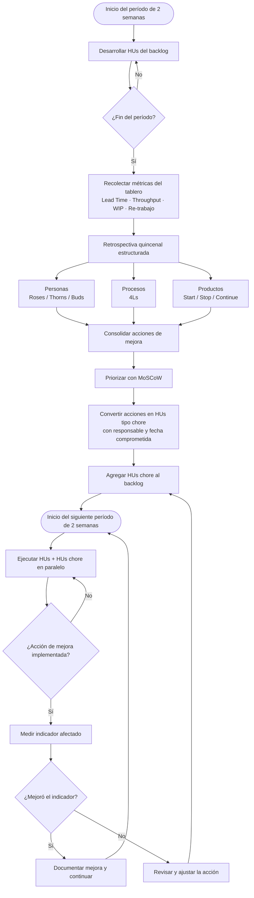

# Capítulo VI: Cierre y Mejora

## 6.1 Consideraciones generales para la mejora del método

La mejora en FlowAgile es continua, incremental y basada en evidencia producida por las métricas de flujo documentadas en el capítulo V.
Se aplica de manera simultánea a tres dimensiones: personas (el equipo de Hitss Perú), procesos (el sistema de trabajo Kanban) y productos (Flowtex mismo).
La cadencia de mejora es quincenal: cada dos semanas el equipo realiza una retrospectiva estructurada que produce al menos una acción de mejora concreta.
Las acciones de mejora se registran como Historias de Usuario de tipo "chore" en el backlog, se priorizan con la técnica MoSCoW y se ejecutan en el siguiente período de dos semanas.
La mejora no interrumpe el flujo de entrega: las acciones de mejora se tratan como cualquier otra Historia de Usuario en el tablero Kanban, con WIP limit aplicado y fecha comprometida.
Este enfoque garantiza que la capacidad de entrega de valor al cliente Claro Perú se mantiene mientras el equipo mejora simultáneamente su forma de trabajar.

## 6.2 Herramientas del taller de retrospectiva para personas, procesos y productos

FlowAgile utiliza una herramienta diferenciada para cada dimensión de la retrospectiva, evitando que una sola técnica intente capturar realidades heterogéneas.
La siguiente tabla describe las tres herramientas y su aplicación concreta en el proyecto Flowtex.

| Dimensión | Herramienta | Descripción | Aplicación en Flowtex |
|---|---|---|---|
| Personas | Roses, Thorns and Buds (Rosas, Espinas y Brotes) | El equipo identifica qué funcionó bien (rosas), qué causó fricción (espinas) y qué potencial aún no explorado existe (brotes). | Se aplica para reflexionar sobre la dinámica del equipo de Hitss: comunicación, carga de trabajo y motivación. Ejemplo: rosa: el pair programming en FlowEngine redujo defectos; espina: falta de visibilidad del representante de Claro en el Daily; brote: Milagros puede aportar análisis predictivo al dashboard de adopción. |
| Procesos | 4Ls (Liked, Learned, Lacked, Longed For) | El equipo responde cuatro preguntas: ¿Qué me gustó? ¿Qué aprendí? ¿Qué faltó? ¿Qué desearía para el futuro? | Se aplica para mejorar el proceso Kanban. Liked: el WIP limit eliminó el cuello de botella de revisión. Learned: el STATIK reveló que MigraFlow necesita más capacidad. Lacked: tiempo explícito para spike técnico. Longed For: automatizar el análisis del CFD semanalmente. |
| Productos | Start, Stop, Continue (Iniciar, Parar, Continuar) | El equipo identifica qué prácticas iniciar, cuáles detener y cuáles mantener respecto al producto. | Se aplica al MVP de Flowtex. Start: agregar templates predefinidos en FormBuilder para reducir el tiempo de creación. Stop: no construir funcionalidades de reportería avanzada sin validar primero el MVP. Continue: versionamiento automático de formularios, que es el diferenciador principal respecto a NINTEX. |

## 6.3 Pasos básicos para mejorar el método en la solución propuesta

FlowAgile define cuatro pasos mínimos para que la mejora sea sistemática, medible y no dependa de la memoria individual del equipo.

**Paso 1: Recolectar evidencia.**
Al cierre de cada período de dos semanas, el equipo recopila las métricas del tablero Kanban: Lead Time, Throughput, tasa de re-trabajo y WIP promedio.
Estas métricas identifican con datos objetivos las áreas de mejora antes de que comience la retrospectiva, evitando que la sesión se base únicamente en percepciones subjetivas.

**Paso 2: Aplicar la retrospectiva estructurada.**
El Scrum Master facilita la sesión de retrospectiva quincenal usando las herramientas asignadas por dimensión: Roses/Thorns/Buds para personas, 4Ls para procesos y Start/Stop/Continue para productos.
El rol de facilitador rota entre los miembros del equipo para desarrollar la habilidad de facilitación en todos, no solo en Omar.

**Paso 3: Priorizar las acciones de mejora.**
Las acciones identificadas en la retrospectiva se filtran usando MoSCoW: Must Have, Should Have, Could Have y Won't Have.
Cada acción seleccionada (Must Have o Should Have) se convierte en una Historia de Usuario de tipo "chore" con un responsable nombrado y una fecha comprometida en el tablero Kanban.

**Paso 4: Implementar y medir el impacto.**
Las acciones de mejora se ejecutan en el siguiente período de dos semanas como cualquier otra Historia de Usuario.
Al cierre del período, el equipo mide si el indicador afectado mejoró: por ejemplo, si la acción era reducir el re-trabajo, se verifica si la tasa bajó por debajo del 10 %.
Si el indicador no mejoró, la acción se revisa y se ajusta antes de ser reincorporada al backlog.

## 6.4 Tabla de motivos de mejora en tres aspectos

La siguiente tabla presenta los principales motivos que justifican la mejora en cada una de las tres dimensiones de FlowAgile durante el proyecto Flowtex.

| Mejorar procesos | Mejorar personas | Mejorar productos |
|---|---|---|
| Reducir el tiempo promedio de code review de 2 días a 4 horas, mediante la adopción de un checklist de revisión estructurado y la rotación del rol de revisor entre los miembros del equipo. | Capacitar a Milagros (Data Science) en la arquitectura DDD + CQRS del backend para reducir la dependencia de Christopher en las decisiones de modelo de datos. | Agregar al FormBuilder una biblioteca de templates predefinidos por tipo de formulario (permisos, solicitudes de RRHH, aprobaciones de presupuesto) para reducir el tiempo de creación de un formulario de 2 días a 4 horas. |
| Automatizar la generación del Diagrama de Flujo Acumulado (CFD) mediante un script semanal que consulte el tablero y publique la imagen en el canal de Teams del proyecto, eliminando la actualización manual. | Incorporar sesiones de pair programming rotativas (cada sprint un par diferente) para distribuir el conocimiento técnico y reducir el riesgo de pérdida de conocimiento si un miembro sale del equipo. | Incorporar al FlowEngine un asistente de configuración de reglas condicionales con ejemplos visuales, para reducir el tiempo de configuración de un flujo complejo de 3 horas a 30 minutos (detectado como pain point en la Fase 5 del Design Thinking). |
| Estandarizar el proceso de MigraFlow con un playbook de migración por tipo de formulario (simples, con adjuntos, con firmas) para reducir la tasa de defectos en la migración de 30 % a menos del 5 %. | Establecer un facilitador rotativo en las retrospectivas para desarrollar habilidades de facilitación en todos los miembros, no solo en Omar. | Integrar un dashboard de adopción (métricas de uso por área de Claro: número de solicitudes, tiempos de aprobación, áreas más activas) como funcionalidad del MVP+, respondiendo al pain point del administrador detectado en el Journey Map. |

## 6.5 Mapa del ciclo de mejora continua de FlowAgile

El siguiente flujograma representa el ciclo completo de mejora continua que FlowAgile aplica de forma quincenal en el proyecto Flowtex.

## 6.6 Tabla de los 5 pasos del método: Fase de Mejora

La siguiente tabla presenta las cinco herramientas propias de FlowAgile para la fase de mejora, indicando su origen en el sílabo SI570, la fusión o creación que las define y el valor o principio del Manifiesto Ágil que las respalda.

| Herramienta/s del sílabo SI570 | Fusión / creación / combinación | Respaldo en Valor o Principio del Manifiesto Ágil |
|---|---|---|
| Roses, Thorns and Buds + Lean (métricas de satisfacción del equipo) | **PersonaFlow**: retrospectiva de personas que combina la dinámica de Roses/Thorns/Buds con indicadores cuantitativos del equipo (tasa de retrabajo, throughput individual, tiempo de resolución de bloqueadores) para generar mejoras con base en datos, no solo en percepciones. | Valor 1: "Individuos e interacciones sobre procesos y herramientas". PersonaFlow prioriza el bienestar y el desarrollo del equipo como condición para la sostenibilidad del proyecto. |
| 4Ls (Liked, Learned, Lacked, Longed For) + Kanban | **ProcessRetro**: retrospectiva de proceso que usa el 4Ls para evaluar el sistema de trabajo Kanban y genera acciones de mejora que se incorporan como HUs de tipo "chore" en el backlog, integrando la mejora continua al flujo normal de trabajo. | Principio 12: "A intervalos regulares el equipo reflexiona sobre cómo ser más efectivo para a continuación ajustar y perfeccionar su comportamiento en consecuencia." |
| Start/Stop/Continue + MVP (feedback del usuario) | **ProductRetro**: retrospectiva de producto que integra el feedback del cliente Claro (obtenido en la Review semanal) con la herramienta Start/Stop/Continue para decidir qué funcionalidades agregar, cuáles retirar y cuáles mantener en el roadmap del MVP. | Principio 1: "Nuestra mayor prioridad es satisfacer al cliente mediante la entrega temprana y continua de software con valor". ProductRetro asegura que cada período el producto se acerca más al problema real del usuario. |
| Kaizen (mejora incremental) + Cycle Time (métricas de flujo) | **KaizenFlow**: ciclo de mejora incremental basado en reducir el Cycle Time de un tipo de tarea específico en cada período (por ejemplo, reducir el Cycle Time del code review de 2 días a 4 horas), usando el kaizen enfocado en el cuello de botella identificado por las métricas. | Principio 8: "Los procesos ágiles promueven el desarrollo sostenible. El promotor, los desarrolladores y los usuarios deben ser capaces de mantener un ritmo constante de forma indefinida." |
| Lean Startup (Pivot o Perseverar) + KPI | **LearnPivot**: mecanismo de decisión que evalúa los KPIs del MVP al cierre de cada período para determinar si el equipo debe perseverar en la dirección actual o pivotar hacia una funcionalidad o enfoque diferente, basándose en evidencia cuantitativa y no en suposiciones. | Principio 2: "Bienvenidos los requisitos cambiantes, incluso en etapas avanzadas del desarrollo". LearnPivot institucionaliza la capacidad de cambiar de dirección con base en aprendizaje real. |

## 6.7 El ciclo PDCA como marco de la mejora continua

El ciclo PDCA (Plan-Do-Check-Act, es decir Planificar-Hacer-Verificar-Actuar) es el marco de mejora continua popularizado por W. Edwards Deming, razón por la cual también se conoce como ciclo de Deming, sobre la base del trabajo previo de Walter Shewhart.
PDCA describe un lazo iterativo de cuatro etapas que se repite de forma indefinida: se planifica un cambio, se ejecuta, se verifica su efecto con datos y se actúa sobre lo aprendido para estandarizar la mejora o corregir el rumbo.
Su propósito es institucionalizar el aprendizaje, de modo que el equipo mejore mediante evidencia y no por intuición o de forma esporádica: cada período se convierte en un experimento controlado del que se extraen conclusiones.

En Flowtex, PDCA no es una ceremonia adicional, sino la estructura subyacente que ordena las cadencias que el equipo ya ejecuta.
El mapeo a las ceremonias reales del equipo es directo.

| Etapa PDCA | Ceremonia del equipo Flowtex | Qué ocurre |
|---|---|---|
| **Plan (Planificar)** | Sprint planning y Replenishment | El PO y el equipo seleccionan y priorizan las Historias de Usuario del período con MoSCoW, definen las metas y estiman la capacidad disponible. |
| **Do (Hacer)** | Desarrollo de las HUs | El equipo construye las Historias de Usuario en el tablero Kanban siguiendo el ciclo de diseño DDD, TDD, code review, deploy a QA y validación del PO. |
| **Check (Verificar)** | Retrospectiva quincenal | Cada dos semanas el equipo recolecta las métricas del tablero (Lead Time, Throughput, tasa de re-trabajo, WIP) y evalúa qué funcionó y qué no, con las herramientas por dimensión (Roses/Thorns/Buds, 4Ls, Start/Stop/Continue). |
| **Act (Actuar)** | Acciones de mejora | Las conclusiones de la retrospectiva se convierten en acciones de mejora priorizadas con MoSCoW, registradas como Historias de Usuario de tipo "chore" con responsable y fecha, que se ejecutan en el período siguiente. |

De este modo, la retrospectiva quincenal descrita en las secciones anteriores es exactamente la etapa Check del ciclo, y las acciones de mejora que produce son la etapa Act.
El cierre del lazo es lo que da continuidad al método: las acciones de mejora (Act) alimentan la planificación del período siguiente (Plan), de manera que cada iteración de dos semanas equivale a una vuelta completa del ciclo PDCA.
El equipo adopta PDCA porque le da un lenguaje común y una disciplina para que la mejora sea sistemática y basada en evidencia, en coherencia con el Principio 12 del Manifiesto Ágil (el equipo reflexiona a intervalos regulares sobre cómo ser más efectivo y ajusta su comportamiento en consecuencia).
