# Capítulo VII: Conclusiones

## 7.1 Framework FlowAgile: diagrama integrador y descripción de cada fase

FlowAgile es el método propio desarrollado por el equipo de Hitss Perú para el proyecto Flowtex.
Integra herramientas del sílabo SI570 (Lean, Kanban, Design Thinking, Scrum, Lean Startup) en un ciclo continuo de cinco fases: Inicio, Plan, Ejecución, Control y Mejora.
El ciclo es iterativo: al completar la fase de Mejora, el equipo regresa a la fase de Inicio con mayor comprensión del problema y del sistema de trabajo.

```mermaid
flowchart LR
    subgraph IN["INICIO"]
        direction TB
        I1(EmpathySPIN)
        I2(FlowVision)
        I3(ImpactPriority)
        I4(LearnBuild)
        I5(JourneyKPI)
    end

    subgraph PL["PLAN"]
        direction TB
        P1(FlowPlan)
        P2(PriorityFlow)
    end

    subgraph EJ["EJECUCIÓN"]
        direction TB
        E1(FlowSTATIK)
        E2(TeamFlow)
        E3(FlowRisk)
        E4(ArchFlow)
        E5(DeployFlow)
    end

    subgraph CO["CONTROL"]
        direction TB
        C1(FlowMetric)
        C2(WasteFlow)
        C3(DeployKan)
        C4(FlowRadiator)
        C5(RootCycleFlow)
    end

    subgraph ME["MEJORA"]
        direction TB
        M1(PersonaFlow)
        M2(ProcessRetro)
        M3(ProductRetro)
        M4(KaizenFlow)
        M5(LearnPivot)
    end

    IN --> PL --> EJ --> CO --> ME
    ME -->|"ciclo continuo"| IN
```

**Inicio (EmpathySPIN, FlowVision, ImpactPriority, LearnBuild, JourneyKPI).**
FlowAgile genera en esta fase comprensión profunda del problema del usuario mediante empatía contextual antes de cualquier decisión técnica.
EmpathySPIN garantiza que el equipo entiende el dolor real del administrador de TI que espera semanas por NINTEX antes de diseñar la solución.
FlowVision alinea al equipo y al cliente en una visión compartida y verificable del producto.
ImpactPriority asegura que se construye primero lo que más valor aporta al proceso crítico del cliente.
LearnBuild y JourneyKPI validan la propuesta de valor con evidencia antes de invertir en construcción.

**Plan (FlowPlan, PriorityFlow).**
FlowAgile diseña en esta fase el sistema de trabajo a partir de la demanda real del cliente, no desde una plantilla genérica.
FlowPlan aplica el STATIK para diseñar el tablero Kanban con WIP limits y políticas explícitas adaptadas al contexto de Flowtex.
PriorityFlow permite cambiar la prioridad del trabajo sin replanificar todo el tablero, respondiendo en tiempo real a los cambios del negocio de Claro Perú.

**Ejecución (FlowSTATIK, TeamFlow, FlowRisk, ArchFlow, DeployFlow).**
FlowAgile ejecuta en esta fase el desarrollo con control de flujo predecible y entrega continua.
FlowSTATIK mantiene el flujo visible y controlado durante toda la ejecución.
ArchFlow garantiza que la calidad técnica no se sacrifica por la velocidad de entrega.
DeployFlow reduce el tiempo entre "código listo" y "cliente usando la funcionalidad" mediante automatización CI/CD.

**Control (FlowMetric, WasteFlow, DeployKan, FlowRadiator, RootCycleFlow).**
FlowAgile detecta en esta fase las desviaciones en tiempo real usando métricas de flujo antes de que lleguen al cliente.
FlowRadiator hace visible el avance real sin necesidad de reportes adicionales.
WasteFlow y RootCycleFlow eliminan de forma sistemática el trabajo que consume tiempo sin agregar valor.

**Mejora (PersonaFlow, ProcessRetro, ProductRetro, KaizenFlow, LearnPivot).**
FlowAgile institucionaliza en esta fase el aprendizaje en tres dimensiones simultáneas: personas, procesos y productos.
PersonaFlow desarrolla al equipo mientras el proyecto avanza, sin separar el desarrollo humano del desarrollo del software.
KaizenFlow mejora el proceso de forma incremental y focalizada sin interrumpir la entrega de valor.
LearnPivot asegura que el producto evoluciona con base en evidencia cuantitativa real del usuario, no en suposiciones.

## 7.2 Tabla de 4 valores y 12 principios del Manifiesto Ágil: verificación en Flowtex

La siguiente tabla verifica el cumplimiento de los cuatro valores y doce principios del Manifiesto Ágil en el proyecto Flowtex, indicando qué asegura cada uno en el contexto específico del producto.

| Principio / Valor | Check list: verificación en Flowtex | Qué asegura en el proyecto |
|---|---|---|
| Valor 1: Individuos e interacciones sobre procesos y herramientas | ✓ El equipo realiza daily standup diario; el PO tiene acceso directo al representante de Claro Perú. | Asegura que los cambios de requisito se detectan y comunican rápidamente, sin esperar a una reunión formal. |
| Valor 2: Software funcionando sobre documentación exhaustiva | ✓ Cada Historia de Usuario completada se despliega en QA y es validada por el PO antes de marcarla como Hecha. | Asegura que el avance se mide en funcionalidades verificables, no en documentos de especificación. |
| Valor 3: Colaboración con el cliente sobre negociación contractual | ✓ Review semanal con representante de Claro; Replenishment mensual estratégico con el área de Tecnología. | Asegura que el backlog refleja las necesidades actuales del cliente, no las del día de inicio del proyecto. |
| Valor 4: Responder al cambio sobre seguir un plan | ✓ Los WIP limits permiten re-priorizar sin replanificar todo; PriorityFlow gestiona los cambios de prioridad de forma sistemática. | Asegura que el equipo puede incorporar cambios en el backlog sin interrumpir el flujo de entrega. |
| Principio 1: Satisfacer al cliente mediante entregas tempranas y continuas | ✓ FormBuilder entrega valor desde la primera semana de ejecución; el cliente valida en cada Review semanal. | Asegura que el cliente recibe valor real antes de completar todos los módulos de Flowtex. |
| Principio 2: Bienvenidos los requisitos cambiantes, incluso en etapas avanzadas | ✓ La arquitectura DDD + CQRS permite agregar nuevos tipos de flujo sin reescribir el core de FlowEngine. | Asegura que FlowEngine puede adaptarse a nuevos procesos de aprobación de Claro sin deuda técnica acumulada. |
| Principio 3: Entregar software funcionando frecuentemente | ✓ El pipeline CI/CD despliega a QA en cada merge; las Reviews semanales validan el software desplegado. | Asegura que el cliente recibe software funcionando cada semana, reduciendo el riesgo de desalineación. |
| Principio 4: Negocio y desarrollo trabajan juntos a diario | ✓ Daily standup; el representante de Claro participa en las Reviews semanales y en el Replenishment mensual. | Asegura sincronización continua entre el equipo de Hitss y el Área de Tecnología de Claro Perú. |
| Principio 5: Construir proyectos en torno a individuos motivados | ✓ El equipo tiene autonomía técnica plena; las decisiones de arquitectura se toman por consenso y se documentan en ADRs. | Asegura que el equipo mantiene el compromiso durante los seis meses del proyecto sin necesidad de supervisión directiva. |
| Principio 6: La conversación cara a cara es el método más eficiente | ✓ Las Reviews se realizan en Teams con pantalla compartida del ambiente QA; el pair programming se realiza de forma presencial. | Asegura que la validación del software es directa y sin ambigüedades, eliminando el teléfono descompuesto documental. |
| Principio 7: El software funcionando es la medida principal de progreso | ✓ El Throughput se mide en Historias de Usuario completadas y desplegadas, nunca en Historias de Usuario iniciadas. | Asegura que el progreso reportado al cliente refleja el valor real entregado, no el esfuerzo invertido. |
| Principio 8: Los procesos ágiles promueven el desarrollo sostenible | ✓ Los WIP limits evitan la sobrecarga individual; el ritmo de tres HUs por semana es mantenible para el equipo de cinco personas. | Asegura que el equipo puede mantener el ritmo durante todo el proyecto sin burnout ni rotación. |
| Principio 9: La atención continua a la excelencia técnica mejora la agilidad | ✓ DDD + CQRS + tests obligatorios + code review estructurado + SonarQube integrado en el pipeline. | Asegura que el código de Flowtex puede ser mantenido por el equipo de Claro Perú después de la entrega del proyecto. |
| Principio 10: La simplicidad es esencial | ✓ MoSCoW + ImpactPriority priorizan únicamente las funcionalidades esenciales para reemplazar NINTEX en el MVP. | Asegura que el equipo no construye funcionalidades que el cliente no necesita en el alcance del proyecto. |
| Principio 11: Las mejores arquitecturas emergen de equipos autoorganizados | ✓ El equipo decide autónomamente la arquitectura, el stack tecnológico y los WIP limits del tablero. | Asegura que las soluciones técnicas son las más adecuadas para el contexto real del proyecto, no para un estándar genérico. |
| Principio 12: El equipo reflexiona a intervalos regulares y ajusta su comportamiento | ✓ Retrospectiva quincenal con herramientas diferenciadas por dimensión: PersonaFlow, ProcessRetro y ProductRetro. | Asegura que el proceso mejora continuamente y que las lecciones aprendidas se incorporan en el siguiente período. |

## 7.3 Qué valor busca FlowAgile en cada una de sus fases principales

**Inicio (EmpathySPIN + FlowVision + ImpactPriority + LearnBuild + JourneyKPI).**
FlowAgile busca en esta fase el valor de la comprensión real del problema antes de cualquier inversión técnica.
EmpathySPIN garantiza que el equipo entiende el dolor del usuario (el administrador de TI que espera semanas por un formulario en NINTEX) antes de diseñar la solución.
FlowVision alinea al equipo y al cliente en una visión compartida del producto que sirve como norte durante todo el proyecto.
ImpactPriority asegura que se construye primero lo que más valor aporta al proceso crítico del cliente, no lo más técnicamente interesante.
LearnBuild y JourneyKPI validan con evidencia real que la propuesta de valor es correcta antes de comprometer recursos en la construcción.

**Plan (FlowPlan + PriorityFlow).**
FlowAgile busca en la planificación el valor de la predictibilidad sin rigidez.
FlowPlan diseña el sistema de trabajo desde la demanda real del cliente, no desde una plantilla genérica de proyecto de software.
El sistema diseñado con STATIK define las reglas del juego: WIP limits, clases de servicio, políticas de priorización y cadencias de sincronización.
PriorityFlow permite cambiar la prioridad del trabajo sin replanificar todo el tablero, respondiendo a los cambios del negocio de Claro Perú en tiempo real.
La combinación de ambas herramientas produce un plan que es a la vez predecible para el cliente y adaptable para el equipo.

**Ejecución (FlowSTATIK + TeamFlow + FlowRisk + ArchFlow + DeployFlow).**
FlowAgile busca en la ejecución el valor de la entrega predecible y sostenible.
FlowSTATIK mantiene el flujo visible y controlado durante toda la ejecución, haciendo explícitas las restricciones del sistema.
TeamFlow asegura la cohesión del equipo y la distribución del conocimiento técnico para evitar dependencias individuales.
ArchFlow garantiza que la calidad técnica no se sacrifica por la velocidad de entrega, preservando la mantenibilidad futura del código.
DeployFlow reduce el tiempo entre "código listo" y "cliente usando la funcionalidad" mediante automatización del pipeline CI/CD.

**Control (FlowMetric + WasteFlow + DeployKan + FlowRadiator + RootCycleFlow).**
FlowAgile busca en el control el valor de la transparencia hacia el cliente.
FlowRadiator hace visible el avance real del proyecto sin necesidad de reportes adicionales ni reuniones de status.
FlowMetric detecta las desviaciones en Lead Time y Throughput antes de que lleguen al cliente como un retraso percibido.
WasteFlow y RootCycleFlow eliminan de forma sistemática el trabajo que consume capacidad del equipo sin agregar valor al producto.
El resultado del control es un sistema de trabajo transparente donde el cliente puede verificar el avance en tiempo real.

**Mejora (PersonaFlow + ProcessRetro + ProductRetro + KaizenFlow + LearnPivot).**
FlowAgile busca en la mejora el valor del aprendizaje institucionalizado.
PersonaFlow desarrolla al equipo mientras el proyecto avanza, convirtiendo cada retrospectiva en una oportunidad de crecimiento profesional medible.
KaizenFlow mejora el proceso de forma incremental y focalizada, atacando el cuello de botella identificado por las métricas sin interrumpir la entrega de valor.
ProductRetro asegura que el producto evoluciona hacia el problema real del usuario, incorporando el feedback del cliente Claro en cada período.
LearnPivot asegura que las decisiones de dirección del producto se basan en evidencia cuantitativa real, no en suposiciones del equipo.

## 7.4 Lista de consideraciones para el gestor de proyecto ágil que usa FlowAgile

La siguiente tabla presenta diez recomendaciones para el gestor de proyecto ágil que adopta FlowAgile como método de trabajo, con su justificación y el principio o valor del Manifiesto Ágil que las respalda.

| N.° | Recomendación para el gestor ágil | Justificación | Principio o Valor del Manifiesto Ágil |
|---|---|---|---|
| 1 | Formar equipos autoorganizados, libres de mando y control centralizado. | Los equipos autoorganizados producen las mejores soluciones técnicas porque tienen el contexto completo del problema; la supervisión directiva reduce la calidad de las decisiones técnicas. | Principio 11: Las mejores arquitecturas, requisitos y diseños emergen de equipos autoorganizados. |
| 2 | Diseñar el sistema de trabajo (tablero Kanban) antes de asignar tareas. | El sistema define las reglas del juego; sin WIP limits y políticas explícitas, el equipo trabaja de forma caótica y el Lead Time se vuelve impredecible. | Principio 8: Los procesos ágiles promueven el desarrollo sostenible a ritmo constante. |
| 3 | Medir el progreso en software funcionando, nunca en porcentajes de avance. | Los porcentajes de avance son subjetivos y no reflejan el valor entregado al cliente; una HU al 80 % no entrega valor. | Principio 7: El software funcionando es la medida principal de progreso. |
| 4 | Involucrar al cliente en las Reviews semanales, no solo en la entrega final. | La validación temprana reduce el riesgo de construir algo que el cliente no necesita; el costo de cambio es menor cuanto antes se detecta la desalineación. | Valor 3: Colaboración con el cliente sobre negociación contractual. |
| 5 | Aplicar retrospectivas con herramientas diferenciadas por dimensión (personas, procesos, productos). | Una sola herramienta de retrospectiva no captura todas las dimensiones de mejora; las personas, los procesos y los productos tienen dinámicas distintas que requieren preguntas distintas. | Principio 12: A intervalos regulares el equipo reflexiona y ajusta su comportamiento. |
| 6 | Mantener WIP limits estrictos y aplicar "stop starting, start finishing". | El trabajo en curso excesivo es la principal causa de retrasos en equipos de desarrollo; el WIP descontrolado aumenta el Lead Time de forma no lineal. | Principio 8: Ritmo constante e indefinido para todos los involucrados. |
| 7 | Tomar las decisiones técnicas por consenso del equipo y documentarlas como ADRs. | Las decisiones no documentadas se pierden y generan inconsistencias cuando el equipo crece, cambia o el proyecto es mantenido por otro equipo. | Principio 9: La atención continua a la excelencia técnica y al buen diseño mejora la agilidad. |
| 8 | Priorizar con MoSCoW + clases de servicio de Kanban, no solo por urgencia percibida. | La urgencia percibida sin criterio objetivo lleva a construir lo que pide más fuerte, no lo que más valor aporta al negocio del cliente. | Principio 10: La simplicidad (el arte de maximizar el trabajo no hecho) es esencial. |
| 9 | Integrar CI/CD desde el primer sprint, no como actividad de "cuando haya tiempo". | El CI/CD automatiza la validación técnica y libera capacidad del equipo para el trabajo de mayor valor; postponerlo genera deuda técnica de entrega que se vuelve muy costosa. | Principio 3: Entregar software funcionando frecuentemente, desde un par de semanas hasta un par de meses. |
| 10 | Usar el método para aprender, no para cumplir un proceso: si una herramienta no genera valor en el contexto, cambiarla. | Los métodos ágiles son marcos adaptativos, no recetas fijas; su valor está en la reflexión que generan y en la mejora que producen, no en su ejecución mecánica. | Principio 12: Ajustar y perfeccionar el comportamiento del equipo a intervalos regulares. |

## 7.5 Nombre del framework, herramientas por fase, principios de uso y alcance

**Nombre del framework: FlowAgile**

FlowAgile es un método de gestión de proyectos de software ágil creado por el equipo de Hitss Perú para el proyecto Flowtex.
Fusiona herramientas de Kanban, Design Thinking, Lean, Scrum, Lean Startup y métricas de flujo en un ciclo continuo de cinco fases.
Cada herramienta de FlowAgile es una fusión de al menos dos métodos del sílabo SI570, nunca la copia directa de uno solo.

### Herramientas de FlowAgile por fase

| Fase | Herramientas de FlowAgile | Qué aseguran en el proyecto |
|---|---|---|
| Inicio | EmpathySPIN, FlowVision, ImpactPriority, LearnBuild, JourneyKPI | Comprensión del problema antes de construir, visión compartida con el cliente, priorización por impacto real, validación temprana de la propuesta de valor. |
| Plan | FlowPlan, PriorityFlow | Diseño del sistema de trabajo desde la demanda real del cliente, priorización dinámica del backlog sin replanificación total. |
| Ejecución | FlowSTATIK, TeamFlow, FlowRisk, ArchFlow, DeployFlow | Flujo de trabajo predecible, cohesión y distribución de conocimiento en el equipo, gestión cuantitativa de riesgos, calidad técnica sostenida, entrega continua automatizada. |
| Control | FlowMetric, WasteFlow, DeployKan, FlowRadiator, RootCycleFlow | Transparencia del avance en tiempo real, eliminación sistemática de desperdicios, detección temprana de desvíos antes de impactar al cliente. |
| Mejora | PersonaFlow, ProcessRetro, ProductRetro, KaizenFlow, LearnPivot | Mejora continua en personas, procesos y productos; decisiones de dirección del producto basadas en evidencia cuantitativa. |

### Cuatro principios de uso de FlowAgile

1. Toda herramienta de FlowAgile es una fusión de al menos dos métodos del sílabo SI570; nunca es la copia directa de uno solo.
2. Toda decisión de proceso se respalda en al menos uno de los cuatro valores o doce principios del Manifiesto Ágil.
3. El control mediante métricas de flujo (Lead Time, Throughput, WIP) es obligatorio para mantener la predictibilidad del sistema de trabajo.
4. La mejora es continua: cada retrospectiva quincenal produce al menos una acción concreta con responsable nombrado y fecha comprometida.

### Cuándo es útil FlowAgile

FlowAgile es útil en proyectos de desarrollo de software interno (B2B, inhouse) donde el equipo desarrolla para un cliente organizacional con procesos críticos que dependen del software.
Es adecuado cuando la demanda de requisitos es variable durante el proyecto, el equipo tiene entre tres y diez personas, y el cliente necesita validar el software frecuentemente antes de la entrega final.
El método es especialmente efectivo en contextos donde el cliente ya tiene un proceso existente que el software debe reemplazar o mejorar (como el caso de Flowtex reemplazando a NINTEX en Claro Perú).

### Cuándo NO usar FlowAgile

FlowAgile no es adecuado para proyectos de desarrollo de productos de consumo masivo (B2C) donde la experimentación con usuarios externos y la validación mediante A/B testing sean el núcleo del método.
Tampoco es adecuado para proyectos con requisitos completamente fijos y sin posibilidad de cambio, como proyectos de cumplimiento regulatorio con especificación inmutable, donde un método predictivo (cascada o CMMI) es más apropiado.

### Diferencia de FlowAgile frente a Scrum, Kanban, Scrumban y Lean Startup

FlowAgile no reemplaza a esos métodos: los fusiona y les añade una capa de métricas de flujo y de trazabilidad al Manifiesto que ninguno exige por separado.

| Método | Qué aporta | Qué le falta que FlowAgile añade |
|---|---|---|
| Scrum | Cadencias, roles y compromiso por iteración. | No gestiona flujo continuo ni WIP; FlowAgile conserva las cadencias útiles pero controla el trabajo con WIP limits y Lead Time en lugar de Sprints de alcance cerrado. |
| Kanban | Visualización del flujo, WIP limits y métricas. | No prescribe cómo iniciar (empatía, MVP) ni cómo mejorar al equipo; FlowAgile antepone una fase de Inicio (Design Thinking + Lean Startup) y una fase de Mejora en tres dimensiones. |
| Scrumban | Combina eventos de Scrum con flujo Kanban. | Se queda en la ejecución; FlowAgile lo extiende a un ciclo completo de cinco fases (Inicio, Plan, Ejecución, Control, Mejora) con herramientas propias en cada una. |
| Lean Startup | Construir-Medir-Aprender y decisión de pivotar o perseverar. | Está pensado para productos nuevos con usuarios externos; FlowAgile lo adapta a un cliente organizacional que reemplaza un proceso existente (NINTEX) y lo integra con control de flujo y calidad técnica. |

El rasgo distintivo es que cada herramienta de FlowAgile es una fusión de al menos dos métodos del sílabo y se respalda de forma explícita en un valor o principio del Manifiesto Ágil, algo que los métodos originales no imponen como regla de construcción.

### Pasos mínimos para replicar FlowAgile

Un equipo que quiera replicar FlowAgile necesita seguir seis pasos mínimos, no la copia de todas sus herramientas.

1. Comprender el problema y al usuario con empatía y definir el MVP antes de escribir código (fase Inicio).
2. Diseñar el sistema de trabajo con STATIK: tablero, tipos y clases de servicio, WIP limits y cadencias, partiendo de la demanda real del cliente.
3. Establecer las cadencias mínimas (Replenishment, Daily, Review con el cliente y Retrospectiva quincenal).
4. Instrumentar el control con métricas de flujo (Lead Time, WIP, Throughput) y al menos un radiador visible para el cliente.
5. Integrar CI/CD y una Definition of Done desde el primer período, no como actividad posterior.
6. Cerrar el ciclo con retrospectivas en tres dimensiones (personas, procesos, producto) que produzcan acciones concretas, aplicando PDCA para estandarizar lo que funciona.

Cada equipo debe adaptar las respuestas del STATIK y las herramientas a su propio contexto: replicar FlowAgile es reproducir su método de razonamiento (fusión, respaldo en el Manifiesto y control por flujo), no calcar sus tablas.

### Qué ajustaría FlowAgile tras la ejecución

Con el aprendizaje del proyecto, FlowAgile incorporaría tres ajustes.
Primero, adelantar la validación del propósito con el cliente a la Definition of Ready, porque el review reveló que una HU puede cumplir lo pedido y aun así no entregar el valor esperado.
Segundo, dar a MigraFlow una clase de servicio y un límite de WIP propios desde el inicio, ya que su alto retrabajo por defectos exigió tratarlo distinto de FormBuilder y FlowEngine.
Tercero, automatizar antes los radiadores (CFD y Throughput) para que el costo de controlar no compita con el tiempo de construir, en línea con el criterio anti-burocracia de la sección 5.6.

## 7.6 Evidencia del MVP desarrollado durante el ciclo

El MVP de Flowtex comprende tres módulos: FormBuilder (creación de formularios), FlowEngine (motor de flujos de aprobación) y MigraFlow (migración de formularios existentes).
Los siguientes flujos funcionales documentan el comportamiento del MVP desplegado en el ambiente QA de Hitss Perú con automatización CI/CD.

### Flujo 1: Creación de formulario en FormBuilder

El administrador accede a la sección "Mis Formularios" y hace clic en el botón "Nuevo Formulario".
El sistema abre el editor visual con el panel de tipos de campo en el lado izquierdo y el lienzo de construcción en el centro de la pantalla.
El administrador arrastra el campo "Texto corto" al lienzo, lo renombra como "Nombre del solicitante" y activa el indicador de campo obligatorio.
Repite el proceso con los tipos de campo: fecha, lista desplegable y adjunto, configurando las opciones de cada uno directamente sobre el lienzo.
Al hacer clic en "Guardar", el sistema crea automáticamente la versión 1.0 del formulario con la fecha, la hora y el nombre del administrador como metadatos de auditoría.
El administrador hace clic en "Publicar" y el sistema genera el enlace único del formulario listo para compartir con los solicitantes del área.

### Flujo 2: Configuración de flujo de aprobación en FlowEngine

El administrador accede a la sección "Mis Flujos" y selecciona el formulario creado en el Flujo 1.
En el editor de flujo, el administrador define dos pasos de aprobación en modo secuencial: Paso 1, Analista TI (aprobador: Jose Ames); Paso 2, Gerente de TI (aprobador: Ricardo Alvarado).
El administrador configura una regla condicional mediante el panel de lógica: si el campo "Tipo de solicitud" es igual a "Urgente", el flujo salta directamente al Paso 2, omitiendo el Paso 1.
Para cada paso, el administrador define un SLA de 48 horas y activa el escalamiento automático al siguiente nivel si el SLA vence sin acción del aprobador.
Al hacer clic en "Guardar y Activar", el sistema valida la configuración del flujo y lo deja disponible para recibir solicitudes.

### Flujo 3: Envío de solicitud y seguimiento por el solicitante

El solicitante accede al enlace publicado del formulario desde su navegador o desde el portal interno de Claro Perú.
El solicitante completa los campos requeridos: nombre, fecha, tipo de solicitud y adjunto, y hace clic en "Enviar".
El sistema valida que todos los campos obligatorios están completos y, si la validación es exitosa, genera el ticket con el identificador FLOW-00142.
El solicitante recibe inmediatamente una confirmación por correo electrónico con el número de ticket y el enlace de seguimiento en tiempo real.
Al ingresar al enlace de seguimiento, el solicitante visualiza el estado actual de su solicitud: "Paso 1: Aprobación Analista TI, Pendiente (24 h restantes)".
El estado se actualiza automáticamente cada vez que un aprobador realiza una acción sobre la solicitud.

### Flujo 4: Aprobación y notificación al siguiente paso

El aprobador designado (Jose Ames) recibe una notificación por correo electrónico y por Microsoft Teams en menos de un minuto después de que la solicitud llega a su paso.
El mensaje de Teams incluye el número de ticket, el nombre del solicitante y un enlace directo a la solicitud, sin necesidad de ingresar al sistema por separado.
Al hacer clic en el enlace, el aprobador visualiza el formulario completo con todos los campos y el adjunto, y selecciona la acción "Aprobar" con un comentario opcional.
El sistema registra la acción de aprobación con la fecha, la hora, el nombre del aprobador y el comentario en el historial permanente de la solicitud.
Inmediatamente después del registro, el sistema notifica al siguiente aprobador del flujo (Gerente de TI) siguiendo la misma lógica de notificación.
Al completarse el último paso de aprobación, el sistema notifica al solicitante con el estado final "Aprobado" y el historial completo del flujo.

### Enlace del ambiente QA

El MVP de Flowtex se desplegó en el ambiente de QA de Hitss Perú con automatización CI/CD mediante GitHub Actions y contenedores Docker.
Las capturas de pantalla de los flujos 1 a 4 (incluyendo el editor de FormBuilder, el editor de flujo de FlowEngine, la vista de seguimiento del solicitante y las notificaciones de Teams) se adjuntan en la sección de Anexos del informe final.

La trazabilidad del proyecto encadena seis niveles de forma verificable: el ODS 9 (infraestructura tecnológica) se conecta con el problema (la lentitud y la dependencia de NINTEX en Claro), el problema se traduce en el backlog (épicas EP01 a EP03 y sus HUs con criterios de aceptación), el backlog se materializa en el MVP (los tres módulos desplegados en QA), el MVP se mide con KPIs (tiempo de aprobación, tasa de adopción y KPIs del Asistente de IA de la sección 5.14) y esos KPIs evidencian el valor entregado (reducción de tiempos, eliminación de reprocesos y de papel).
Cada nivel deja rastro en un artefacto concreto: la Definition of Ready exige que toda HU tenga trazabilidad a los archivos del repositorio, y los radiadores del capítulo V permiten seguir cada HU desde su selección hasta el valor medido, de modo que la cadena que enlaza ODS, problema, backlog, MVP, KPI y valor puede recorrerse en ambos sentidos.

Más allá del valor operativo y económico para Claro Perú, el MVP evidencia el aporte del proyecto a los Objetivos de Desarrollo Sostenible (sección 1.3.4): al digitalizar y automatizar un proceso antes manual, Flowtex fortalece la infraestructura tecnológica interna (ODS 9), reduce el desperdicio de papel y de reprocesos (ODS 12) y libera tiempo del personal hacia trabajo de mayor valor (ODS 8).
