# SI570 · Flujograma maestro de FLOWTEX

> Un solo diagrama que cuenta el proceso lógico de creación del MVP de FLOWTEX, paso por paso. Las decisiones se explicitan con rombos: cada herramienta se elige según el contexto, no se aplican todas a la vez. Cada caja lleva en cursiva el concepto del curso que la sostiene, para que la defensa en macro sea inmediata. Al lado, la explicación pieza por pieza con la teoría que soporta cada decisión.

---

## Flujograma maestro

```mermaid
flowchart TD
    INI([Punto de partida<br/>Claro paga cuatrocientos mil soles al año por NINTEX<br/>y la operación se ralentiza por semanas en cada formulario<br/><i>visión orientada a valor económico</i>])

    A[1 · Levantar el contexto del producto<br/>se mapea al cliente, los proveedores y los factores externos<br/>contrastándolos con el benchmark del mercado<br/><i>FODA · PEST · benchmark · pentágono de oportunidades</i>]

    B[2 · Conformar y madurar al equipo<br/>se atraviesan las fases de Tuckman<br/>hasta que el equipo opera de forma autónoma<br/><i>modelo de Tuckman · cross-functional team</i>]

    C[3 · Formular objetivos SMART<br/>cada objetivo se justifica en costo evitado o valor generado<br/>y se ata a un plazo concreto del ciclo<br/><i>SMART · OKRs alineados a resultado financiero</i>]

    D[4 · Empatizar con el usuario<br/>se entrevista al administrador TI de Claro<br/>y se construye la persona del solicitante<br/><i>Design Thinking · empatizar · persona · jobs-to-be-done</i>]

    DEF[5 · Definir el problema<br/>los pain points heredados de NINTEX<br/>se redactan como dolor concreto del cliente<br/><i>Design Thinking · definir · pain points</i>]

    DEC1{¿En qué fase de Tuckman<br/>se encuentra el equipo<br/>al momento de idear?<br/><i>selección contextual de herramienta</i>}
    ID1[Aplicar Escribir en silencio<br/>se nivela el aporte cuando el equipo todavía no se anima<br/>a debatir de forma abierta<br/><i>técnica de ideación · contexto Forming</i>]
    ID2[Aplicar Round Robin<br/>cada miembro aporta su idea por turno<br/>cuando el grupo ya tiene una confianza intermedia<br/><i>técnica de ideación · contexto Norming</i>]
    ID3[Aplicar Free<br/>la discusión ocurre en paralelo y sin filtros<br/>cuando el equipo ya está consolidado<br/><i>técnica de ideación · contexto Performing</i>]

    POOL[6 · Cosechar el pool de ideas<br/>las ideas válidas se traducen en oportunidades y amenazas<br/>y cada oportunidad concreta se vuelve funcionalidad candidata<br/><i>convergencia · pentágono O/A · Design Thinking idear</i>]

    HU[7 · Redactar las historias de usuario<br/>cada funcionalidad se escribe como Como/Quiero/Para<br/>con criterios de aceptación gherkin verificables<br/><i>user stories · Gherkin Given/When/Then · INVEST</i>]

    BL[8 · Construir el backlog priorizado<br/>las historias se ordenan con la regla MoSCoW<br/>y se agrupan en épicas por bounded context<br/><i>MoSCoW · épicas · DDD bounded context</i>]

    MVP[9 · Liberar el MVP genérico<br/>se entrega únicamente el bloque Must Have del backlog<br/>las historias Should y Could quedan ocultas en reserva<br/><i>MVP · Lean Startup · build-measure-learn</i>]

    AI[★ 9b · Capacidad IA del MVP<br/>asistente con IA generativa<br/>traduce lo que el solicitante escribe en lenguaje normal<br/>en una estructura de formulario lista para usar<br/><i>Lean: eliminación del waiting waste · autoservicio asistido · continuous discovery</i>]

    VAL[10 · Validar el MVP con el cliente<br/>el cliente prueba el producto en el ambiente de QA<br/>y devuelve feedback que alimenta la próxima iteración<br/><i>Design Thinking · testear · validated learning</i>]

    LIN[11 · Iterar con Lean Inception<br/>cada nueva épica se construye en cinco días<br/>desde la visión inicial hasta el lanzamiento controlado<br/><i>Lean Inception · Caroli · ciclo de cinco días</i>]

    DEC2{¿Qué tipo de problema<br/>aparece durante el sprint<br/>en curso?<br/><i>diagnóstico antes de remedio</i>}
    PR1[Aplicar Recordar el futuro<br/>se imagina que el sprint terminó mal<br/>para anticipar los riesgos del trabajo por venir<br/><i>retrospectiva proactiva · pre-mortem</i>]
    PR2[Aplicar Árbol<br/>se dibuja el tronco del MVP estable y sus ramas<br/>para descubrir las nuevas funcionalidades posibles<br/><i>técnica de retrospectiva expansiva</i>]
    PR3[Aplicar Lancha rápida<br/>se identifica lo que impulsa al equipo y lo que lo ancla<br/>para resolver la fricción interna del sprint<br/><i>retrospectiva de fuerzas · Speed Boat</i>]

    KB[12 · Operar el tablero Kanban<br/>cada historia avanza por su columna del tablero<br/>y el equipo limita cuántas se trabajan a la vez<br/><i>Kanban · límite de tareas en curso · trabajo que se jala, no se empuja</i>]

    KPI[13 · Medir el ritmo con la Ley de Little<br/>cuánto tarda una historia, cuántas terminamos por sprint<br/>y cuántas quedan bloqueadas<br/><i>Ley de Little · tiempo de entrega · velocidad del equipo</i>]

    Z([Producto verificable<br/>cada historia del backlog queda demostrable<br/>y el equipo entra a una nueva vuelta del proceso<br/><i>Definition of Done · ciclo cerrado</i>])

    INI --> A --> B --> C --> D --> DEF --> DEC1
    DEC1 -->|Forming| ID1
    DEC1 -->|Norming| ID2
    DEC1 -->|Performing| ID3
    ID1 --> POOL
    ID2 --> POOL
    ID3 --> POOL
    POOL --> HU --> BL --> MVP
    MVP --> AI
    AI --> VAL
    VAL --> LIN --> DEC2
    DEC2 -->|Riesgos del trabajo| PR1
    DEC2 -->|Nuevas funcionalidades| PR2
    DEC2 -->|Fricción del equipo| PR3
    PR1 --> KB
    PR2 --> KB
    PR3 --> KB
    KB --> KPI --> Z
    KPI -. realimenta los objetivos .-> C
    Z -. nuevo aprendizaje .-> A
    AI -. ataca directamente las 3-6 semanas de espera .-> DEF
```

---

## Cómo se lee, paso a paso

> Cada subsección abre con la **teoría** que sostiene el paso (lo que la profesora pidió defender en macro), y sigue con la aplicación concreta a FLOWTEX.

### Punto de partida — el dinero

**Teoría:** *visión orientada a valor económico (Lean Startup, Reis 2011)*. Un producto que no se ata a un resultado financiero medible es un experimento académico, no un MVP. La construcción ágil parte siempre de un *business case* explícito.

El proyecto no arranca con un sprint, arranca con una pérdida. Claro paga cuatrocientos mil soles al año por NINTEX y espera entre tres y seis semanas por cada formulario nuevo. Eso es lo que el proceso completo está diseñado para apagar. **Si una pieza del flujograma no está atada a una pérdida que se va a recuperar o a un ingreso que se va a generar, no pertenece al proceso.**

### 1 · Levantar el contexto del producto

**Teoría:** *análisis estratégico previo al desarrollo* — **FODA** para fortalezas/oportunidades internas y externas, **PEST** para factores políticos/económicos/sociales/tecnológicos, **benchmark** para comparar contra la competencia, **pentágono de oportunidades y amenazas** para clasificar lo que importa al producto. Sin este levantamiento la decisión de qué construir queda atada al gusto, no al mercado.

En FLOWTEX el cliente es el área de Tecnología de Claro Perú, los proveedores son NINTEX y los integradores certificados, y los factores externos pesan: presión regulatoria, vencimiento de licencias y la demanda interna por reducción de costos.

### 2 · Conformar y madurar al equipo

**Teoría:** *modelo de Tuckman (1965)* — Forming → Storming → Norming → Performing → Adjourning. Sin atravesar Storming el equipo no acuerda; sin Norming no hay políticas; sin Performing el PO no puede liberar mando y control. Refuerza el concepto de *cross-functional team* de Scrum: el equipo cubre todas las disciplinas necesarias para entregar valor sin handoffs externos.

El equipo Hitss atravesó las cuatro fases en seis semanas: kick-off (Forming), discusión DDD+CQRS (Storming), políticas Kanban y ADRs (Norming), autonomía operativa actual (Performing).

### 3 · Formular objetivos SMART

**Teoría:** *objetivos SMART* — Specific, Measurable, Achievable, Relevant, Time-bound. Cada objetivo debe poder responder *baja costos / sube ingresos / reduce riesgo*; si no responde ninguna, no entra. Compatible con la lógica de **OKRs** alineados al resultado financiero.

Para FLOWTEX el objetivo se redacta así: "reemplazar NINTEX antes del corte de licencia con un MVP que reduzca el costo de licencia a cero y el lead time de creación de formulario de tres semanas a dos días laborales".

### 4 · Empatizar con el usuario

**Teoría:** *Design Thinking — etapa empatizar (IDEO/Stanford d.school)*. Se construye una **persona** del solicitante con sus tareas (jobs-to-be-done), miedos y restricciones reales. La empatía sustituye la suposición.

En FLOWTEX se entrevista al administrador TI y al solicitante de negocio. La persona resultante es: *colaborador no técnico que sabe qué información necesita pedir pero no sabe cómo armar el formulario, y depende del equipo de TI para cada cambio*. Esa persona es la que la IA del paso 9b ataca de frente.

### 5 · Definir el problema

**Teoría:** *Design Thinking — etapa definir*. Los **pain points** se redactan como dolor concreto del cliente, no como generalidades de mercado. La definición es el contrato implícito sobre qué problema se va a resolver.

Pain points heredados de NINTEX: dependencia del proveedor, costo de licencia, tres a seis semanas por cambio, imposibilidad de extender el modelo de aprobación con la jerarquía interna de Claro.

### 6 · Idear · primera decisión del flujo

**Teoría:** *Design Thinking — etapa idear* combinado con *modelo de Tuckman para selección de técnica*. Las herramientas de ideación no son intercambiables: cada una se diseñó para un nivel de confianza distinto del grupo. Aplicarlas todas a la vez sería contradictorio.

El rombo **DEC1** explicita la elección. Si el equipo todavía está en **Forming**, **Escribir en silencio** nivela el aporte de los miembros tímidos. Si está en **Norming**, **Round Robin** asegura que cada miembro aporte sin atropellos. Cuando el equipo ya está en **Performing**, se libera el **Free** y la discusión ocurre en paralelo sin reglas de turno. **La herramienta correcta depende del contexto Tuckman, no del gusto del facilitador.**

### 7 · Pool de ideas

**Teoría:** *convergencia* (cierre de la fase divergente del Design Thinking). Cada idea se filtra contra el **pentágono de oportunidades y amenazas** y se traduce en *funcionalidad candidata*. Cuanto más amplio el pool, mayor la probabilidad de descartar la mediocre.

En FLOWTEX el pool inicial cubrió desde el constructor visual de formularios hasta integración con Teams; tras el filtro pentagonal Teams cayó (ADR-0009) y el constructor visual escaló a Must.

### 8 · Redactar las historias de usuario

**Teoría:** *user stories* con plantilla *Como [rol] / Quiero [funcionalidad] / Para [beneficio]*, criterios **Gherkin** (Dado / Cuando / Entonces) y test del **INVEST** (Independent, Negotiable, Valuable, Estimable, Small, Testable). Sin Gherkin la historia no es verificable; sin verificable no entra al backlog operativo.

El backlog de FLOWTEX tiene 36 historias redactadas con esta plantilla, todas con criterios Gherkin trazables al código del repo `flowtex-web-service` y `flowtex-web-app`.

### 9 · Construir el backlog priorizado

**Teoría:** *MoSCoW* (Must / Should / Could / Won't) para priorización, y *bounded context (DDD, Evans 2003)* para agrupar épicas por dominio coherente. El bounded context evita que una funcionalidad de identidad termine mezclada con una de aprobaciones.

El backlog corregido de FLOWTEX tiene **36 historias en 7 épicas mapeadas a 6 bounded contexts del repo** (IAM, FormBuilder, Workflow, Tracking implementados; Notifications y Reporting en construcción). **El backlog se construye antes que el MVP**: el MVP es el producto del backlog, no su origen.

### 10 · Liberar el MVP genérico

**Teoría:** *Minimum Viable Product (Reis, Lean Startup)* — el subconjunto mínimo que ya entrega valor verificable al cliente y permite cerrar el ciclo *build-measure-learn*. No es una versión recortada del producto final: es el experimento más barato que valida la hipótesis.

Del backlog se libera **únicamente el bloque Must Have**. Las historias Should y Could permanecen ocultas en reserva, esperando reacción del mercado, igual que WhatsApp y ChatGPT esconden funcionalidades hasta que el público las pide.

### 9b · Capacidad IA del MVP — por qué incluimos un asistente

**En una frase:** la IA está en el MVP porque sin ella, el solicitante de Claro **sigue dependiendo del equipo de TI** para crear su formulario, y eso es exactamente el problema que vinimos a resolver.

#### La analogía para el profe

> *"Pensálo como Google Maps. Antes, para ir de un punto a otro, necesitabas a alguien que supiera la ciudad. Hoy escribes el destino y Maps te arma la ruta. **No reemplaza al chofer: reemplaza la dependencia de un experto que sepa el camino.** Nuestra IA hace eso mismo con los formularios: el solicitante dice qué proceso quiere capturar, y la IA arma la estructura del formulario. El solicitante sigue decidiendo qué aceptar."*

#### El ejemplo concreto · antes vs después

**Antes (con NINTEX, sin IA):**

1. Juan, de Recursos Humanos, necesita un formulario para *"reembolso de viáticos"*.
2. Manda un correo al equipo de TI explicando lo que necesita.
3. TI agenda una reunión (espera 1 semana).
4. En la reunión Juan explica los campos; TI los traduce a NINTEX (semana 2).
5. TI prueba, manda a Juan para validar, Juan pide cambios (semana 3).
6. **3 a 6 semanas después**, el formulario existe.

**Después (con FLOWTEX + IA):**

1. Juan abre FLOWTEX, le dice al chatbot: *"necesito capturar reembolsos de viaje, con monto, fecha, motivo y comprobante"*.
2. La IA le sugiere 6 campos: *Nombre del viaje (texto), Fecha del viaje (fecha), Monto en S/. (número), Motivo (texto largo), Comprobante (archivo), Centro de costo (select)*.
3. Juan acepta 5, edita 1, descarta ninguno. **5 minutos.**
4. Juan diseña el flujo de aprobación arrastrando cajas (eso ya lo hace solo, no necesita IA ahí).
5. Publica el formulario. **Mismo día.**

La diferencia entre 3 semanas y 5 minutos **es el problema que vinimos a resolver**.

#### Las cuatro razones para defenderlo (cada una atada a un concepto del curso)

| # | Razón en simple | Concepto del curso que lo sostiene |
|---|---|---|
| 1 | **Resuelve el dolor real, no uno inventado.** El dolor del paso 5 era *"3-6 semanas porque dependo de TI"*. Si no atacamos esa dependencia, no resolvimos nada. | Design Thinking · *definir → idear → solución* |
| 2 | **Llega hasta donde la persona puede.** En el paso 4 dijimos: la persona es alguien no técnico que no sabe traducir su necesidad a campos de formulario. La IA cubre ese hueco de conocimiento. | Design Thinking · *empatizar* (persona y *jobs-to-be-done*) |
| 3 | **Quita espera, que es el peor desperdicio.** En Lean, esperar a otro equipo es desperdicio puro. La IA mata esa espera. | Lean · *eliminación del waiting waste* (Poppendieck) |
| 4 | **Acelera la métrica del paso 13.** El indicador principal es el *tiempo de entrega* del formulario. Con IA, lo que tardaba horas de reuniones se reduce a minutos de chat. | Ley de Little · *tiempo de entrega* |

#### Cómo está construida (lo justo para que el profe sepa que es real)

**Primero, los dos nombres técnicos que aparecen y qué significan en simple:**

| Nombre | Qué es, en una frase | Analogía |
|---|---|---|
| **Llama 3.1** | El modelo de IA generativa que entiende y responde en lenguaje natural. Es **libre y gratuito**, lo creó Meta (Facebook) y lo publicó para que cualquiera lo use. | Es **como ChatGPT, pero de código abierto**. Mismo tipo de tecnología, distinto dueño y gratis. |
| **Groq** | Una empresa de cloud que **ejecuta modelos de IA muy rápido** y los expone como un servicio. Nosotros le pagamos solo cuando usamos el servicio (centavos por consulta). | Es como **Netflix para modelos de IA**: nosotros no compramos los servidores, solo nos suscribimos y usamos. |

> **Cómo trabajan juntos:** Llama 3.1 es el "cerebro" (la inteligencia), Groq es la "fábrica" que hace funcionar ese cerebro en la nube. Le mandamos al solicitante una pregunta en lenguaje natural, Groq la procesa con Llama 3.1, y nos devuelve la lista de campos sugeridos.

**Cómo está cableado en nuestro código:**

- **Backend (Java + Spring Boot):** una clase llamada `GroqFieldSuggestionService` se encarga de hablar con Groq. Recibe del frontend el título y el contexto del formulario, le manda la consulta a la IA, y devuelve los campos sugeridos.
- **Frontend (React + TypeScript):** dos componentes — `AiSuggestionPanel` (el panel con el botón "Generar campos") y `ContextChatbot` (el chatbot flotante para conversar y refinar el contexto).
- **Plan B sin internet ni API:** si Groq se cae, o si la API key no está configurada, el backend tiene una **lógica local de respaldo** que igual devuelve sugerencias razonables a partir de palabras clave del título. La app **no se rompe nunca**, solo bajan un poco la calidad de las sugerencias. Esto está documentado en el ADR-0008.

**¿Por qué elegimos Groq y no OpenAI/ChatGPT directamente?** Tres razones simples:

1. **Costo:** Groq es mucho más barato que OpenAI (centavos por miles de consultas vs dólares).
2. **Velocidad:** Groq tiene infraestructura especializada y responde en menos de 1 segundo, mientras OpenAI puede tardar 3-5 segundos.
3. **Independencia:** al usar Llama (que es libre), si mañana queremos cambiar de proveedor, podemos llevarnos el mismo modelo a otro lado. **No quedamos atrapados.**

#### La frase que cierra el argumento

> *"Si quitas la IA del MVP, el constructor visual sigue funcionando — pero el solicitante no técnico sigue llamando al equipo de TI. Y entonces no resolvimos nada. La IA no es decoración: es lo que hace que el MVP cumpla su promesa."*

### 11 · Validar con el cliente

**Teoría:** *Design Thinking — etapa testear* combinada con *validated learning (Lean Startup)*. Lo que el cliente aprueba se consolida; lo que objeta vuelve al ciclo, no a la basura. La validación es lo que cierra la primera vuelta del proceso.

En FLOWTEX la validación se hace en QA (`develop` desplegado en Render), con el administrador TI ejerciendo de cliente interno.

### 12 · Iterar con Lean Inception

**Teoría:** *Lean Inception (Paulo Caroli, 2018)* — comprime cinco etapas en cinco días: visión del producto, persona, stack lógico, funcionalidades con mapa de calor (esfuerzo × valor), lanzamiento controlado. Es Design Thinking acelerado para cuando el contexto general ya es conocido y no se redescubre.

Cada nueva épica de FLOWTEX (Notifications, Reporting) atraviesa este ciclo de cinco días antes de tocar código.

### 13 · Resolver problemas · segunda decisión del flujo

**Teoría:** *retrospectivas con técnica adecuada al tipo de problema*. Diagnosticar antes de remediar: tres herramientas, tres problemas distintos.

El rombo **DEC2** explicita la elección. Si el problema son **riesgos del trabajo por venir**, se usa **Recordar el futuro** (pre-mortem): se imagina que el sprint terminó mal para descubrir qué falló. Si lo que se busca son **nuevas funcionalidades** sobre el MVP estable, se usa el **Árbol** dibujando tronco y ramas. Si la dificultad es **fricción interna** del equipo durante el sprint, se usa **Lancha rápida (Speed Boat)** identificando lo que impulsa y lo que ancla. Cada herramienta tiene su problema.

### 12 · Operar el tablero Kanban

**Teoría en simple:** Kanban es un **tablero con columnas** donde cada historia es una tarjeta que avanza de izquierda a derecha (Por hacer → En curso → En revisión → Terminado). Tres reglas básicas:

1. **Hacer visible el trabajo:** todo lo que el equipo está haciendo está en una tarjeta del tablero. Nada en la cabeza de una persona, nada en un Excel oculto.
2. **Limitar cuántas tareas se trabajan a la vez:** si la columna "En curso" tiene un límite de 3, no se puede agregar una cuarta hasta que una de las tres pase a "Terminado".
3. **Jalar, no empujar:** un desarrollador no recibe la siguiente tarea por orden del jefe. Cuando termina una, va al tablero y *él mismo jala* la siguiente que tiene más prioridad.

**La analogía que se entiende rápido:**

> *"Es como una cocina de restaurante. Si el cocinero tiene 20 pedidos a la vez, ninguno sale rápido y todos salen mal. Si limitamos a 5 pedidos al mismo tiempo, salen ordenados, calientes y bien hechos. Lo mismo pasa con un equipo de software: trabajar 10 historias en paralelo es la mejor receta para no terminar ninguna."*

**Por qué importa para FLOWTEX:** el equipo se impuso un **límite de 3 historias en curso** durante Norming. Esa regla evita que las 36 historias del backlog se empiecen todas a la vez y ninguna se termine. Cada bounded context (IAM, FormBuilder, Workflow, Tracking) tiene su columna en el tablero.

### 13 · Medir el ritmo con la Ley de Little

**La Ley de Little en una frase:** dice que el tiempo que tarda una historia en estar lista depende de cuántas historias estamos trabajando al mismo tiempo. **Mientras más cosas en paralelo, más lento sale cada una.**

**La fórmula es simple:**

> **Tareas en curso = Velocidad × Tiempo de entrega**

Tres números que medimos siempre:

| Número | En palabras simples | Pregunta que responde |
|---|---|---|
| **Tiempo de entrega** | Cuántos días pasan desde que una historia entra al backlog hasta que se entrega terminada. | *"¿En cuánto tiempo le doy una nueva función al cliente?"* |
| **Velocidad del equipo** | Cuántas historias terminamos por sprint. | *"¿Cuánto avanzamos cada dos semanas?"* |
| **Tasa de bloqueo** | Cuántas historias quedaron paradas por algo externo (esperando a otro equipo, esperando una respuesta, etc.). | *"¿Dónde se está atascando el flujo?"* |

**La analogía de la autopista:**

> *"Imagina una autopista de 1 km. Si hay 100 autos al mismo tiempo, todos van a 5 km/h y nadie llega. Si la autopista limita a 30 autos, todos van a 80 km/h. Lo contraintuitivo: **menos autos, más rápido todo el mundo**. Esa es la Ley de Little aplicada al equipo."*

**Por qué importa para FLOWTEX:** estos tres números **no son adorno de un Excel**. Son las palancas para ajustar el plan del próximo ciclo:

- Si el **tiempo de entrega** sube, el equipo tiene demasiadas historias en paralelo. Hay que bajar el límite del paso 12.
- Si la **velocidad** cae, el problema puede ser bloqueos externos (pedimos algo a otro equipo y no responde) o carga mal estimada.
- Si la **tasa de bloqueo** crece, hay un cuello de botella sistemático que toca atacar (paso 13 + retrospectiva del paso 13).

**Ejemplo concreto del proyecto:** si en un sprint terminamos 4 historias y tenemos 12 en curso, el tiempo de entrega promedio es 3 sprints (12 ÷ 4). Si queremos bajar a 2 sprints, tenemos dos opciones: bajar las historias en curso a 8, o subir la velocidad a 6. Las dos cosas no se logran solas: se planifican.

### Realimentaciones

Tres flechas punteadas cierran el sistema:

- Las **métricas del paso 13** alimentan los **objetivos SMART** del próximo ciclo (si la velocidad del equipo cae, se ajusta el plazo "T" del objetivo SMART antes de comprometer alcance nuevo).
- El **producto verificable** alimenta el **contexto** (lo aprendido en QA reabre el pentágono).
- La **capacidad IA** ataca directamente el pain point identificado en el paso 5 (cierre del bucle empatizar/definir → solución).

El proceso es un *sistema vivo*, no una secuencia única.

---

## Cómo explicárselo al profe (talking points)

1. **Abre con el dinero.** "El backlog de FLOWTEX existe para matar cuatrocientos mil soles al año en NINTEX y las semanas de espera por cada formulario. Sin ese norte, nada de lo que sigue tiene sentido."

2. **Recorre el flujograma marcando los tres bloques mentales:** *setup* (pasos 1-3), *creación* (pasos 4-10), *operación* (pasos 11-13). Esa segmentación te ahorra explicar caja por caja si el tiempo aprieta.

3. **Defiende cada paso con su concepto.** El profesor pidió que el flujo se sostenga con la teoría del curso. Cada caja tiene en cursiva el concepto que la sostiene: FODA/PEST en el contexto, Tuckman en el equipo, SMART en los objetivos, Design Thinking en empatizar/definir/idear/testear, MoSCoW + DDD en el backlog, Lean Startup en el MVP, Lean Inception en la iteración, Kanban + Ley de Little en la operación. Cuando el profe pregunte "¿por qué?", la respuesta es el concepto, no la decisión.

4. **Cuando llegues al primer rombo, explica POR QUÉ es decisión.** "Las tres herramientas de ideación se contradicen entre sí. Si el equipo es tímido, *Free* lo apaga; si el equipo es maduro, *Escribir en silencio* lo aburre. La elección depende de la fase Tuckman."

5. **Cuando llegues al backlog, deja claro el orden.** "El backlog **precede** al MVP. El MVP es el producto del backlog priorizado, no al revés. Si alguien lanza un MVP sin backlog, está improvisando."

6. **Cuando llegues al MVP, justifica la IA con un ejemplo, no con jerga.** Usa la analogía de Google Maps: *"antes necesitabas a alguien que supiera la ciudad; hoy le dices el destino y la app arma la ruta. Nuestra IA hace lo mismo con los formularios: el solicitante dice qué proceso quiere capturar, y la IA arma la estructura. Sin IA, el solicitante de Claro seguía llamando al equipo de TI y esperando 3 semanas. **Con IA, son 5 minutos.** Esa diferencia es el problema que vinimos a resolver."* Si el profe pide nombre del concepto, decí: *eliminación del waiting waste de Lean*.

7. **Cuando llegues al segundo rombo, vuelve a justificar la decisión.** "Las tres herramientas de problemas resuelven cosas distintas: una mira al futuro, otra mira al producto, otra mira al equipo. No se mezclan."

8. **Cierra con las realimentaciones.** "Las métricas vuelven a los objetivos, el producto vuelve al contexto, la IA vuelve al pain point. El proceso se reinicia con lo aprendido. Por eso lo llamamos un sistema vivo."

9. **Frase de cierre del pitch:** *"El backlog que no genera dinero ni reduce costo es a lo más, una lista de deseos. El nuestro: cada historia está atada a una fila de pérdida que se va a recuperar."*

---

## Preguntas anticipables

| Si te pregunta… | Respondes… |
|---|---|
| "¿Por qué el backlog está antes del MVP?" | Porque el MVP es el producto del backlog priorizado con MoSCoW. Sin backlog priorizado no se sabe qué entra al MVP y qué queda oculto en reserva. |
| "¿En qué fase Tuckman está hoy el equipo?" | En Performing. El kick-off cerró Forming, la discusión de DDD+CQRS cerró Storming, las políticas de Kanban cerraron Norming. Hoy el PO ya no revisa cada PR. |
| "¿Por qué tres herramientas de ideación si solo se usa una?" | Porque las tres existen como opciones del catálogo. La elección depende de la madurez del equipo. Aplicarlas todas a la vez sería contradictorio. |
| "¿Qué pasa si el cliente rechaza el MVP en la validación?" | El feedback vuelve al backlog como nuevas historias o como reordenamiento MoSCoW. Lo que falló no se descarta: se reinterpreta como aprendizaje del próximo ciclo. |
| "¿Cuándo se usa Lean Inception y no Design Thinking completo?" | Cuando el contexto general ya es conocido y solo se quiere agregar una épica concreta. Lean Inception comprime cinco etapas en cinco días. |
| "¿Cómo eligen entre Recordar el futuro, Árbol y Lancha rápida?" | Por el tipo de problema. Riesgos del trabajo por venir → Recordar el futuro. Nuevas funcionalidades sobre el MVP → Árbol. Fricción del equipo en el sprint → Lancha rápida. Cada uno resuelve algo distinto. |
| "¿Qué hacen si una métrica del paso 13 se pone roja?" | La métrica realimenta los objetivos SMART del próximo ciclo. Por ejemplo, si la velocidad del equipo cae (terminamos menos historias por sprint), se ajusta el plazo "T" del SMART antes de comprometer alcance nuevo. No se le miente al cliente con una fecha que el dato dice que no vamos a cumplir. |
| "¿Y si una funcionalidad no encaja en ningún bounded context?" | Es señal de que el catálogo de bounded contexts está incompleto. Se evalúa abrir uno nuevo o redirigir la funcionalidad a un bounded context existente. La épica EP06 Reporting nació exactamente así. |
| "¿Por qué hay una funcionalidad de IA en el MVP?" | Porque el dolor que vinimos a resolver (paso 5) era *"creo un formulario en NINTEX y espero 3 a 6 semanas porque dependo del equipo de TI"*. El solicitante (paso 4) es alguien no técnico, sabe qué información necesita pedir pero no sabe armar el formulario. Sin IA, FLOWTEX seguiría siendo un constructor que ese solicitante no sabe usar y volvería a llamar a TI. **Con IA, escribe en una frase qué necesita y recibe los campos en segundos.** La IA es lo que hace que el MVP cumpla la promesa de bajar el tiempo de 3 semanas a 5 minutos. |
| "¿Y si la IA se equivoca con las sugerencias?" | El usuario decide qué acepta, qué edita y qué descarta. La IA propone, no impone. Si una sugerencia no sirve, el usuario la borra con un clic; si todas son malas, simplemente arma el formulario a mano con el constructor visual, igual que sin IA. El peor caso de la IA es que el flujo vuelva a ser *"como un constructor sin asistente"*. Nunca empeora la experiencia. |
| "¿Qué es Groq y qué es Llama 3.1?" | **Llama 3.1** es el modelo de IA generativa, igual que ChatGPT pero de código abierto y gratuito (lo hizo Meta/Facebook). **Groq** es una empresa de cloud que ejecuta ese modelo muy rápido y nos lo expone como servicio (le pagamos solo por uso, centavos por consulta). En analogía: Llama es el cerebro, Groq es la fábrica que lo hace funcionar en la nube. |
| "¿Por qué Groq y no ChatGPT?" | Tres razones: (1) **más barato** — centavos vs dólares por las mismas consultas; (2) **más rápido** — responde en menos de 1 segundo vs 3-5 de OpenAI; (3) **no quedamos atrapados** — Llama es libre, así que si mañana cambiamos de proveedor, nos llevamos el mismo modelo. |
| "¿Qué pasa si el proveedor de IA (Groq) se cae?" | La aplicación tiene un *plan B* dentro del propio backend: si Groq no responde, el sistema usa una **lógica local** que igual devuelve sugerencias razonables a partir del título y contexto. La app no se rompe nunca, solo bajan un poco la calidad de las sugerencias hasta que Groq vuelva. Esto está documentado en el ADR-0008: no aceptamos depender de un proveedor que pueda paralizarnos. |
| "¿Qué teoría sostiene la IA en el flujograma?" | En palabras simples: la IA está ahí porque *esperar a otro equipo es desperdicio*, y el curso llama a eso "eliminación del waiting waste" (Lean). En el lenguaje del curso son tres conceptos juntos: (1) **waiting waste** del Lean (esperar a TI es perder tiempo y dinero), (2) **autoservicio** (empoderar al usuario del paso 4), (3) **continuous discovery** (cada sugerencia aceptada o rechazada nos enseña qué mejorar). |
| "¿La IA reemplaza al diseñador de formularios?" | No. La IA propone, el solicitante decide. Es como el corrector de Word: te subraya, vos aceptás o ignorás. El diseñador deja de ser cuello de botella en cada formulario y pasa a diseñar *plantillas* y *patrones* que la IA usa de base. Mismo cambio que pasó con los IDEs: nadie programa sin autocompletado, pero el desarrollador sigue decidiendo. |
| "¿Cómo miden el impacto de la IA?" | Con el mismo indicador del paso 13: **el tiempo de entrega** del formulario. Línea base con NINTEX: 3 a 6 semanas. Objetivo del MVP: 2 días laborales. Con IA, el primer borrador del formulario baja a minutos; lo que sobra de tiempo se va en revisiones de negocio (que son sanas, no desperdicio). La Ley de Little nos da el marco: **si baja el tiempo de entrega, sube la velocidad del equipo sin contratar más gente**. |
| "¿Qué concepto del curso sostiene cada paso del flujograma?" | Cada caja del diagrama lo lleva escrito en cursiva: FODA/PEST/benchmark en contexto, Tuckman en equipo, SMART en objetivos, Design Thinking en empatizar/definir/idear/testear, MoSCoW + DDD en backlog, Lean Startup en MVP, Lean Inception en la iteración, Kanban + Ley de Little en la operación. **Esa cursiva es la defensa en macro: cada decisión está atada a teoría, no a gusto.** |
