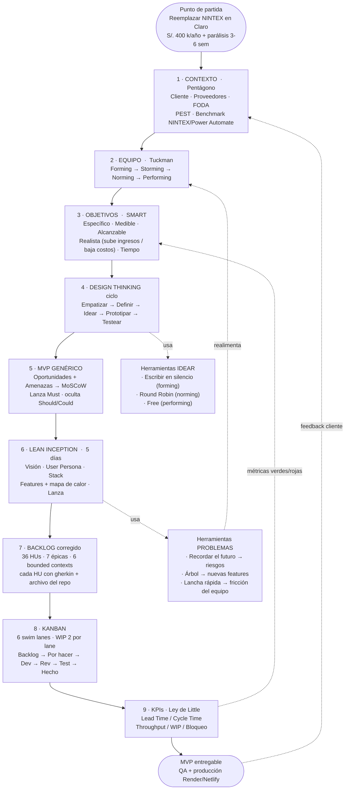

# SI570 · Flujograma maestro de FLOWTEX

> Un solo diagrama que cuenta el ciclo completo del producto: cómo arrancamos, cómo trabajamos y cómo medimos. Al lado, la explicación pieza por pieza para sostener la presentación oral con el profesor.

---

## Flujograma maestro

---

## Cómo se lee, paso a paso

### Punto de partida — el dinero

El proyecto no arranca con un sprint, arranca con una pérdida. NINTEX cuesta a Claro Perú **S/. 400 000 al año** en licencias y obliga a esperar **3 a 6 semanas** por cada formulario nuevo. Eso es lo que hay que matar. **Un backlog que no apunta a bajar costos o subir ingresos, no es backlog. Es lista de deseos.**

### 1 · Contexto · Pentágono

Antes de tocar código se rellena el pentágono. Cliente (área TI Claro, persona Gabriel Mora), proveedores (SMTP, cloud América Móvil, GitHub), FODA del equipo Hitss, factores PEST (OSIPTEL exige soberanía, post-COVID acelera lo digital, Microsoft Teams ya es estándar en el grupo), benchmark contra NINTEX, Power Automate y Bizagi. **Sin contexto, el MVP es capricho.**

### 2 · Equipo · Tuckman

El equipo pasa por cuatro fases. **Forming** (kick-off, ADR-0001 acuerda la estructura de repos). **Storming** (discusión de arquitectura, se cierra con ADR-0003 DDD+CQRS). **Norming** (políticas Kanban, Definition of Done, WIP limits acordados). **Performing** (PO ya no revisa cada PR, suelta mando y control). El profe insiste: **liberar mando y control en Forming destruye al equipo; en Performing lo libera.**

### 3 · Objetivos · SMART

Cinco objetivos del cap. 1.7 escritos como **S**ustituibles por nada (específico), **M**edibles con timestamp del propio sistema, **A**lcanzables con el stack y el equipo que tenemos, **R**ealistas (cada uno aterriza en S/. ahorrados o S/. ganados), **T**iempo (cierre del ciclo 2026-10). **Si no es SMART, es deseo, no objetivo.**

### 4 · Design Thinking ciclo

Loop de cinco etapas que se ejecuta cliente ↔ equipo, no flecha lineal. **Empatizar** con admin TI Claro (entrevistas). **Definir** los 10 pain points PD-01..PD-10. **Idear** con la herramienta que corresponde a la madurez del equipo (ver caja lateral T1). **Prototipar** en código real (FormBuilder visual, canvas Workflow). **Testear** en QA con feedback semanal del cliente. Lo que no funciona vuelve a Empatizar; no a la basura.

> **Caja T1 (idear)**: la herramienta cambia con la madurez. **Escribir en silencio** cuando hay tímidos o el equipo está en Forming (iguala el derecho a opinar). **Round Robin** cuando el grupo es mixto y está en Norming (cada uno aporta una vuelta sin interrupciones). **Free** cuando hay confianza alta y el equipo está en Performing (gritan, debaten, suman). El objetivo NO es elegir la mejor idea; es **tener muchas ideas**.

### 5 · MVP genérico

De las ideas salen oportunidades y amenazas; cada flecha del pentágono **se convierte en una funcionalidad**. Las funcionalidades se priorizan con **MoSCoW** (Must / Should / Could / Won't). El primer MVP **lanza solo los Must**; los Should y Could quedan ocultos esperando reacción del mercado, igual que WhatsApp y ChatGPT esconden funcionalidades hasta que el público las pide.

### 6 · Lean Inception · 5 días

Cuando el contexto ya es conocido y solo se quiere **agregar una épica**, se pasa a Lean Inception. Cinco días: visión, user persona + árbol del futuro, backend + frontend, funcionalidades + mapa de calor, lanzamiento. **Lean Inception suelta muchas funcionalidades rápido para que alguna pegue en el mercado.** Nuestra épica EP06 Reporting nació de un Lean Inception de 5 días sobre el MVP base.

> **Caja T2 (problemas durante el sprint)**: tres herramientas, una para cada tipo de problema. **Recordar el futuro** se imagina que hoy es diciembre y todo salió mal — sirve para encontrar **riesgos** antes de que se materialicen, alimenta el Risk Register. **Árbol** dibuja el tronco (MVP estable) y las ramas (funcionalidades posibles) — sirve para descubrir **features nuevas** en el backlog. **Lancha rápida** dibuja qué impulsa al equipo y qué lo ancla — sirve para encontrar **fricción interna**, alimenta la retrospectiva y, si pega, modifica las normas del equipo (vuelve a la fase Tuckman).

### 7 · Backlog corregido

Las funcionalidades priorizadas se materializan como **36 historias de usuario** organizadas en **7 épicas** mapeadas a **6 bounded contexts** que existen en el código (IAM, FormBuilder, Workflow, Tracking, Notifications, Reporting + Operación transversal). Cada HU lleva el formato Como/Quiero/Para, dos escenarios gherkin Dado/Cuando/Entonces y la **referencia explícita al archivo del repo** que la implementa (ej. `SubmissionsController.java`, `FormBuilder.page.tsx`). Sin trazabilidad al código, la HU no es ejecutable.

### 8 · Kanban · 6 swim lanes

Una swim lane por bounded context. WIP limit de 2 por lane (con 5 personas y 6 lanes el sistema no se sobrecarga). Las columnas (Backlog → Por Hacer → Desarrollo → Revisión → Testing → Hecho) tienen límites explícitos y políticas: nada pasa a "Hecho" sin deploy en QA y validación del PO. Bloqueador rojo se resuelve o se escala en menos de 24 horas.

### 9 · KPIs · Ley de Little

Lead Time, Cycle Time, Throughput, WIP, tasas de re-trabajo y de bloqueo. **Lead Time = WIP / Throughput** — bajar el WIP sube la velocidad. Estas métricas alimentan dos retornos al sistema: **(a)** verde/rojo dispara revisión de los objetivos SMART (si el throughput cae, ajustamos la T del SMART), **(b)** el ciclo cerrado MVP → cliente → contexto reabre el pentágono y el ciclo vuelve a empezar. **Sin medir, no hay mejora.**

---

## Cómo explicárselo al profe (talking points)

1. **Abre con el dinero.** "El backlog de FLOWTEX existe para matar S/. 400 000 al año en NINTEX y los 3-6 semanas que cuesta cada formulario. Sin ese norte, no hay backlog."

2. **Recorre el flujograma de izquierda a derecha** sin saltarte ninguna caja. Cada caja **ya** está conectada a la siguiente; tu trabajo es nombrar el aporte de cada una en una frase.

3. **Cuando llegues a Idear, abre la caja T1.** Justifica las herramientas con la madurez del equipo: "en el sprint 1 usamos escribir en silencio porque estábamos en Forming; hoy en Performing trabajamos en Free". Eso conecta Tuckman ↔ Idear ↔ Design Thinking en una sola frase.

4. **Cuando llegues a Lean Inception, abre la caja T2.** Justifica las tres herramientas según el tipo de problema. Aclara que **lancha rápida es del equipo, no del producto** — esa es la confusión más común.

5. **Cierra con la realimentación.** El sistema no es lineal: KPIs vuelven a SMART, problemas vuelven al equipo, MVP entregado vuelve al contexto. **Es un sistema vivo, no un documento.**

6. **Si tienes 30 segundos al final, suelta el cierre del pitch:** *"El backlog que no genera dinero ni reduce costo, es a lo más, un wishlist. El nuestro: cada HU está atada a una fila de pérdida que se va a recuperar."*

---

## Preguntas anticipables

| Si te pregunta… | Respondes… |
|---|---|
| "¿Por qué 6 bounded contexts y no 3 módulos?" | Porque el código real tiene 4 BCs (IAM, FormBuilder, Workflow, Tracking) y 2 nuevos logrables sobre lo que ya hay (Notifications email-only, Reporting de auditoría). El planteamiento de 3 módulos era marketing. Ver ADR-0007/0008. |
| "¿Por qué descartaron MigraFlow?" | Porque no tenemos acceso al tenant productivo de NINTEX (ADR-0008). Lo que no se puede verificar contra el sistema real, no entra al MVP académico. |
| "¿Cómo manejan escalamiento si no tienen scheduler?" | Sobre la jerarquía IAM: si el aprobador AREA_POSITION está vacante, el resolver sube por la escalera Claro hasta encontrar usuario activo. Sin scheduler. ADR-0010. |
| "¿Cómo priorizaron las funcionalidades?" | MoSCoW recalibrado contra el código: Must Have son las 18 HUs que entregan el flujo end-to-end mínimo; Should Have y Could Have suman robustez sin bloquear el demo. |
| "¿Por qué no notificaciones por Teams?" | Costo de integración real: Teams requiere tenant M365 corporativo. El puerto `INotificationChannel` deja la puerta abierta. ADR-0009. |
| "¿Cuál es su throughput actual?" | 3 HUs/semana objetivo. Con la Ley de Little, eso pone el backlog completo (36 HUs) en aproximadamente 12 semanas, y los 18 Must Have en 6. |
| "¿Y si una HU no se puede verificar?" | No entra al backlog operativo (cap. III). Si es visión histórica, queda en cap. I y se cita en un ADR. La trazabilidad lo dice todo. |
