# SI570 · Flujograma maestro de FLOWTEX

> Un solo diagrama que cuenta cómo llegamos al MVP de FLOWTEX, paso por paso. La herramienta de ideación se elige según el contexto del equipo: como nosotros nos conocemos medianamente y trabajamos en confianza intermedia, aplicamos Round Robin. Al lado, la explicación pieza por pieza para sostener la presentación oral con el profesor.

---

## Flujograma maestro

```mermaid
flowchart TD
    INI([Punto de partida<br/>Claro paga cuatrocientos mil soles al año por NINTEX<br/>y la operación se ralentiza por semanas en cada formulario])

    A[1 · Levantar el contexto del producto<br/>se mapea al cliente, los proveedores y los factores externos<br/>contrastándolos con el benchmark del mercado]

    B[2 · Conformar y madurar al equipo<br/>el equipo de Hitss ya se conoce medianamente<br/>y opera en la fase Norming del modelo Tuckman]

    C[3 · Formular objetivos SMART<br/>cada objetivo se justifica en costo evitado o valor generado<br/>y se ata a un plazo concreto del ciclo]

    D[4 · Empatizar con el usuario<br/>se entrevista al administrador TI de Claro<br/>y se construye la persona del solicitante]

    DEF[5 · Definir el problema<br/>los pain points heredados de NINTEX<br/>se redactan como dolor concreto del cliente]

    ID[6 · Idear con Round Robin<br/>cada miembro del equipo aporta su idea por turno<br/>porque es la herramienta justa para un equipo en confianza intermedia]

    POOL[7 · Cosechar el pool de ideas<br/>las ideas válidas se traducen en oportunidades y amenazas<br/>y cada oportunidad concreta se vuelve funcionalidad candidata]

    HU[8 · Redactar las historias de usuario<br/>cada funcionalidad se escribe como Como/Quiero/Para<br/>con criterios de aceptación gherkin verificables]

    BL[9 · Construir el backlog priorizado<br/>las historias se ordenan con la regla MoSCoW<br/>y se agrupan en épicas por módulo del producto]

    MVP([10 · Liberar el MVP<br/>se entrega únicamente el bloque Must Have del backlog<br/>y las historias Should y Could quedan ocultas en reserva])

    INI --> A --> B --> C --> D --> DEF --> ID --> POOL --> HU --> BL --> MVP
```

---

## Cómo se lee, paso a paso

### Punto de partida — el dinero

El proyecto no arranca con un sprint, arranca con una pérdida. Claro paga cuatrocientos mil soles al año por NINTEX y espera entre tres y seis semanas por cada formulario nuevo. Eso es lo que el proceso completo está diseñado para apagar. **Si una pieza del flujograma no está atada a una pérdida que se va a recuperar o a un ingreso que se va a generar, no pertenece al proceso.**

### 1, 2 y 3 · Setup del producto y del equipo

Antes de tocar código se levanta el **contexto** (cliente, proveedores, FODA, PEST, benchmark contra NINTEX y los productos del mercado), se **conforma y madura el equipo** ubicándolo en la fase Norming del modelo de Tuckman porque ya nos conocemos medianamente y trabajamos con confianza intermedia, y se **formulan los objetivos SMART** con justificación financiera explícita. Estos tres pasos son secuenciales: sin contexto el equipo no sabe qué construir, sin equipo maduro los objetivos quedan en buenas intenciones, y sin objetivos claros no hay forma de medir si el sprint sirvió.

### 4 y 5 · Empatizar y definir

Las dos primeras etapas del Design Thinking. Se entrevista al administrador TI de Claro y se construye la persona del solicitante (etapa **empatizar**); luego se redactan los pain points heredados de NINTEX como dolores concretos, no como generalidades de mercado (etapa **definir**). Estas dos etapas garantizan que la idea que viene tenga un usuario y un problema reales detrás.

### 6 · Idear con la herramienta justa al contexto

El profesor remarca que las herramientas de ideación no se aplican todas a la vez porque se contradicen. Como nuestro equipo está en **fase Norming** (nos conocemos medianamente, hemos trabajado juntos lo suficiente para tener confianza pero todavía no es un equipo veterano), la herramienta correcta es **Round Robin**: cada miembro aporta su idea por turno, sin atropellos, asegurando que todas las voces sumen. **Aplicar Escribir en silencio sería sobreproteger al equipo y aplicar Free sería atropellar a quienes todavía dudan.**

### 7 · Cosechar el pool de ideas

El resultado de la ideación es un **pool de ideas válidas**. Cada idea se traduce en una **oportunidad o una amenaza** del análisis del contexto, y cada oportunidad concreta se vuelve **funcionalidad candidata**. Cuanto más amplio el pool, mayor la probabilidad de matar la mediocre.

### 8 · Redactar las historias de usuario

Las funcionalidades candidatas se formalizan en **historias de usuario** con la estructura *Como [rol] / Quiero [funcionalidad] / Para [beneficio]* y criterios de aceptación **gherkin** (Dado / Cuando / Entonces). Sin gherkin, la historia no es verificable; sin verificable, no entra al backlog operativo.

### 9 · Construir el backlog priorizado

Las historias entran al backlog **priorizadas con MoSCoW** (Must / Should / Could / Won't) y agrupadas en **épicas por módulo del producto**. El backlog corregido de FLOWTEX tiene 36 historias en 7 épicas. **El backlog se construye antes que el MVP**: el MVP es el producto del backlog, no su origen.

### 10 · Liberar el MVP

Del backlog se libera **únicamente el bloque Must Have**. Las historias Should y Could permanecen ocultas en reserva, esperando reacción del mercado, igual que WhatsApp y ChatGPT esconden funcionalidades hasta que el público las pide. El MVP no es una versión recortada del producto final: es el subconjunto mínimo que ya entrega valor verificable al cliente.

---

## Cómo explicárselo al profe (talking points)

1. **Abre con el dinero.** "El backlog de FLOWTEX existe para matar cuatrocientos mil soles al año en NINTEX y las semanas de espera por cada formulario. Sin ese norte, nada de lo que sigue tiene sentido."

2. **Recorre el flujograma marcando los tres bloques mentales:** *setup* (pasos 1-3 contexto, equipo, SMART), *Design Thinking* (pasos 4-7 empatizar, definir, idear, pool), *del backlog al MVP* (pasos 8-10 historias, backlog, lanzamiento).

3. **Justifica la elección de Round Robin desde el contexto del equipo.** "Aplicamos Round Robin porque estamos en fase Norming. Nos conocemos lo suficiente para que cada uno aporte, pero todavía no tenemos la confianza para discutir todos al mismo tiempo. Escribir en silencio sería sobreproteger al equipo, y Free atropellaría a quienes todavía dudan."

4. **Cuando llegues al backlog, deja claro el orden.** "El backlog **precede** al MVP. El MVP es el producto del backlog priorizado, no al revés. Si alguien lanza un MVP sin backlog, está improvisando."

5. **Cierra con la lógica del MVP.** "Liberamos el bloque Must Have y dejamos Should y Could ocultos en reserva, igual que WhatsApp esconde funcionalidades hasta que el mercado las pide."

6. **Frase de cierre del pitch:** *"Así fue como FLOWTEX pasó de cuatrocientos mil soles al año en NINTEX a un MVP con backlog priorizado y verificable. Cada historia atada a una fila de pérdida que se va a recuperar."*

---

## Preguntas anticipables

| Si te pregunta… | Respondes… |
|---|---|
| "¿Por qué el backlog está antes del MVP?" | Porque el MVP es el producto del backlog priorizado con MoSCoW. Sin backlog priorizado no se sabe qué entra al MVP y qué queda oculto en reserva. |
| "¿Por qué eligieron Round Robin y no otra herramienta?" | Porque el equipo está en fase Norming. Nos conocemos medianamente, tenemos confianza intermedia. Escribir en silencio sería para un equipo aún en Forming; Free sería para un equipo en Performing. Round Robin es la herramienta justa al contexto. |
| "¿Qué fue lo más difícil del paso de definir el problema?" | Pasar de la queja general (NINTEX es lento) al dolor concreto del cliente (Gabriel Mora espera tres a seis semanas por cada formulario y eso bloquea su área). El detalle del dolor es lo que después justifica cada historia del backlog. |
| "¿Cómo aseguran que cada historia es verificable?" | Cada una se redacta como Como/Quiero/Para y trae al menos dos escenarios gherkin con Dado/Cuando/Entonces. Si la historia no se puede verificar contra el sistema, no entra al backlog operativo. |
| "¿Qué historias quedaron ocultas y por qué?" | Las marcadas como Should y Could en MoSCoW. Quedaron en reserva para liberarse cuando el cliente las pida o cuando el mercado responda al MVP base. Es la misma lógica de los productos que esconden funcionalidades hasta que el público las exige. |
| "¿Y si una funcionalidad candidata no encaja en ningún módulo del producto?" | Es señal de que el catálogo de módulos está incompleto. Se evalúa abrir uno nuevo o redirigir la funcionalidad a un módulo existente. La épica de Reportes nació exactamente así. |
| "¿Qué viene después del MVP?" | Validación con el cliente, iteración sobre nuevas épicas y operación con métricas. Eso ya es la siguiente fase del proceso, fuera del alcance de cómo llegamos al MVP. |
