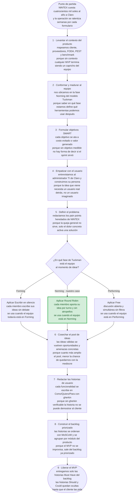

# SI570 · Flujograma maestro de FLOWTEX

> Un solo diagrama que cuenta cómo llegamos al MVP de FLOWTEX. Cada caja trae **qué se hace** y **por qué**, en una línea cada una. El rombo de ideación muestra las tres herramientas posibles, pero el equipo aplica únicamente la que corresponde a su fase Tuckman: como nos conocemos medianamente, vamos por Round Robin (resaltado en verde).

---

## Flujograma maestro

---

## Cómo se lee, paso a paso

### Punto de partida — el dinero

El proyecto no arranca con un sprint, arranca con una pérdida. Claro paga cuatrocientos mil soles al año por NINTEX y espera entre tres y seis semanas por cada formulario. Eso es lo que el proceso completo está diseñado para apagar.

### 1 · Levantar el contexto · *por qué*: sin contexto el MVP es capricho

Antes de tocar código se mapea cliente, proveedores, FODA, PEST y benchmark contra los productos del mercado. Sin esa base, cualquier propuesta del equipo es solo opinión interna; con esa base, cada propuesta se justifica contra el mercado real.

### 2 · Madurar al equipo · *por qué*: la fase Tuckman define las herramientas posibles

El equipo de Hitss ya pasó por Forming (kick-off) y por Storming (discusión de arquitectura) y opera hoy en **Norming**: nos conocemos medianamente, hemos trabajado lo suficiente para tener confianza, pero todavía no somos un equipo veterano. Identificar la fase es lo que después permite elegir bien la herramienta de ideación.

### 3 · Formular objetivos SMART · *por qué*: sin objetivo medible no se sabe si el sprint sirvió

Cada objetivo del cap. 1.7 se justifica en costo evitado (reducir 60% el gasto de licencias) o en valor generado (reducir el tiempo de creación de formularios de 21 días a 2). Plazo concreto antes del cierre del ciclo 2026-10. **Si no es SMART, es deseo.**

### 4 · Empatizar con el usuario · *por qué*: la idea necesita usuario real

Entrevistas con administradores TI de Claro y construcción de la persona Gabriel Mora con sus diez pain points (PD-01 a PD-10). Sin esa empatía, las funcionalidades que vienen después son inventadas, no requeridas.

### 5 · Definir el problema · *por qué*: el dolor concreto activa la solución

Los pain points se redactan como dolor concreto del cliente (Gabriel espera 3-6 semanas por formulario, NINTEX no le da versionamiento, los flujos se congelan en vacaciones). La queja general "NINTEX no me gusta" no sirve para construir nada.

### 6 · Idear con la herramienta justa · *por qué*: las herramientas se contradicen entre sí

El rombo muestra las **tres opciones del catálogo**, pero solo una aplica. **Escribir en silencio** es para Forming porque protege a los miembros que aún no se animan. **Free** es para Performing porque libera la discusión simultánea. **Round Robin** es para Norming, que es donde estamos: cada miembro aporta su idea por turno, sin atropellos, asegurando que todas las voces sumen sin requerir confianza total. Aplicarlas todas a la vez sería contradictorio. Por eso el flujograma marca Round Robin como nuestro camino y los otros dos como caminos no tomados.

### 7 · Cosechar el pool de ideas · *por qué*: cuanto más amplio el pool, mejor el filtro

Las ideas válidas se traducen en oportunidades y amenazas, y cada oportunidad concreta se vuelve funcionalidad candidata. Más cantidad ahora significa mejor calidad después.

### 8 · Redactar las historias de usuario · *por qué*: sin gherkin no es verificable

Cada funcionalidad candidata se escribe como *Como [rol] / Quiero [funcionalidad] / Para [beneficio]* y se acompaña con criterios gherkin (Dado / Cuando / Entonces). Sin gherkin la historia no se puede demostrar al cliente y por lo tanto no entra al backlog operativo.

### 9 · Construir el backlog priorizado · *por qué*: el MVP sale del backlog, no al revés

Las 36 historias se priorizan con MoSCoW y se agrupan en 7 épicas por módulo del producto. **El backlog precede al MVP.** Si alguien lanza un MVP sin backlog, está improvisando.

### 10 · Liberar el MVP · *por qué*: entregar lo mínimo verificable

Se libera únicamente el bloque Must Have del backlog. Las historias Should y Could quedan ocultas en reserva, igual que WhatsApp esconde funcionalidades hasta que el mercado las pide. El MVP no es una versión recortada del producto final: es el subconjunto mínimo que ya entrega valor verificable al cliente.

---

## Cómo explicárselo al profe (talking points)

1. **Abre con el dinero.** "El backlog de FLOWTEX existe para matar cuatrocientos mil soles al año en NINTEX y las semanas de espera por cada formulario. Sin ese norte, nada de lo que sigue tiene sentido."

2. **Recorre el flujograma marcando los tres bloques mentales:** *setup* (pasos 1-3 contexto, equipo, SMART), *Design Thinking* (pasos 4-6 empatizar, definir, idear), *del backlog al MVP* (pasos 7-9 historias, backlog, lanzamiento).

3. **Justifica el rombo de ideación con la fase del equipo.** "El catálogo de herramientas es el mismo para todos los equipos, pero la elección depende del contexto. Estamos en Norming, no en Forming ni en Performing. Por eso aplicamos Round Robin: equilibra la voz de todos sin requerir confianza total."

4. **Cuando llegues al backlog, deja claro el orden.** "El backlog precede al MVP. El MVP es el producto del backlog priorizado, no al revés."

5. **Cierra con la lógica del MVP.** "Liberamos el bloque Must Have y dejamos Should y Could ocultos en reserva, igual que WhatsApp esconde funcionalidades hasta que el mercado las pide."

6. **Frase de cierre del pitch:** *"Así fue como FLOWTEX pasó de cuatrocientos mil soles al año en NINTEX a un MVP con backlog priorizado y verificable. Cada historia atada a una fila de pérdida que se va a recuperar."*

---

## Preguntas anticipables

| Si te pregunta… | Respondes… |
|---|---|
| "¿Por qué el backlog está antes del MVP?" | Porque el MVP es el producto del backlog priorizado con MoSCoW. Sin backlog priorizado no se sabe qué entra al MVP y qué queda oculto en reserva. |
| "¿Por qué muestran tres herramientas si solo usan una?" | Porque el catálogo de opciones existe para todo equipo, pero solo se aplica la que corresponde al contexto. El rombo evidencia que la elección fue deliberada y no por gusto. |
| "¿Por qué Round Robin y no las otras dos?" | Porque estamos en fase Norming. Escribir en silencio es para Forming (protege a los tímidos), Free es para Performing (libera la discusión simultánea), Round Robin es para Norming (turnos sin atropellos, justo lo que necesita un equipo en confianza intermedia). |
| "¿Qué fue lo más difícil del paso de definir el problema?" | Pasar de la queja general (NINTEX es lento) al dolor concreto del cliente (Gabriel Mora espera tres a seis semanas por cada formulario y eso bloquea su área). El detalle del dolor justifica cada historia del backlog después. |
| "¿Cómo aseguran que cada historia es verificable?" | Cada historia se redacta como Como/Quiero/Para y trae al menos dos escenarios gherkin con Dado/Cuando/Entonces. Si la historia no se puede verificar contra el sistema, no entra al backlog operativo. |
| "¿Qué historias quedaron ocultas y por qué?" | Las marcadas como Should y Could en MoSCoW. Quedaron en reserva para liberarse cuando el cliente las pida o cuando el mercado responda al MVP base. |
| "¿Y si una funcionalidad candidata no encaja en ningún módulo del producto?" | Es señal de que el catálogo de módulos está incompleto. Se evalúa abrir uno nuevo o redirigir la funcionalidad a un módulo existente. La épica de Reportes nació exactamente así. |
| "¿Qué viene después del MVP?" | Validación con el cliente, iteración sobre nuevas épicas y operación con métricas. Eso ya es la siguiente fase del proceso, fuera del alcance de cómo llegamos al MVP. |
