# SI570 · Flujograma maestro de FLOWTEX

> Un solo diagrama que cuenta el proceso lógico de creación del MVP de FLOWTEX, paso por paso. Las decisiones se explicitan con rombos: cada herramienta se elige según el contexto, no se aplican todas a la vez. Al lado, la explicación pieza por pieza para sostener la presentación oral con el profesor.

---

## Flujograma maestro

```mermaid
flowchart TD
    INI([Punto de partida<br/>Claro paga cuatrocientos mil soles al año por NINTEX<br/>y la operación se ralentiza por semanas en cada formulario])

    A[1 · Levantar el contexto del producto<br/>se mapea al cliente, los proveedores y los factores externos<br/>contrastándolos con el benchmark del mercado]

    B[2 · Conformar y madurar al equipo<br/>se atraviesan las fases de Tuckman<br/>hasta que el equipo opera de forma autónoma]

    C[3 · Formular objetivos SMART<br/>cada objetivo se justifica en costo evitado o valor generado<br/>y se ata a un plazo concreto del ciclo]

    D[4 · Empatizar con el usuario<br/>se entrevista al administrador TI de Claro<br/>y se construye la persona del solicitante]

    DEF[5 · Definir el problema<br/>los pain points heredados de NINTEX<br/>se redactan como dolor concreto del cliente]

    DEC1{¿En qué fase de Tuckman<br/>se encuentra el equipo<br/>al momento de idear?}
    ID1[Aplicar Escribir en silencio<br/>se nivela el aporte cuando el equipo todavía no se anima<br/>a debatir de forma abierta]
    ID2[Aplicar Round Robin<br/>cada miembro aporta su idea por turno<br/>cuando el grupo ya tiene una confianza intermedia]
    ID3[Aplicar Free<br/>la discusión ocurre en paralelo y sin filtros<br/>cuando el equipo ya está consolidado]

    POOL[6 · Cosechar el pool de ideas<br/>las ideas válidas se traducen en oportunidades y amenazas<br/>y cada oportunidad concreta se vuelve funcionalidad candidata]

    HU[7 · Redactar las historias de usuario<br/>cada funcionalidad se escribe como Como/Quiero/Para<br/>con criterios de aceptación gherkin verificables]

    BL[8 · Construir el backlog priorizado<br/>las historias se ordenan con la regla MoSCoW<br/>y se agrupan en épicas por bounded context]

    MVP[9 · Liberar el MVP genérico<br/>se entrega únicamente el bloque Must Have del backlog<br/>las historias Should y Could quedan ocultas en reserva]

    VAL[10 · Validar el MVP con el cliente<br/>el cliente prueba el producto en el ambiente de QA<br/>y devuelve feedback que alimenta la próxima iteración]

    LIN[11 · Iterar con Lean Inception<br/>cada nueva épica se construye en cinco días<br/>desde la visión inicial hasta el lanzamiento controlado]

    DEC2{¿Qué tipo de problema<br/>aparece durante el sprint<br/>en curso?}
    PR1[Aplicar Recordar el futuro<br/>se imagina que el sprint terminó mal<br/>para anticipar los riesgos del trabajo por venir]
    PR2[Aplicar Árbol<br/>se dibuja el tronco del MVP estable y sus ramas<br/>para descubrir las nuevas funcionalidades posibles]
    PR3[Aplicar Lancha rápida<br/>se identifica lo que impulsa al equipo y lo que lo ancla<br/>para resolver la fricción interna del sprint]

    KB[12 · Operar el flujo Kanban<br/>las historias avanzan por la swim lane que les corresponde<br/>respetando los límites WIP que el equipo se impone]

    KPI[13 · Medir con la Ley de Little<br/>el Lead Time, el Throughput y la tasa de bloqueo<br/>retroalimentan los objetivos del próximo ciclo]

    Z([Producto verificable<br/>cada historia del backlog queda demostrable<br/>y el equipo entra a una nueva vuelta del proceso])

    INI --> A --> B --> C --> D --> DEF --> DEC1
    DEC1 -->|Forming| ID1
    DEC1 -->|Norming| ID2
    DEC1 -->|Performing| ID3
    ID1 --> POOL
    ID2 --> POOL
    ID3 --> POOL
    POOL --> HU --> BL --> MVP --> VAL --> LIN --> DEC2
    DEC2 -->|Riesgos del trabajo| PR1
    DEC2 -->|Nuevas funcionalidades| PR2
    DEC2 -->|Fricción del equipo| PR3
    PR1 --> KB
    PR2 --> KB
    PR3 --> KB
    KB --> KPI --> Z
    KPI -. realimenta los objetivos .-> C
    Z -. nuevo aprendizaje .-> A
```

---

## Cómo se lee, paso a paso

### Punto de partida — el dinero

El proyecto no arranca con un sprint, arranca con una pérdida. Claro paga cuatrocientos mil soles al año por NINTEX y espera entre tres y seis semanas por cada formulario nuevo. Eso es lo que el proceso completo está diseñado para apagar. **Si una pieza del flujograma no está atada a una pérdida que se va a recuperar o a un ingreso que se va a generar, no pertenece al proceso.**

### 1, 2 y 3 · Setup del producto y del equipo

Antes de tocar código se levanta el **contexto** (cliente, proveedores, FODA, PEST, benchmark contra NINTEX y los productos del mercado), se **conforma y madura el equipo** atravesando las cuatro fases de Tuckman, y se **formulan los objetivos SMART** con justificación financiera explícita. Estos tres pasos son secuenciales: sin contexto el equipo no sabe qué construir, sin equipo maduro los objetivos quedan en buenas intenciones, y sin objetivos claros no hay forma de medir si el sprint sirvió.

### 4 y 5 · Empatizar y definir

Las dos primeras etapas del Design Thinking. Se entrevista al administrador TI de Claro y se construye la persona del solicitante (etapa **empatizar**); luego se redactan los pain points heredados de NINTEX como dolores concretos, no como generalidades de mercado (etapa **definir**). Estas dos etapas garantizan que la idea que viene tenga un usuario y un problema reales detrás.

### 6 · Idear · primera decisión del flujo

El rombo **DEC1** explicita lo que el profesor remarca: las herramientas de ideación no se aplican todas a la vez porque se contradicen. Si el equipo todavía está en **Forming**, se aplica **Escribir en silencio** porque nivela el aporte de los miembros tímidos. Si está en **Norming**, **Round Robin** asegura que cada miembro aporte sin atropellos. Cuando el equipo ya está en **Performing**, se libera el **Free** y la discusión ocurre en paralelo sin reglas de turno. **La herramienta correcta depende del contexto Tuckman, no del gusto del facilitador.**

### 7 · Pool de ideas

Independientemente de la herramienta de ideación, el resultado es un **pool de ideas válidas**. Cada idea se traduce en una **oportunidad o una amenaza** del pentágono, y cada oportunidad concreta se vuelve **funcionalidad candidata**. Cuanto más amplio el pool, mayor la probabilidad de matar la mediocre.

### 8 · Redactar las historias de usuario

Las funcionalidades candidatas se formalizan en **historias de usuario** con la estructura *Como [rol] / Quiero [funcionalidad] / Para [beneficio]* y criterios de aceptación **gherkin** (Dado / Cuando / Entonces). Sin gherkin, la historia no es verificable; sin verificable, no entra al backlog operativo.

### 9 · Construir el backlog priorizado

Las historias entran al backlog **priorizadas con MoSCoW** (Must / Should / Could / Won't) y agrupadas en **épicas por bounded context**. El backlog corregido de FLOWTEX tiene 36 historias en 7 épicas mapeadas a 6 bounded contexts del repo. **El backlog se construye antes que el MVP**: el MVP es el producto del backlog, no su origen.

### 10 · Liberar el MVP genérico

Del backlog se libera **únicamente el bloque Must Have**. Las historias Should y Could permanecen ocultas en reserva, esperando reacción del mercado, igual que WhatsApp y ChatGPT esconden funcionalidades hasta que el público las pide. El MVP no es una versión recortada del producto final: es el subconjunto mínimo que ya entrega valor verificable al cliente.

### 11 · Validar con el cliente

Etapa **testear** del Design Thinking. El cliente prueba el MVP en QA y devuelve feedback. Lo que aprueba se consolida; lo que objeta vuelve al ciclo, no a la basura. Esta validación es la que cierra la primera vuelta del proceso.

### 12 · Iterar con Lean Inception

Para cada nueva épica que el cliente solicita, el equipo aplica **Lean Inception** comprimida en cinco días: visión, persona, stack lógico, funcionalidades con mapa de calor, lanzamiento. Es el mismo Design Thinking pero acelerado, porque el contexto general ya es conocido y no se redescubre.

### 13 · Resolver problemas · segunda decisión del flujo

Durante cualquier sprint pueden aparecer problemas, y el rombo **DEC2** explicita la elección: cada herramienta se aplica al **tipo** de problema, no se aplican todas a la vez. Si el problema son **riesgos del trabajo por venir**, se usa **Recordar el futuro** y se imagina que el sprint terminó mal para descubrir qué falló. Si lo que se busca son **nuevas funcionalidades** sobre el MVP estable, se usa el **Árbol** dibujando tronco y ramas. Si la dificultad es **fricción interna** del equipo durante el sprint, se usa **Lancha rápida** identificando lo que impulsa y lo que ancla. Cada herramienta tiene su problema.

### 14 y 15 · Operar y medir

Las historias avanzan por el **Kanban** respetando los WIP limits, y los **KPIs de la Ley de Little** (Lead Time, Throughput, tasa de bloqueo) regulan el ritmo del equipo. Estas métricas no son adorno: son el mecanismo que cierra el ciclo.

### Realimentaciones

Dos flechas punteadas cierran el sistema. Las **métricas de KPI** alimentan los **objetivos SMART** del próximo ciclo (si el throughput cae, se ajusta la T del SMART). El **producto verificable** alimenta el **contexto** (lo aprendido en QA reabre el pentágono). El proceso es un sistema vivo, no una secuencia única.

---

## Cómo explicárselo al profe (talking points)

1. **Abre con el dinero.** "El backlog de FLOWTEX existe para matar cuatrocientos mil soles al año en NINTEX y las semanas de espera por cada formulario. Sin ese norte, nada de lo que sigue tiene sentido."

2. **Recorre el flujograma marcando los tres bloques mentales:** *setup* (pasos 1-3), *creación* (pasos 4-10), *operación* (pasos 11-13). Esa segmentación te ahorra explicar caja por caja si el tiempo aprieta.

3. **Cuando llegues al primer rombo, explica POR QUÉ es decisión.** "Las tres herramientas de ideación se contradicen entre sí. Si el equipo es tímido, *Free* lo apaga; si el equipo es maduro, *Escribir en silencio* lo aburre. La elección depende de la fase Tuckman."

4. **Cuando llegues al backlog, deja claro el orden.** "El backlog **precede** al MVP. El MVP es el producto del backlog priorizado, no al revés. Si alguien lanza un MVP sin backlog, está improvisando."

5. **Cuando llegues al segundo rombo, vuelve a justificar la decisión.** "Las tres herramientas de problemas resuelven cosas distintas: una mira al futuro, otra mira al producto, otra mira al equipo. No se mezclan."

6. **Cierra con las realimentaciones.** "Las métricas vuelven a los objetivos, el producto vuelve al contexto. El proceso se reinicia con lo aprendido. Por eso lo llamamos un sistema vivo."

7. **Frase de cierre del pitch:** *"El backlog que no genera dinero ni reduce costo es a lo más, una lista de deseos. El nuestro: cada historia está atada a una fila de pérdida que se va a recuperar."*

---

## Preguntas anticipables

| Si te pregunta… | Respondes… |
|---|---|
| "¿Por qué el backlog está antes del MVP?" | Porque el MVP es el producto del backlog priorizado con MoSCoW. Sin backlog priorizado no se sabe qué entra al MVP y qué queda oculto en reserva. |
| "¿En qué fase Tuckman está hoy el equipo?" | En Performing. El kick-off cerró Forming, la discusión de DDD+CQRS cerró Storming, las políticas de Kanban cerraron Norming. Hoy el PO ya no revisa cada PR. |
| "¿Por qué tres herramientas de ideación si solo se usa una?" | Porque las tres existen como opciones del catálogo. La elección depende de la madurez del equipo. Aplicarlas todas a la vez sería contradictorio. |
| "¿Qué pasa si el cliente rechaza el MVP en la validación?" | El feedback vuelve al backlog como nuevas historias o como reordenamiento MoSCoW. Lo que falló no se descarta: se reinterpreta como aprendizaje del próximo ciclo. |
| "¿Cuándo se usa Lean Inception y no Design Thinking completo?" | Cuando el contexto general ya es conocido y solo se quiere agregar una épica concreta. Lean Inception comprime cinco etapas en cinco días. |
| "¿Cómo eligen entre Recordar el futuro, Árbol y Lancha rápida?" | Por el tipo de problema. Riesgos del trabajo por venir → Recordar el futuro. Nuevas funcionalidades sobre el MVP → Árbol. Fricción del equipo en el sprint → Lancha rápida. Cada uno resuelve algo distinto. |
| "¿Qué hacen si una métrica de KPI se pone roja?" | La métrica realimenta los objetivos SMART del próximo ciclo. Por ejemplo, si el throughput cae, se ajusta la T del SMART antes de comprometer alcance nuevo. |
| "¿Y si una funcionalidad no encaja en ningún bounded context?" | Es señal de que el catálogo de bounded contexts está incompleto. Se evalúa abrir uno nuevo o redirigir la funcionalidad a un bounded context existente. La épica EP06 Reporting nació exactamente así. |
