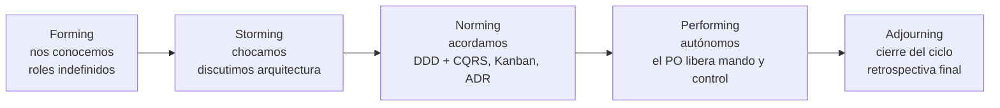
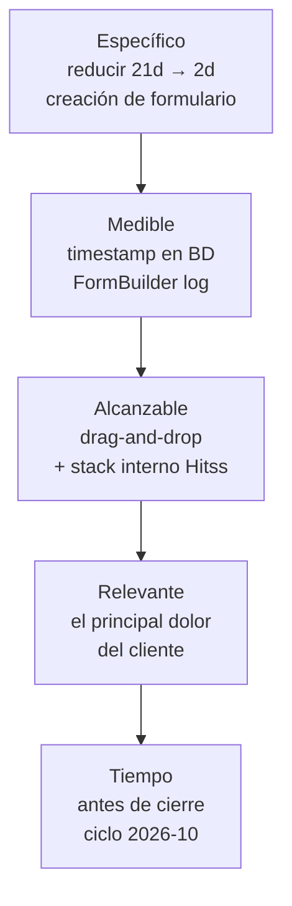
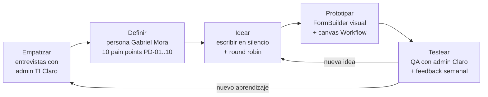
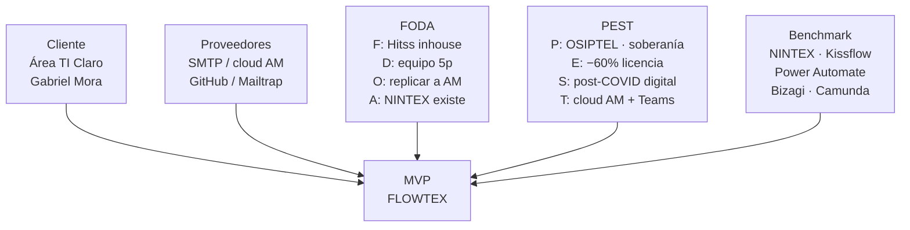
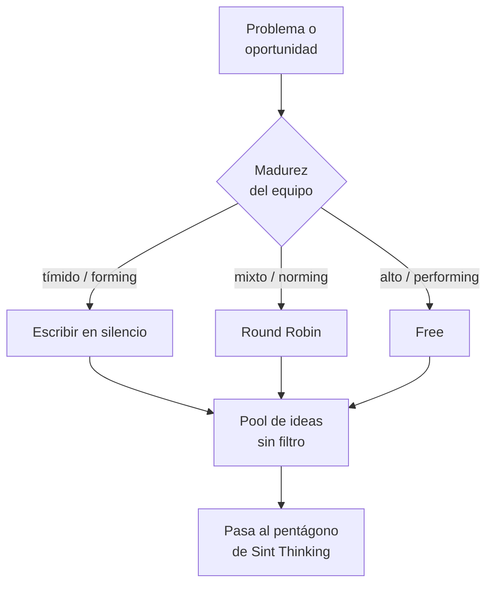
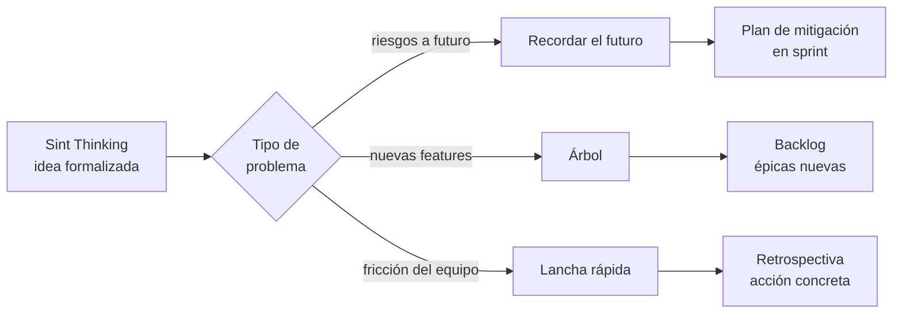
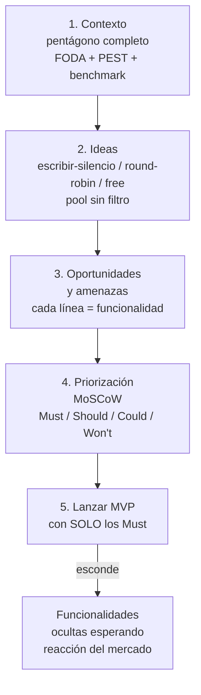
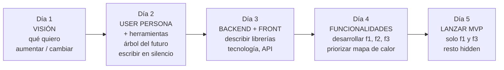
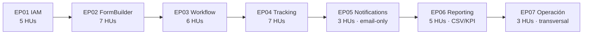
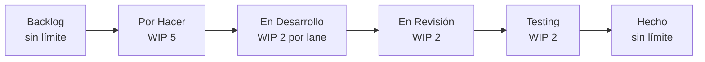

# SI570 · Agile · Pitch FLOWTEX

> Guión de slides para el examen oral del curso SI570 (UPC 2026-01).
> Cada slide es un disparador con palabras clave grandes, un flujograma o tabla, y notas cortas para el expositor.
> El profesor evalúa pitch tipo gerencia, no exposición típica. **No leer introducción ni conclusión.** Las palabras clave abren la idea, el expositor la sostiene.

---

## Slide 1 — Portada

# **FLOWTEX**

### Reemplazar NINTEX en Claro Perú

> **¿Para qué sirve un backlog?**
> **Para ganar dinero. Para perder menos.**

| Equipo Hitss | Rol |
|---|---|
| Christopher Lecca | Product Owner / Backend |
| Angello Sosa | Frontend / UX |
| Milagros Tongo | Data Scientist |
| Mariano Ames | Backend / Prototipos |
| Omar Morales | Scrum Master |

**Habla esto:**
- Cliente: área de Tecnología de Claro Perú
- Visión: reemplazar el SaaS NINTEX
- 36 historias de usuario, 7 épicas, 6 bounded contexts ya construidos

---

## Slide 2 — El backlog se mide en S/. no en HUs

> **NINTEX cuesta S/. 400 000 al año.**
> **Crear un formulario tarda 3 a 6 semanas.**
> **Eso es lo que el backlog tiene que matar.**

| Métrica | NINTEX (AS-IS) | FLOWTEX (TO-BE) | $ que se mueve |
|---|---|---|---|
| Licencia anual | S/. 400 k | S/. 0 (inhouse) | **−60% costo** |
| Crear formulario | 3-6 semanas | 2 días laborales | **agilidad operativa** |
| Personalización | 4-8 semanas + costo proveedor | horas, sin costo extra | **−deuda técnica** |
| Caída del proveedor | paraliza Claro | continuidad propia | **−riesgo operativo** |

**Habla esto:**
- El backlog NO es una lista de deseos: es un mapa de dónde el dinero entra o se escapa
- Cada HU debe contestar: *baja costos / sube ingresos / reduce riesgo*
- Si una HU no contesta ninguna de las tres, no entra al backlog

---

## Slide 3 — Equipo en 4 fases (Tuckman)

> **Forming → Storming → Norming → Performing**
> Sin saber dónde está el equipo, el jefe no sabe cuándo soltar mando y control.

| Fase | Dónde estuvimos | Qué activó el salto |
|---|---|---|
| Forming | semana 1 — kick-off | acuerdo de stack + ADR-0001 |
| Storming | semana 2-3 | discusión bounded contexts, ADR-0003 (DDD+CQRS) |
| Norming | semana 4-6 | políticas explícitas Kanban, definition of done |
| Performing | actualmente | el PO ya no revisa cada PR; suelta el control |

**Habla esto:**
- Si el equipo está en Forming, el jefe NO libera mando y control. Lo destruye.
- Liberar el control en Performing aumenta velocidad sin perder calidad
- Por eso el WIP limit y los ADR son herramientas, no burocracia

---

## Slide 4 — Objetivos SMART de FLOWTEX

> **Específico · Medible · Alcanzable · Relevante · Tiempo**
> Si no es SMART, es deseo.

**Habla esto:**
- Tomar UNO de los 5 objetivos del cap. 1.7 y diseccionarlo en S-M-A-R-T
- *No es alcanzable* mandar a Carlos a configurar Linux si Carlos no sabe Linux
- *Aporta valor* = aumenta ingresos o baja costos. Punto.

---

## Slide 5 — Design Thinking · cómo llegamos al MVP

> **Empatizar → Definir → Idear → Prototipar → Testear**
> Loop cliente ↔ equipo, no flecha lineal.

**Habla esto:**
- Cada vuelta del loop es un sprint
- La idea va creciendo con el cliente, no contra el cliente
- Lo que NO funcionó vuelve a empatía, no a la basura

---

## Slide 6 — Pentágono · Contexto del MVP

> **Cliente · Proveedores · FODA · PEST · Benchmark Silicon Valley**
> Sin contexto, el MVP es un capricho.

**Habla esto:**
- El benchmark contra NINTEX es **cualitativo** porque no tenemos acceso al tenant (ADR-0008)
- Por eso descopamos MigraFlow (ADR-0007) — sin acceso, no hay verificación posible
- El pentágono se rellena ANTES de tocar código

---

## Slide 7 — Generar muchas ideas (no la mejor)

> **Cuantas más ideas, mejor.**
> El filtro viene después.

| Herramienta | Cuándo se usa | Qué activa |
|---|---|---|
| **Escribir en silencio** | participantes tímidos, cultura jerárquica | iguala el derecho a opinar |
| **Round Robin** | grupo mixto, fase Norming | cada uno aporta una vuelta sin interrupciones |
| **Free** | equipo en Performing, confianza alta | gritan, debaten, suman |

**Habla esto:**
- En FLOWTEX usamos *escribir en silencio* en sprint 1 (forming) y *round robin* a partir del sprint 3
- Cuanta más idea, más oportunidades de matar la mediocre

---

## Slide 8 — Resolver problemas (3 herramientas)

> **Recordar el futuro · Árbol · Lancha rápida**
> Cada una para un problema distinto.

| Herramienta | Sirve para | Pregunta clave |
|---|---|---|
| **Recordar el futuro** | identificar **riesgos** del trabajo que viene | "Estamos en diciembre y todo salió mal. ¿Por qué?" |
| **Árbol** | descubrir **funcionalidades nuevas** una vez que tengo MVP | "¿Qué ramas crecen del tronco?" |
| **Lancha rápida** | encontrar **problemas del equipo** en el sprint actual | "¿Qué nos frena? ¿Qué ancla?" |

**Habla esto:**
- Las 3 NO se mezclan. Lancha rápida es para el equipo, no para el producto
- En FLOWTEX, el árbol nos dio la épica Reporting (no estaba en el backlog original)
- *Recordar el futuro* es la base del Risk Register del cap. 6 de calidad

---

## Slide 9 — MVP genérico · cómo se construye

> **Contexto → Ideas → Funcionalidades → Priorizar → Lanzar**

**Habla esto:**
- En FLOWTEX el MVP entregado tiene 18 Must Have. Hay 18 funcionalidades más esperando feedback (Should + Could)
- Como WhatsApp y ChatGPT, que tienen features ocultas hasta que el mercado responde
- MoSCoW NO es opinión: es contrato del PO con el equipo

---

## Slide 10 — Lean Inception · 5 días para una iteración

> **Visión · User Persona · Funcionalidades · Priorización · Lanzamiento**
> Cuando el contexto YA es conocido, no se redescubre.

| Día | En FLOWTEX |
|---|---|
| 1 | "agregar reportes a FLOWTEX" — visión clara |
| 2 | persona "auditor de Compliance" + árbol → 5 funcionalidades candidatas |
| 3 | endpoint `/api/v1/reports/*` + componente React `ReportsList.page` |
| 4 | construir 3 reportes, priorizar con mapa de calor del PO |
| 5 | publicar 2 reportes (HU-RP-01 y HU-RP-04 CSV); HU-RP-03 queda hidden |

**Habla esto:**
- Lean Inception suelta muchas funcionalidades rápido para que **alguna pegue en el mercado**
- Es la lógica de los chinos: lanzan, ven qué le gusta, descontinúan el resto
- En el ciclo académico cada épica nueva (Reporting, Notifications) sigue Lean Inception

---

## Slide 11 — Backlog corregido · 36 HUs en 7 épicas

> **6 bounded contexts logrables + 1 épica transversal.**
> Cada HU tiene gherkin verificable y archivo del repo.

| Won't Have del MVP | Justificación |
|---|---|
| Notificaciones Microsoft Teams | costo de tenant M365 (ADR-0009) |
| Escalamiento por SLA programado | requiere scheduler (ADR-0010) |
| Exportación PDF | usamos CSV, suficiente para auditoría |
| Migración paralela contra NINTEX | sin acceso al tenant (ADR-0007 + 0008) |

**Habla esto:**
- Cada HU dice **archivo del repo** (`SubmissionsController.java`, `FormBuilder.page.tsx`...)
- Cero HU académica sin contraparte ejecutable
- El descope explícito por ADR es lo que protege la honestidad del backlog

---

## Slide 12 — Kanban · 6 swim lanes + Ley de Little

> **Lead Time = WIP / Throughput**
> Si bajo el WIP, sube la velocidad.

| KPI Kanban | Meta FLOWTEX |
|---|---|
| Lead Time | ≤ 5 días por feature estándar |
| Cycle Time | ≤ 3 días |
| Throughput | ≥ 3 HUs / semana |
| Re-trabajo | ≤ 10% |
| Bloqueo > 24h | ≤ 5% |

**Habla esto:**
- Las 6 swim lanes (IAM, FormBuilder, Workflow, Tracking, Notifications, Reporting) son los 6 BCs del producto
- WIP por lane = 2 → el equipo de 5 personas no se sobrecarga
- Ley de Little nos da el throughput esperado: con 3 HUs/semana, el backlog completo (36 HUs) cierra en 12 semanas

---

## Slide 13 — Cierre · qué entregamos

> **De 13 HUs en visión a 36 HUs verificables.**
> **De 3 módulos de marketing a 6 bounded contexts demostrables.**
> **De promesas a Microsoft Teams a un MVP que sí podemos enseñar.**

| Entregable | Estado |
|---|---|
| `flowtex-web-service` (backend Java/Spring) | desplegable en Render |
| `flowtex-web-app` (frontend React/Vite) | desplegable en Netlify |
| 36 HUs gherkin trazables | cap. III §3.0 |
| 10 ADRs de decisiones de arquitectura | `docs/adr/0001..0010` |
| Kanban con 6 swim lanes y KPIs | en operación |

**Cierre del pitch:**
- *El backlog que NO genera dinero ni reduce costo, no es backlog. Es a lo más, un wishlist.*
- El nuestro: cada HU está atada a una fila de pérdida que se va a recuperar
- *Preguntas, profe.*
